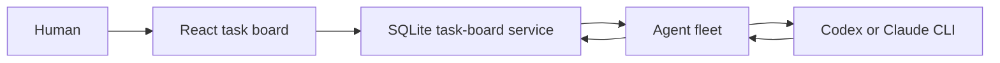

# Nexus Seventeen

Nexus Seventeen is a task board where people coordinate durable work with short-lived Codex or Claude agents. The board owns projects, agent profiles, tasks, messages, questions, wakeups, and run history in SQLite. Model processes start only when work is assigned, answered, resumed, or handed from an engineer to the project's sole manager.

The browser is only an operator interface. Closing it does not stop active work or lose task state.

## Architecture



There are three runtime pieces:

- **Task board** — the authoritative HTTP API and SQLite store.
- **Task fleet** — one lightweight waiting lane for each configured agent.
- **Task worker** — claims one wakeup, launches one contained provider process, and records progress or a result.

The product deliberately has no deployment endpoint. Agents can implement and review work, but production approval and deployment remain human responsibilities.

## Decomposition and cross-repo changes

A request can stay as one executable work item or become a **coordination family**: a branchless parent plus independently mergeable child work items. Each child owns one project, repository, branch, and merge; the parent preserves the overall request, approved split, dependency order, and completion state.

One board Project can own several repositories. A decomposed child selects one with `repositoryId`; an omitted value resolves to the project's primary repository. Repository-scoped agent identities then keep each child's execution on a worker configured for that repository.

The proposed plan declares each child’s objective, project, scope, acceptance criteria, dependencies, and optional phase before the human confirms it.

| Change shape           | Allowed declaration                                                                                                                                                                |
| ---------------------- | ---------------------------------------------------------------------------------------------------------------------------------------------------------------------------------- |
| `mechanical_sweep`     | No children.                                                                                                                                                                       |
| `feature`              | Optional unphased children with non-overlapping same-project scopes.                                                                                                               |
| `blast_radius`         | Children required; every child declares `splitBy: consumer` or `splitBy: phase`. Unphased same-project scopes must not overlap; only the sequenced Expand/Contract pair is exempt. |
| Any phased declaration | Exactly one Expand, one or more Migrates, and one Contract. Every child has a phase; each Migrate depends on Expand, and Contract depends on every Migrate.                        |

Expand and Contract stay in the provider project and both cover `docs/interface.md`; Migrate children target consumer projects. Expand publishes that interface, consumers read the published interface at the Expand merge SHA—never the provider’s source—and Contract removes the compatibility surface only after migration.

Merge policy is keyed on phases, not change shape:

- **Unphased family, including unphased `blast_radius`** — children run independently. **Approve & merge children** succeeds only when every remaining unmerged child is in `final_approval`; it then checks each child's base, merges in dependency order, and skips children already merged. Same-repository siblings may need a second parent approval when an earlier merge advances a later sibling's base and sends it back for re-verification.
- **Phased family** — confirming the parent plan pre-authorizes Expand and Migrate to auto-merge after verification and review. Each merged Expand/Migrate child still needs a human **Attest deployed** action. Contract remains blocked until every such sibling is merged and attested, then requires its own human approval.

The full coordination state, audit actions, recovery rules, operator UI, and rolling-upgrade order are in [Transparent workflow architecture](docs/WORKFLOW_ARCHITECTURE.md#decomposition-and-cross-repository-coordination).

## Source layout

```text
src/
  web/                         React operator interface
    components/                Shared UI primitives
    task-board/                Pages, API client, and view models
  server/
    task-board/                SQLite board, HTTP API, and validation
    agents/
      task-fleet/              Multi-agent lane orchestration
      task-worker/             Work claiming and provider execution
  shared/
    task-board-contract/       API types shared by board and workers
tests/
  e2e/                         Browser workflows
  server/                      Board, fleet, and worker tests
  shared/                      Contract tests
```

This is one package with one source tree. Folders under `src/server` are module boundaries, not separate packages.

## Run locally

Requires Node 22.13+ or Node 24+.

```bash
npm ci
npm run build
install -d -m 700 .steward-data
```

Choose a private human token containing at least 32 characters and start the board:

```bash
export STEWARD_TASK_BOARD_HUMAN_TOKEN='replace-with-a-private-human-token-0001'
STEWARD_TASK_BOARD_DB_PATH="$PWD/.steward-data/board.sqlite" \
STEWARD_TASK_BOARD_HUMAN_TOKEN="$STEWARD_TASK_BOARD_HUMAN_TOKEN" \
STEWARD_TASK_BOARD_HUMAN_PRINCIPAL='human:operator' \
npm run dev:task-board
```

Start the frontend in another terminal:

```bash
STEWARD_TASK_BOARD_HUMAN_TOKEN="$STEWARD_TASK_BOARD_HUMAN_TOKEN" \
npm run dev -- --host 127.0.0.1
```

Open `http://127.0.0.1:4173/`.

To run agents, copy the fleet example and add one entry for each board agent:

```bash
cp src/server/agents/task-fleet/fleet.example.json .steward-data/fleet.json
chmod 600 .steward-data/fleet.json
npm run build:runtime
node build/server/agents/task-fleet/main.js "$PWD/.steward-data/fleet.json"
```

The commands use the ignored `.steward-data/` directory; keeping `fleet.json` in another private directory outside the repository also works.

The task fleet runs multiple existing board agents from one private JSON file. Each lane uses the existing held claim, so an idle fleet has no model process and spends no model tokens. Its timer only backs off after transient board failures; it never creates work or wakes an agent.

The example shows two engineer lanes for two repositories in one project. Delete the second agent object for a single-repository project. The file has this shape:

```json
{
  "version": 1,
  "boardUrl": "http://127.0.0.1:4318",
  "runtimesConfigPath": "/absolute/path/to/nexus-seventeen/config/runtimes.json",
  "promptsFile": "/absolute/path/to/nexus-seventeen/config/prompts.md",
  "retry": {
    "initialDelayMs": 250,
    "maximumDelayMs": 10000
  },
  "agents": [
    {
      "workerId": "worker-platform-api-engineer",
      "agentId": "platform-api-engineer",
      "token": "replace-with-the-one-time-agent-token-0000000001",
      "provider": "codex",
      "role": "engineer",
      "model": "replace-with-a-codex-model-id",
      "workingDirectory": "/absolute/path/to/platform-api",
      "statePath": "/absolute/path/to/.steward-data/workers/platform-api-engineer.json"
    },
    {
      "workerId": "worker-platform-worker-engineer",
      "agentId": "platform-worker-engineer",
      "token": "replace-with-the-one-time-agent-token-0000000002",
      "provider": "codex",
      "role": "engineer",
      "model": "replace-with-a-codex-model-id",
      "workingDirectory": "/absolute/path/to/platform-worker",
      "statePath": "/absolute/path/to/.steward-data/workers/platform-worker-engineer.json"
    }
  ]
}
```

Every lane needs a distinct `workerId`, `agentId`, token of at least 32 characters, and `statePath`. Agent tokens stay in this local file and never enter the frontend. Closing or updating the frontend does not affect the fleet. Set `STEWARD_TASK_FLEET_CONFIG` instead of passing a positional path if preferred.

For several repositories in one project, add each extra repository with `POST /v1/projects/{projectId}/repositories` (`{"name", "path"}`); creating the project already made its primary. `GET /v1/projects/{projectId}/repositories` lists them, primary first, and is where the `repositoryId` values below come from. Both routes are human-only.

Then create one board agent per repository with `POST /v1/projects/{projectId}/agents`, including that repository's `repositoryId` in each request. Use the same `agentId` in `fleet.json`, and set its `workingDirectory` to that repository's absolute path. `repositoryId` belongs only on the board agent; it is not a fleet config field.

Give every repository a full set of the roles its stages use, not just an engineer. Stage dispatch matches on role **and** repository, so a repository with only an engineer implements its child and then blocks at verification with `has no verifier for this repository`. The checked-in pipeline uses `engineer` for implementation and `verifier` for verification, so each repository needs both.

This pairing is not enforced. Claims identify the board agent but do not declare the worker's tree. If an agent's `repositoryId` names repository B while its fleet lane points `workingDirectory` at repository A, the board can route B's task to a worker that commits in A.

The top-level runtime and prompt keys are optional. Their defaults, `config/runtimes.json` and `config/prompts.md`, are resolved from the process's current working directory—not from the fleet file's directory. Use absolute `runtimesConfigPath` and `promptsFile` values when starting the fleet outside this repository. The standalone task-worker entrypoint uses the same cwd-relative defaults; override them with `STEWARD_TASK_WORKER_RUNTIMES_CONFIG` and `STEWARD_TASK_WORKER_PROMPTS_FILE`.

Each agent may declare `role` as `manager`, `engineer`, or `verifier`. When present, the fleet validates the runtime profile's role and sandbox before the lane can claim work. If omitted, it checks each claimed role immediately before model launch. [`workingDirectory`](src/server/agents/task-fleet/types.ts) is the absolute repository path for the lane; optional local-process `workspaceRoot` creates a separate task workspace per pipeline work item.

Claude lanes use bare mode when `ANTHROPIC_API_KEY` is present. Without an explicit key, safe mode leaves OAuth and Keychain authentication available. Project customizations, session persistence, MCP servers, and slash commands stay disabled in either case.

The fleet retries transport failures, throttling, server errors, and journal I/O with capped exponential backoff. Authentication errors close the affected lane. Invalid-state and unexpected local errors quarantine a held claim as failed. A `RuntimeCapabilityError` is `POISONED`: it quarantines a held claim and closes the lane permanently. `SIGINT` and `SIGTERM` abort held claims, interrupt active model processes through the worker, and close every journal.

Edit prompt templates in `config/prompts.md`: each `## <name>` section contains one template, names use lowercase letters, digits, and hyphens, and any content change updates the `promptsSha` pinned to agent runs. Blank lines between sections are fine; column-0 `## ` lines are reserved for section headers and cannot appear inside template or skill bodies.

### Less common environment settings

The task fleet takes worker values from `fleet.json`; an operator sets the equivalent variables only when starting the standalone task-worker entrypoint. `STEWARD_SAFE_PHASE` is included because it matched the source sweep, but it is an internal activity marker rather than an environment variable.

| Name                                            | Who sets it                                          | Default                                                            | Required                |
| ----------------------------------------------- | ---------------------------------------------------- | ------------------------------------------------------------------ | ----------------------- |
| `STEWARD_TASK_BOARD_CORS_ORIGINS`               | Board operator                                       | Empty list                                                         | No                      |
| `STEWARD_TASK_BOARD_VERIFY_WORKSPACE_ROOT`      | Board operator                                       | `verify-workspaces` beside the board database                      | No                      |
| `STEWARD_TASK_BOARD_HOST`                       | Board operator                                       | `127.0.0.1` (or `::1`)                                             | No                      |
| `STEWARD_TASK_BOARD_PORT`                       | Board operator                                       | `4318`                                                             | No                      |
| `STEWARD_TASK_BOARD_HEARTBEAT_TIMEOUT_SECONDS`  | Board operator                                       | `300`                                                              | No                      |
| `STEWARD_TASK_BOARD_RECONCILE_INTERVAL_SECONDS` | Board operator                                       | `60`                                                               | No                      |
| `STEWARD_TASK_BOARD_PARK_NOTIFY_SECONDS`        | Board operator                                       | `86400` (1 day)                                                    | No                      |
| `STEWARD_TASK_BOARD_PARK_AUTO_ABANDON_SECONDS`  | Board operator                                       | `604800` (7 days)                                                  | No                      |
| `STEWARD_TASK_BOARD_STAGE_CAP_SECONDS`          | Board operator                                       | `3600`                                                             | No                      |
| `STEWARD_TASK_BOARD_TASK_CAP_SECONDS`           | Board operator                                       | `10800`                                                            | No                      |
| `STEWARD_PROJECT_ROOTS`                         | Board operator                                       | Unset (host project picker disabled) — colon-separated directories | No                      |
| `STEWARD_BOARD_URL`                             | Bootstrap operator                                   | `https://steward.cicadasystem.com/board-api`                       | No                      |
| `STEWARD_AGENT_KEYCHAIN_SERVICE`                | Bootstrap operator                                   | `cicada-steward-agent-token`                                       | No                      |
| `STEWARD_OPERATOR_TOKEN`                        | Bootstrap operator                                   | None                                                               | For `bootstrap:apply`   |
| `STEWARD_TASK_BOARD_URL`                        | Fleet from `boardUrl`; standalone operator           | None                                                               | For a standalone worker |
| `STEWARD_TASK_WORKER_PROVIDER`                  | Fleet from `provider`; standalone operator           | None                                                               | For a standalone worker |
| `STEWARD_TASK_WORKER_MODEL`                     | Fleet from `model`; standalone operator              | None                                                               | For a standalone worker |
| `STEWARD_TASK_WORKER_ID`                        | Fleet from `workerId`; standalone operator           | None                                                               | For a standalone worker |
| `STEWARD_TASK_WORKER_AGENT_ID`                  | Fleet from `agentId`; standalone operator            | None                                                               | For a standalone worker |
| `STEWARD_TASK_WORKER_AGENT_TOKEN`               | Fleet from `token`; standalone operator              | None                                                               | For a standalone worker |
| `STEWARD_TASK_WORKER_STATE_PATH`                | Fleet from `statePath`; standalone operator          | None                                                               | For a standalone worker |
| `STEWARD_TASK_WORKER_WORKING_DIRECTORY`         | Fleet from `workingDirectory`; standalone operator   | None                                                               | For a standalone worker |
| `STEWARD_TASK_WORKER_RUNTIMES_CONFIG`           | Fleet from `runtimesConfigPath`; standalone operator | `config/runtimes.json` from cwd                                    | No                      |
| `STEWARD_TASK_WORKER_PROMPTS_FILE`              | Fleet from `promptsFile`; standalone operator        | `config/prompts.md` from cwd                                       | No                      |
| `STEWARD_TASK_WORKER_LONG_POLL_MS`              | Fleet from `longPollMs`; standalone operator         | `30000`                                                            | No                      |
| `STEWARD_TASK_WORKER_AGENT_TIMEOUT_MS`          | Fleet from `agentTimeoutMs`; standalone operator     | `3600000`                                                          | No                      |
| `STEWARD_TASK_WORKER_TERMINATION_GRACE_MS`      | Fleet from `terminationGraceMs`; standalone operator | `2000`                                                             | No                      |
| `STEWARD_SAFE_PHASE`                            | Worker internals; operators must not set it          | Internal marker                                                    | No                      |

## Commands

```bash
npm run typecheck:all       # browser and server TypeScript
npm run test:all            # unit and runtime tests
npm run test:e2e            # desktop and mobile browser workflows
npm run bootstrap:validate  # validate config/company-bootstrap.json locally
npm run bootstrap:apply     # reconcile that config into a running board
npm run build               # production server and browser artifacts
```

`bootstrap:apply` requires a private `STEWARD_OPERATOR_TOKEN` containing at least 32 characters. It uses `STEWARD_BOARD_URL` and stores one-time agent credentials in the macOS Keychain service named by `STEWARD_AGENT_KEYCHAIN_SERVICE`. Run `bootstrap:validate` first; validation does not contact or modify the board.

Catalog repository paths are board-runtime paths under `/var/lib/steward/repos`, not workstation paths. Before onboarding in Dokploy, clone each catalog repository into the `steward-data` volume at its configured path, or bind-mount the checkouts there. The checked-in local-container mechanism is [`docker-compose.dev.yml`](docker-compose.dev.yml): set `STEWARD_DEV_REPOS_ROOT` to a directory containing the named checkouts, then start Compose with both the Dokploy file and the dev override. The board sees the same `/var/lib/steward/repos/<repo>` paths in both environments; host-native development must create the equivalent `/var/lib/steward/repos` symlink before applying the catalog.

Generated output is written to `build/`, `dist/`, `.test-dist/`, and `test-results/`.

## More detail

- [Agent system](docs/AGENT_SYSTEM.md)
- [Outline docs platform and operations](docs/OUTLINE.md)
- [Transparent workflow architecture](docs/WORKFLOW_ARCHITECTURE.md)
