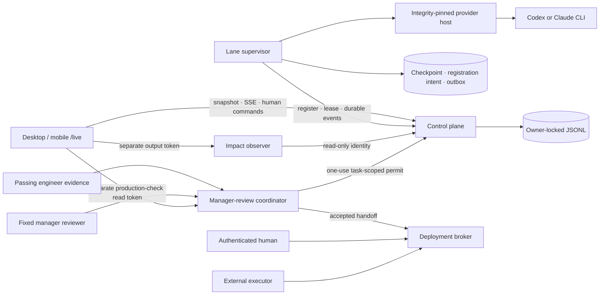

# Cicada Steward

**Status** — working security-focused alpha · **Author** — Cicada · **Date** — 2026-07-19 · **Scope** — independently authored human-led agent control plane, durable engineer and manager runtimes, responsive operator console, cheap-first routing, impact observer, and human deployment-authorization boundary; excludes production deployment, a verifier runtime, and a production-grade model-backed manager inspector.

## Summary

Cicada Steward is a small agent orchestrator for software work with a human in control. An engineer agent can work unattended through Research → Plan → Execute → Test (RPET), while a person can see its current action, inspect its progress journal, queue later outcomes, interrupt it, or pause the workspace from desktop or mobile.

The web app is only a view and control surface. Supervisors, checkpoints, queues, and provider processes live outside the frontend. Taking the frontend down for an update does not stop agents; when it returns, `/live` loads an authoritative snapshot and resumes a sequenced event stream.

Six terms define the system:

- An **agent lane** is a stable agent ID, fixed role, queue, and checkpoint history.
- A **supervisor** is the long-running process that owns one lane, provider boundary, local checkpoint, and durable outbox.
- The **control plane** is the independently deployed authority for lane registration, human commands, leases, tasks, progress, and UI discovery.
- The **impact observer** is a read-only, weak-model projection that explains user impact from bounded and redacted evidence. It cannot command an agent.
- A **production check** is manager-accepted evidence awaiting a separate human decision. Displaying it in `/live` is neither approval nor deployment.
- A **deployment grant** is a short-lived, one-use human authorization for one manager handoff, artifact digest, release-manifest digest, environment, workspace, and task. It is not a deployment.

## Running topology



The topology is intentionally smaller than a company simulator: one durable control plane, one independent supervisor per lane, one optional observer, one narrow manager-review coordinator, and one credential-separated authorization broker.

## What is implemented

| Boundary | Current behavior |
|---|---|
| Live oversight | `/live` discovers registered lanes, shows exact current action, queue, lease, task start/end, 15-minute agent-only forecast, RPET journal, plain-language impact, and separately authenticated read-only production checks. |
| Human control | Queue, interrupt, workspace hold, and resume are authenticated, idempotent, versioned commands. Interrupt/hold remain pending until the runtime acknowledges and settles. |
| Frontend independence | Supervisors never run in the browser. Snapshot plus ordered SSE reconstructs state after a frontend outage. |
| Workload identity | Every runtime token is bound to one workspace, lane, agent, and immutable role. The server issues a private per-generation proof with each contiguous fencing epoch; the token and public epoch alone cannot replace a protected runtime. |
| Restart safety | The exact registration request and random proof challenge are persisted before POST. The successful proof remains in owner-only runtime state, so a crash can retry a lost response or authorize the next process without exposing that capability in the control-plane log. |
| Engineer execution | Only an engineer enters RPET. Research and Plan are read-only, Execute may modify the development workspace, and Test is source-read-only. A failed Test opens the next Research iteration. |
| Provider edge | Real adapters run in a bounded framed child host. The entrypoint is outside work/state roots, owner-safe, and SHA-256 pinned before every launch and import. Output and process I/O are bounded and credential-shaped output is rejected before persistence. |
| Process settlement | On POSIX, the provider host owns a process group. Interrupt, timeout, failure, and shutdown perform TERM → KILL and verify group absence before claiming settlement. The real-provider path fails closed on Windows. |
| Cheap-first routing | Model IDs, capacities, and optional rate cards come from a strict caller catalog. Engineer retries can escalate from Codex economy only after observed failed tests; the impact observer is fixed to Claude economy and zero tools. |
| Impact projection | The observer accepts only a dedicated read-only control-plane identity, strips secrets and implementation detail, bounds context/output, stores the last safe summary, and exposes authenticated routing audit data. |
| Manager execution | A dedicated runtime claims only typed manager-review tasks, exposes its exact current action, performs a bounded read-only inspection loop, honors human interrupt/hold/resume commands, and submits through the one-use permit path. Its generation proof and exact pending registration request remain in private durable state across crashes. |
| Manager-review coordination | A human queues a typed manager-review task bound to one completed engineer task, evidence ID, and digest. Review writes consume one durable control-plane permit ordered with interrupt, hold, and runtime replacement; exact retries recover the original permit and runtime audit. Accepted reviews retry an exact broker v3 handoff, while changes remain durably readable by the trusted engineer-evidence projection. |
| Production authorization | A service-authenticated accepted manager handoff is required before a human can mint a grant. The handoff and grant are single-use; a separately authenticated executor can claim only the exact bound release. The broker has no deployment credentials or deploy method. |

The fixed verifier policy exists, but its dedicated runner is not complete and the generic supervisor fails closed instead of giving that lane the modifying engineer workflow. The dedicated manager runtime is implemented with a bounded frozen-evidence inspector; a production-grade model-backed read-only inspector is still external work. Queue discovery remains a read-only snapshot, but a review write requires the exact assigned task to be the manager runtime's current action and atomically consumes its control-plane permit. `/live` separately polls accepted production checks and exposes the review task and permit audit without any approval or deploy action. Routes other than `/live` remain a local visual demo, not authoritative runtime state.

## How an engineer agent works

1. A human queues a result-oriented objective and an agent-time estimate in a 15-minute increment.
2. The control plane assigns only the head of that lane's queue.
3. The supervisor records the exact task start and runs Research, Plan, Execute, then Test.
4. Before every provider step, the host derives allowed operations from the lane's fixed role and phase. Provider output cannot add permissions.
5. Each phase writes a bounded, outcome-oriented progress entry and a live current action.
6. A failed Test increments the iteration and returns to Research. Routing may escalate only from that observed failure evidence.
7. A passing Test records the result and exact end time. It does not authorize production.

Queueing never interrupts current work. An interrupt is a separate causal barrier: requested → runtime acknowledged → provider process group absent → settled.

## What happens during outages

| Component unavailable | Result |
|---|---|
| Frontend | Agents continue. Returning clients rediscover every retained lane from the control plane. |
| Control plane | Supervisors preserve durable evidence and enter a safe hold instead of inventing server state or starting new work. They reconcile when it returns. |
| One supervisor | That lane stops and eventually appears offline. Its state directory allows a replacement process to resume after server fencing. |
| Provider host | The active step fails/holds; the supervisor confirms containment before a later host can start. |
| Impact observer | Agent work is unaffected. `/live` retains the last good overview and marks it stale. |
| Manager-review coordinator | Development is unaffected. `/live` retains the last valid production-check list and marks it stale; no production decision is inferred. |
| Deployment broker | Development is unaffected. No new production authorization can be created or consumed. |

## Roles and production oversight

- **Engineer** — may research, plan, modify a development workspace, and run tests. It cannot review itself, approve production, claim a grant, or deploy.
- **Verifier** — policy permits independent read/test evidence but no workspace modification or production authority. Its dedicated runtime is pending.
- **Manager** — policy permits review and coordination, not engineering modification or production authority. Its dedicated runtime accepts only evidence-bound review tasks and needs a one-use control-plane permit for every new decision.
- **Impact observer** — may summarize bounded read-only evidence with the economy tier and no tools.
- **Human owner** — may control lanes and make the production decision for an exact accepted handoff.

The implemented broker lifecycle is:

```text
accepted manager handoff
  -> authenticated human grant for exact handoff + artifact + manifest + environment
  -> authenticated executor claims grant once
  -> external deployment system performs an idempotent deployment
```

The last step is deliberately outside this repository.

## Run locally

Use Node 22 or 24+. Node 23 is intentionally outside the supported engine range.

```bash
cd steward
nvm use
npm ci
npm run build:all
```

Start the control plane with distinct tokens. The workload JSON binds the engineer role before first registration:

```bash
STEWARD_WORKSPACE_ID=workspace-alpha \
STEWARD_STORE_PATH=./data/control-plane.jsonl \
STEWARD_WORKLOAD_IDENTITIES_JSON='[{"workspaceId":"workspace-alpha","agentId":"agent-patch","laneId":"lane-patch","role":"engineer","token":"lane-token-change-me-0001"}]' \
STEWARD_HUMAN_TOKEN=human-token-change-me-0002 \
STEWARD_OBSERVER_READ_TOKEN=observer-token-change-me-0003 \
STEWARD_MANAGER_REVIEW_PERMIT_TOKEN=review-permit-token-change-me-0004 \
STEWARD_RUNTIME_GENERATION_PROOF_KEY=runtime-proof-key-change-me-0005 \
STEWARD_CORS_ORIGINS=http://localhost:4173 \
npm run dev:control-plane
```

Start the responsive app and open `http://localhost:4173/live`:

```bash
npm run dev
```

A supervisor reads `STEWARD_CONFIG_FILE` or the fields in [`services/supervisor/src/config.ts`](services/supervisor/src/config.ts). `runtimeInstanceId` must not be configured; each boot creates one and crash recovery reuses only a durable pending registration intent.

```json
{
  "controlPlaneUrl": "http://127.0.0.1:4317",
  "supervisorToken": "lane-token-change-me-0001",
  "workspaceId": "workspace-alpha",
  "agentId": "agent-patch",
  "laneId": "lane-patch",
  "displayName": "Patch",
  "role": "engineer",
  "provider": { "name": "codex", "model": "caller-configured-economy-model" },
  "softwareVersion": "0.1.0",
  "workingDirectory": "/absolute/development/project",
  "stateDirectory": "/absolute/steward-state/agent-patch",
  "leaseIntervalMs": 5000
}
```

For the included real CLI adapter, build it, place its trusted install outside both directories above, and pin its entrypoint:

```bash
STEWARD_CONFIG_FILE=/absolute/supervisor.json \
STEWARD_PROVIDER_ADAPTER_MODULE=/absolute/steward/services/cli-provider-adapter/dist/src/index.js \
STEWARD_PROVIDER_ADAPTER_SHA256=<64-lowercase-hex-sha256> \
CICADA_STEWARD_MODEL_CATALOG_JSON='<caller-supplied-six-profile-catalog>' \
CODEX_API_KEY=<provider-key> \
npm run dev:supervisor
```

The catalog contains `codex` and `claude`, each with `economy`, `balanced`, and `frontier` profiles. Every profile supplies `provider`, `tier`, `modelId`, `contextWindowTokens`, `maximumOutputTokens`, and an optional caller-owned rate card. No model IDs or prices are hard-coded by Steward.

The deterministic fake provider is test-only:

```bash
NODE_ENV=test STEWARD_FAKE_PROVIDER=true \
STEWARD_CONFIG_FILE=/absolute/supervisor.json \
npm run dev:supervisor
```

Impact-observer configuration is defined in [`services/impact-observer/src/config.ts`](services/impact-observer/src/config.ts). Its read token must be `STEWARD_OBSERVER_READ_TOKEN`, while its separate browser output token must differ. A strict model catalog is required even for the fake adapter so routing remains auditable.

The deployment broker's three credentials are intentionally separate: `STEWARD_DEPLOYMENT_HANDOFF_ISSUER_TOKEN`, `STEWARD_DEPLOYMENT_HUMAN_TOKEN`, and `STEWARD_DEPLOYMENT_EXECUTOR_TOKEN`. Its built-in HTTP listener also accepts only literal loopback binds; terminate remote TLS and authentication at a gateway. See [`services/deployment-broker/src/main.ts`](services/deployment-broker/src/main.ts) for the complete environment contract.

The manager-review coordinator runs separately with `npm run dev:manager-review`. Its strict environment contract is defined in [`services/manager-review/src/runtime-config.ts`](services/manager-review/src/runtime-config.ts): evidence issuer, production-check reader, every fixed manager, control-plane observer, permit consumer, and broker handoff issuer use distinct capabilities. `STEWARD_MANAGER_REVIEW_CONTROL_PLANE_PERMIT_CONSUME_TOKEN` must equal the control plane's `STEWARD_MANAGER_REVIEW_PERMIT_TOKEN` and must not be exposed to a browser or manager process. A direct `/live` browser connection requires its exact origin in `STEWARD_MANAGER_REVIEW_CORS_ORIGINS`; a same-origin reverse proxy is the alternative. The service itself binds only to literal loopback, so remote access still terminates TLS at a gateway.

The dedicated manager process runs with `npm run dev:manager-runtime`. Its environment contract is defined in [`services/manager-runtime/src/main.ts`](services/manager-runtime/src/main.ts): it needs one lane-bound control-plane token, its separate fixed-manager review token, a private state-file path, and a read-only evidence directory. Each ordinary process boot creates a fresh runtime instance ID; only an exact durable registration intent is reused after a lost response. The included inspector reads bounded, no-follow `<evidenceId>.review.json` bundles and exposes no command execution or workspace-write method.

## Verification

```bash
npm run typecheck:all
npm run build:all
npm run test:all
npm run test:e2e
npm audit --audit-level=high
```

## Production limits

This alpha is not production-ready.

- **Hard provider isolation** — same-user subprocesses and process groups are not containers, cgroups, job objects, or dedicated UIDs. A provider that creates a new session can escape process-group containment, and Codex read-only still permits broad host reads. Production must add an externally owned filesystem, network, credential, and process boundary.
- **Trusted adapter install** — the adapter entrypoint is pinned; its transitive dependency tree relies on an immutable, trusted install outside the agent workspace.
- **Manager/verifier execution** — the dedicated manager runtime is bounded and read-only, but its included frozen-bundle inspector is not a production model adapter. The verifier runner is still incomplete, and the generic supervisor fails closed for either specialized workflow. Queue discovery is only a snapshot; review authority comes from the separately consumed task-scoped permit.
- **Production-check projection** — `/live` reads accepted checks from manager review with a separate credential and cannot approve or deploy. The service list is unpaginated and has no sequence or ETag; the browser rejects more than 1,000 items or 8 MiB and cannot detect a valid-but-older response.
- **Deployment execution** — the broker issues a one-use authorization but does not deploy. The external executor and target must durably deduplicate `authorizationId`; cross-system exactly-once behavior is not implemented here.
- **Storage and HA** — control, observer, manager-review, and broker stores are owner-locked single-node files, not replicated transactional databases. The manager-review and deployment-broker stores fail closed on a leftover lock; an operator must verify that no writer is alive before removing it. History compaction, pagination, multi-instance leases, backup, and disaster recovery remain.
- **Permit materialization** — permit consumption and human control are atomic in the single control-plane log, but the later manager-review JSONL append is a separate transaction. A stable operation ID recovers a committed permit after a crash; it is not distributed ACID. Pre-permit manager-review records require an explicit offline migration and are never upgraded into production authority by inference.
- **Identity and transport** — static development tokens remain in use. Production needs an identity provider, rotation, revocation, TLS termination, rate limiting, and audit export. Application clients already reject remote plaintext bearer transport.
- **Routing evidence** — engineer retries use observed failed tests, but task risk and complexity are not yet authoritative protocol fields. The impact adapter seam receives the selected model; this repository does not include a provider API implementation for it.
- **Release coordination** — the broker verifies an exact manifest digest, not the manifest contents. A trusted release service must create and preserve that canonical manifest.

## Independent implementation

This code was written independently with project-owned TypeScript and Node built-ins. No Paperclip or Paseo source was copied. Their public designs were used only as product research: durable control-plane separation and cheap summarization were useful ideas, while Steward keeps a smaller topology and makes causal human control and human-only production authority explicit.

## Alternatives considered

- **Fork an existing orchestrator** — rejected because its broader company/task machinery and license obligations are unnecessary for this smaller control plane.
- **Run agents in the browser** — rejected because frontend deploys, tabs, and mobile connectivity must never own agent lifetime.
- **Treat a pause click as proof of stopping** — rejected because accepted intent is not process settlement.
- **Use a frontier model for every phase** — rejected because low-risk work starts on the configured economy tier and escalation requires evidence.
- **Let a manager or passing test deploy** — rejected because review evidence is not human production authority.
