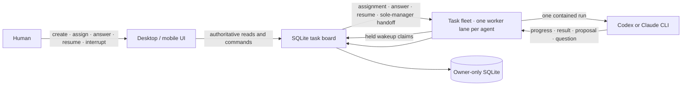

# Nexus Seventeen

**Status** — working alpha · **Author** — John Song · **Date** — 2026-07-25 · **Scope** — durable event-driven task board, fixed agent ownership, ephemeral Codex/Claude runs, responsive operator UI, and human-only production authority; excludes automatic deployment and hard multi-tenant isolation.

## Summary

Nexus Seventeen is a shared todo list for people and software agents. Each durable agent profile has a fixed role and one owned part of a software system. The model process is ephemeral: it starts for one event-triggered run, records its result, and exits with no retained provider session.

Three human actions can wake an agent:

- a human assigns a task;
- a human answers the agent's open question;
- a human explicitly resumes the agent.

There is one narrow automatic wake: completing engineer work creates and wakes a manager review only when that project has exactly one manager. With zero or multiple managers, the review stays unassigned for a human choice. Creating tasks, adding notes, proposing child work, other task transitions, and timers do not wake agents. There is no agent heartbeat or online lease in the default runtime.

The browser is a disposable frontend. Global work-item intake, automation configuration, projects, tasks, messages, questions, runs, interrupts, and wakeups live in the SQLite task board. Closing or updating the UI does not stop an active worker. Reopening it reconstructs every agent from durable records.

Nine terms define the core:

- A **work item** is one immutable human submission with priority and an automatic or explicit project target. It is the future user-visible root for automated workflow attempts.
- An **agent type** is a reusable specialist template with a fixed authority role, bounded supplemental instructions, skill references, and an evaluation profile. It does not create a worker or grant tools.
- A **workflow template** is the company-level mapping from canonical work-item stages to enabled agent types. It is stored configuration only until a coordinator snapshots and executes it.
- An **agent profile** is the persistent role, owned area, mission, model label, and credential hash.
- A **task** is a result-oriented todo with durable queue order and optional work phases. Its assigned agent adds the estimate, in 15-minute increments, after inspecting the work.
- A **wakeup** is one durable human assignment, answer, resume, or validated engineer-to-manager workflow handoff.
- A **run** is one claimed wakeup and one temporary model process.
- A **worker** is the lightweight process that waits for one agent's wakeups. Waiting uses a server-held request and no model tokens.
- A **task fleet** is one local service that hosts a worker lane for every configured agent. It retries transient board failures, but it never creates tasks or wakes models itself.

## Core topology



The frontend does not own the board, worker, or model process. A human note is data for a later run; it is not a command. An interrupt is also not inferred from silence: the board records it, the worker terminates the model process group, and the run settles as interrupted.

## What is implemented

| Boundary | Current behavior |
|---|---|
| Durable board | Global work-item intake, automation configuration, projects, fixed agent profiles, ordered tasks and phases, append-only messages/events, questions, wakeups, runs, and interrupts survive restarts in owner-only SQLite. Earlier schemas upgrade in place to v10 with a foreign-key check. |
| Work-item intake | Human-only global intake stores the original request immutably, accepts priority plus automatic or explicit project targeting, and uses an idempotency key to prevent duplicate submissions. The operator follows bounded 200-row cursor pages and fails explicitly at its 10,000-row safety ceiling instead of displaying a partial queue. A submitted work item does not yet create a task or wake an agent; coordinator wiring is a later slice. |
| Automation configuration | A human-only, compare-and-swap company configuration stores reusable specialist templates and the canonical stage-to-template mapping atomically. Fixed roles remain the authority ceiling, human review is locked to the owner, deployment is disabled, and saving configuration does not create agents, install skills, wake workers, or alter running work. This table stores the latest editable configuration, not historical executable revisions. |
| Event-gated wakes | Human assignment, answer, and explicit resume emit wakeups. The only automatic wake is an atomic engineer-to-sole-manager review handoff; the worker validates its role, task kind, and completed parent evidence before launching. Agent proposals and messages cannot start other agents. |
| Task lifecycle | Assignment queues work. Claim records the exact start. After inspection, the assigned agent records its estimate and the board derives an expected completion on a 15-minute boundary. A question blocks the task and ends the process. Success records result/end time; failure or interrupt leaves the task blocked and resumable. |
| Concurrency | SQLite permits one active run per agent. Claims, answers, assignment, lifecycle changes, and interruption use atomic transactions or compare-and-swap versions. |
| Idle cost | The worker waits on a bounded server-held claim. No model process exists while the agent is idle or waiting for a human. |
| Multi-agent startup | One task-fleet process loads a bounded local JSON roster, starts one held-claim lane per agent, retries transient board failures with bounded backoff, and stops all lanes cleanly. Backoff never creates work. |
| Real providers | A run launches the installed Codex or Claude CLI in its own POSIX process group with bounded context/output, a strict result schema, a fixed environment allowlist, timeout, TERM → KILL settlement, and confirmed group absence. |
| Fixed roles | Engineer runs may write in the configured development directory. Manager and verifier runs are read-only and receive different role instructions. No role can deploy. |
| Task context | Message cursors are tracked per task, so work on one task cannot hide earlier notes on another. A child task receives bounded parent metadata, the actual parent result, and up to 12 recent parent messages. Each agent also receives its own eight newest completed results as compact area memory. |
| Results and proposals | Successful settlement stores the provider's concrete result on the task. Agent proposals remain inert task messages; the simplified UI does not include proposal-promotion controls. |
| Live activity | Codex JSONL and Claude stream events become fixed, sanitized activity labels and durable research/planning/execution/testing/review phases while a run is active. Completed rows retain their semantic stage; repeated loops append new rows, and independent rows may share a parallel group. The agent can publish a remaining-work estimate after planning without another model call. Prompts, reasoning, commands, paths, tool output, and provider payload text are never copied into the board activity stream. |
| Review workflow | Completed implementation work assigns and wakes a manager review when exactly one same-project manager exists; otherwise it creates an unassigned manual fallback. POC and agent chat requests are durable executable tasks but explicitly skip this workflow. Manager completion creates one unassigned human-only check. That human production check remains the gate, records no deployment itself, and never wakes an agent. |
| Operator UI | `/` is the authoritative Cicada task board. It supports desktop and mobile, global intake with Normal/Auto defaults, a dormant Automation configuration page, project-scoped intake, projects imported from disk, durable POC chat, concise task/phase status, role-filtered assignment, question answers, resume, human review decisions, and interrupt. Submitted work items appear separately from legacy board tasks, and the UI does not claim that refinement has started or that a saved template is running. It has no fake-data fallback. |
| Frontend independence | The UI reads the board on return and periodically refreshes durable state while visible. Work-item pagination is a live keyset traversal rather than a database snapshot, so the next refresh converges an item reordered during a multi-page read. These reads are read-only and never wake a model. |

The earlier lease-based control plane remains available at `/live` for compatibility and its separate manager-review, impact-observer, and deployment-authorization experiments. The local visual prototype remains at `/demo`. Neither is the default runtime.

The task-board backend must be upgraded before this frontend because the current `v1` client expects the work-item and automation-configuration endpoints. There is not yet endpoint capability negotiation for mixed-version rollout.

## How one agent run works

Global work-item submission, automation configuration, and agent execution are deliberately separate in the current slice. Intake records the request durably but emits no wake. Automation settings record desired specialist and stage templates but do not change prompts, worker tools, or routing. The existing task path below remains the only executable path until the board-owned coordinator snapshots the complete canonical configuration plus resolved skill digests and creates validated stage attempts. A version number by itself is not historical execution state.

1. A human creates a backlog task. This does not wake an agent.
2. A human assigns an agent. The board records one `human_assignment` wakeup; the human does not enter a duration.
3. The worker's held claim returns. Claiming moves the task to `in_progress` and records `startedAt`. After inspecting and planning the task, the agent publishes its remaining-work estimate; the board then computes `expectedCompletedAt` on the next 15-minute boundary.
4. The worker starts one contained provider process with only the role, owned area, mission, compact project memory, the agent's eight newest completed results, task, acceptance criteria, per-task new messages, question context, workspace references, and bounded parent evidence when the task has a parent.
5. An engineer is instructed to follow Research → Plan → Execute → Test inside that run and repeat after a failed test. Manager and verifier roles remain read-only.
6. While the provider runs, the worker writes fixed, sanitized activity labels and advances durable phases. Independent phases can share a parallel group. It then records bounded result-oriented progress, child-task proposals, or a plain-language result.
7. If human judgment is required, the worker writes one question, the board blocks the task, and the process exits. Answering creates one `human_answer` wakeup with the answer in the next bounded context.
8. Engineer completion records the provider's actual result and exact end time. If the project has one manager, the same transaction queues the manager-review todo and records a `workflow_handoff` wake. With zero or multiple managers, it creates an unassigned review instead.
9. The reviewer worker launches only when the handoff context proves it is a manager-role review with completed parent evidence. Manager completion creates one human-only check; the human records approve or changes requested. Approval is evidence for a separate release step, not deployment authority.

Detailed RPET summaries still arrive with the terminal structured result. During execution, the board shows the current safe lifecycle phase and supports direct interruption without exposing raw provider transcripts.

## Roles and production oversight

- **Engineer** — may research, plan, modify one configured development working directory, and run tests. It cannot deploy or approve its own work.
- **Manager** — may inspect assigned work and record a read-only recommendation. A sole same-project manager receives the engineer's review automatically; an ambiguous or missing manager roster requires human assignment.
- **Verifier** — may independently inspect and run non-modifying checks. A human must assign it explicitly.
- **Human owner** — chooses tasks, assigns ordinary work, resolves ambiguous reviewer assignment, answers authority questions, interrupts work, decides every production check, and controls production outside the core board.

The core has no deployment endpoint or credentials. It automates the read-only review handoff only when the reviewer choice is unambiguous, then stops at a human check. A human still records the final production decision. The compatibility manager-review and deployment-broker services contain a stricter evidence/grant experiment, but they are not connected to the default task board.

## Outage behavior

| Component unavailable | Result |
|---|---|
| Frontend | Board and worker continue. Reopening the UI reloads every durable agent and task. |
| Task board | No new wake can be claimed. Loss of the durable interrupt channel stops an active model run; its private journal preserves settlement work, and the fleet retries transient board failures with bounded backoff. |
| One fleet lane | That agent cannot claim a wakeup. Other lanes continue; the profile and queued task remain durable. Transient failures retry automatically, while a configuration or authorization error requires correcting and restarting the fleet. |
| Model CLI | The run fails or is interrupted; the task remains blocked and resumable. No other agent starts automatically. |

## Run the real core locally

Use Node 22.13+ or Node 24+ so the built-in SQLite module runs without an experimental flag.

```bash
cd nexus-seventeen
npm ci
npm run build:task-board
npm run build:task-worker
npm run build:task-fleet
npm run build:web
install -d -m 700 .steward-data
```

Choose a human token of at least 32 characters and start the task board on loopback:

```bash
export STEWARD_TASK_BOARD_HUMAN_TOKEN='replace-with-a-private-human-token-0001'
STEWARD_TASK_BOARD_DB_PATH="$PWD/.steward-data/board.sqlite" \
STEWARD_TASK_BOARD_HUMAN_TOKEN="$STEWARD_TASK_BOARD_HUMAN_TOKEN" \
STEWARD_TASK_BOARD_HUMAN_PRINCIPAL='human:operator' \
npm run dev:task-board
```

In a second terminal, run the frontend through its same-origin board proxy and open `http://127.0.0.1:4173/`:

```bash
STEWARD_TASK_BOARD_HUMAN_TOKEN="$STEWARD_TASK_BOARD_HUMAN_TOKEN" \
npm run dev -- --host 127.0.0.1
```

Use the UI to add a project by its absolute folder path. Steward derives the project name and workspace scope, creates its default engineer profile, and keeps that profile's one-time credential in the current tab as `cicada.pendingAgentToken.<agent-id>`; the board stores only its SHA-256 hash. The profile appears automatically, while a worker supervisor still needs to adopt that credential into a fleet lane before it can claim work. Keep each displayed model label aligned with the model configured for that lane.

Copy the fleet template to the ignored local data directory, restrict it to the current user, and add one entry per agent. Each entry binds the existing board agent and token to a provider, model, working directory, and private journal:

```bash
cp services/task-fleet/fleet.example.json .steward-data/fleet.json
chmod 600 .steward-data/fleet.json
```

Start every configured agent from a third terminal:

```bash
npm run dev:task-fleet -- "$PWD/.steward-data/fleet.json"
```

The fleet holds one claim request per idle agent. A 30-second held request may reconnect, and transient failures may schedule transport backoff, but neither action runs a model or changes task state. Assignment, answer, explicit resume, or the validated sole-manager review handoff releases real work.

Claude lanes use minimal bare mode when `ANTHROPIC_API_KEY` is explicitly available. Without that variable, they retain safe-mode OAuth/keychain authentication while still disabling project customizations, session persistence, MCP servers, and slash commands.

### Focused single-worker debugging

The fleet is the normal multi-agent path. To isolate one agent while diagnosing its provider, working directory, or journal, run the underlying worker directly:

```bash
STEWARD_TASK_WORKER_PROVIDER=codex \
STEWARD_TASK_WORKER_ID=worker-billing-engineer \
STEWARD_TASK_WORKER_AGENT_ID=billing-engineer \
STEWARD_TASK_WORKER_STATE_PATH="$PWD/.steward-data/workers/billing-engineer/journal.json" \
STEWARD_TASK_BOARD_URL=http://127.0.0.1:4318 \
STEWARD_TASK_WORKER_AGENT_TOKEN='<one-time-agent-token-from-the-ui>' \
STEWARD_TASK_WORKER_MODEL='<caller-selected-codex-model-id>' \
STEWARD_TASK_WORKER_WORKING_DIRECTORY='/absolute/development/repository' \
npm run dev:task-worker
```

Set `STEWARD_TASK_WORKER_PROVIDER=claude` and provide a caller-selected Claude model ID to use Claude instead. Provider credentials come from the installed CLI's supported environment. Steward does not hard-code model IDs or pricing.

Creating a task leaves it in backlog. Click **Assign and wake agent** only when the worker is running and the task scope is ready. Adding a human note never wakes it.

## Deploy the operator board with Dokploy

Create a Dokploy Compose service from `docker-compose.dokploy.yml`, set a private `STEWARD_TASK_BOARD_HUMAN_TOKEN` of at least 32 characters, and route the domain to service `steward` on port `3000`. The container serves the built UI and the loopback-only task-board API; its named volume persists the owner-only SQLite database.

## Reconcile the company project and agent catalog

The versioned catalog in `catalog/company-bootstrap.json` defines the durable projects, three authority profiles per project, reusable agent types, and linear stage ownership. Validate it without network access:

```bash
npm run bootstrap:validate
npm run test:bootstrap
```

Applying it is an explicit, human-authenticated operation. Agent credentials are generated once and stored in macOS Keychain under service `cicada-steward-agent-token`; there is no plaintext fallback:

```bash
STEWARD_OPERATOR_TOKEN="$(security find-generic-password -a "$(id -un)" -s cicada-steward-dokploy -w)" \
  npm run bootstrap:apply
```

The reconciler refuses duplicate project names, immutable profile drift, missing external credentials, and project-description drift. It retains unknown automation types and updates the registry with compare-and-swap. See `docs/AGENT_SYSTEM.md` for the record model, handoff contract, reflection loop, and current dormant-runtime limits.

The production gateway does not inject the human token. On first load, open **Connection settings**, keep the board URL at `/board-api`, and enter the same token. The public `/health` route checks the board through the gateway without granting board authority.

This Compose service runs the operator board only. Agent fleets remain separate, workspace-local processes because they need provider credentials and controlled access to development repositories.

## Verification

```bash
npm run typecheck:all
npm run build:all
npm run test:all
npm run test:e2e
npm audit --audit-level=high
```

The focused durable core suites are also available directly:

```bash
npm run test:task-board
npm run test:task-worker
npm run test:task-fleet
npx vitest run src/task-board/client.test.ts
npx playwright test tests/e2e/task-board.spec.ts
```

## Production limits

This alpha is usable for local development orchestration, not a production multi-tenant control plane.

- **Workspace enforcement** — task `workspaceRefs` are bounded context and audit data. The OS sandbox is configured from one worker working directory; references do not create separate filesystem permissions.
- **Hard isolation** — a same-user POSIX process group is not a container, cgroup, dedicated UID, or VM. Production needs an externally owned filesystem, network, credential, and process boundary.
- **Activity detail** — safe lifecycle activity is live, but detailed result-oriented RPET summaries still arrive with the provider's terminal structured output rather than as a raw phase transcript.
- **Impact summary** — the main agent must return a plain-language user result, but the separate economy-model impact observer is not connected to the default task board yet.
- **Release integration** — the human-check queue is connected, but it records only approval or changes requested. It does not call an external release system.
- **Deployment** — the core deliberately has no deploy method. The older broker can issue one-use authorization, but an external trusted release system must still perform and deduplicate deployment.
- **Storage and HA** — SQLite is owner-locked and single-node. Work-item intake is cursor-paged, but backup, replication, pagination of the other bounded recent projections, and multi-instance failover remain operator responsibilities.
- **Identity and transport** — local static bearer tokens remain in use. Production needs an identity provider, secure same-origin gateway, TLS, rotation, revocation, rate limiting, CSRF protection, and audit export.
- **Model routing** — each event-driven worker currently uses one caller-configured provider/model for its one-shot run. The older RPET runtime contains cheap-first phase routing, but that router is not yet connected to the new worker.

## Independent implementation

This code was written independently with project-owned TypeScript, React, Tailwind, and Node built-ins. No Paperclip or Paseo source was copied. Their public designs informed product research only.

## Alternatives considered

- **Fork a larger orchestrator** — rejected because its company simulation, scheduler, and licensing surface are unnecessary for a shared todo list.
- **Use agent heartbeats** — rejected for the core because agent identity and work state are durable records, not proof that a model process should stay alive.
- **Wake agents from messages or timers** — rejected because it creates token spend and causal work without a human decision.
- **Run agents in the browser** — rejected because frontend deploys, tabs, and mobile connectivity must not own agent lifetime.
- **Let completion trigger review or deployment** — rejected because finishing work is evidence, not human authority for another model run or production.
