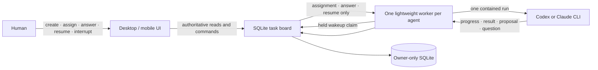

# Cicada Steward

**Status** — working alpha · **Author** — Cicada · **Date** — 2026-07-19 · **Scope** — durable human-triggered task board, fixed agent ownership, one-shot Codex/Claude workers, responsive operator UI, and human-only production authority; excludes automatic deployment and hard multi-tenant isolation.

## Summary

Cicada Steward is a shared todo list for people and software agents. Each agent has a permanent identity, a fixed role, and one owned part of a software system. The model process is temporary: it starts for one human-triggered run, records its result, and exits.

Only three actions wake an agent:

- a human assigns a task;
- a human answers the agent's open question;
- a human explicitly resumes the agent.

Creating tasks, adding notes, proposing child work, finishing another task, and timers do not wake agents. There is no agent heartbeat or online lease in the default runtime.

The browser is a disposable frontend. Projects, tasks, messages, questions, runs, interrupts, and wakeups live in the SQLite task board. Closing or updating the UI does not stop an active worker. Reopening it reconstructs every agent from durable records.

Five terms define the core:

- An **agent profile** is the persistent role, owned area, mission, model label, and credential hash.
- A **task** is a result-oriented todo with workspace references, acceptance criteria, a parent, an assignee, and an agent-time estimate in 15-minute increments.
- A **wakeup** is one durable human assignment, answer, or resume event.
- A **run** is one claimed wakeup and one temporary model process.
- A **worker** is the lightweight process that waits for one agent's wakeups. Waiting uses a server-held request and no model tokens.

## Core topology



The frontend does not own the board, worker, or model process. A human note is data for a later run; it is not a command. An interrupt is also not inferred from silence: the board records it, the worker terminates the model process group, and the run settles as interrupted.

## What is implemented

| Boundary | Current behavior |
|---|---|
| Durable board | Projects, fixed agents, tasks, append-only messages/events, questions, wakeups, runs, and interrupts survive restarts in owner-only SQLite. Schema v1 upgrades in place to v2. |
| Human-only wakes | Assignment, answer, and explicit resume are the only database paths that emit a wakeup. Agent proposals and messages cannot start other agents. |
| Task lifecycle | Assignment queues work. Claim records the exact start and expected completion. A question blocks the task and ends the process. Success records result/end time; failure or interrupt leaves the task blocked and resumable. |
| Concurrency | SQLite permits one active run per agent. Claims, answers, assignment, lifecycle changes, and interruption use atomic transactions or compare-and-swap versions. |
| Idle cost | The worker waits on a bounded server-held claim. No model process exists while the agent is idle or waiting for a human. |
| Real providers | A run launches the installed Codex or Claude CLI in its own POSIX process group with bounded context/output, a strict result schema, a fixed environment allowlist, timeout, TERM → KILL settlement, and confirmed group absence. |
| Fixed roles | Engineer runs may write in the configured development directory. Manager and verifier runs are read-only and receive different role instructions. No role can deploy. |
| Operator UI | `/` is the authoritative Cicada task board. It supports desktop and mobile, project/agent/task creation, assignment, exact timing, progress history, question answers, resume, notes, and interrupt. It has no fake-data fallback. |
| Frontend independence | The UI reads the board on return and periodically refreshes durable state while visible. These reads are read-only and never wake a model. |

The earlier lease-based control plane remains available at `/live` for compatibility and its separate manager-review, impact-observer, and deployment-authorization experiments. The local visual prototype remains at `/demo`. Neither is the default runtime.

## How one agent run works

1. A human creates a backlog task. This does not wake an agent.
2. A human assigns an agent and confirms the agent-only estimate. The board records one `human_assignment` wakeup.
3. The worker's held claim returns. Claiming moves the task to `in_progress`, records `startedAt`, and computes `expectedCompletedAt` from the 15-minute estimate.
4. The worker starts one contained provider process with only the role, owned area, mission, compact project memory, task, acceptance criteria, parent summary, new messages, question context, and workspace references.
5. An engineer is instructed to follow Research → Plan → Execute → Test inside that run and repeat after a failed test. Manager and verifier roles remain read-only.
6. The worker writes bounded progress, child-task proposals, or a plain-language result to the task board.
7. If human judgment is required, the worker writes one question, the board blocks the task, and the process exits. Answering creates one `human_answer` wakeup with the answer in the next bounded context.
8. Completion records the result and exact end time. It creates no deployment authority and wakes nobody else.

The current provider returns its progress batch with its terminal structured result. The board shows `running` and supports direct interruption during execution, but phase-by-phase streaming is still follow-up work.

## Roles and production oversight

- **Engineer** — may research, plan, modify one configured development working directory, and run tests. It cannot deploy or approve its own work.
- **Manager** — may inspect assigned work and record a read-only decision. A human must create and assign the manager task; engineer completion does not wake the manager.
- **Verifier** — may independently inspect and run non-modifying checks. A human must assign it explicitly.
- **Human owner** — chooses tasks, assigns every run, answers authority questions, interrupts work, and controls production outside the core board.

The core has no deployment endpoint, credentials, or automatic post-completion action. A safe review sequence is an engineer task followed by a human-created child manager task, then a separate human production decision. The compatibility manager-review and deployment-broker services contain a stricter evidence/grant experiment, but they are not yet connected to the new task board.

## Outage behavior

| Component unavailable | Result |
|---|---|
| Frontend | Board and worker continue. Reopening the UI reloads every durable agent and task. |
| Task board | An active model run can finish locally, but the worker cannot commit new output or claim more work. It retains a private recovery journal and retries when the board returns. |
| One worker | That agent cannot claim a wakeup. Its profile and queued task remain durable; restarting the same worker resumes from its journal. |
| Model CLI | The run fails or is interrupted; the task remains blocked and resumable. No other agent starts automatically. |

## Run the real core locally

Use Node 22.5+ or Node 24+. The built-in SQLite module is still marked experimental by Node 23.

```bash
cd steward
npm ci
npm run build:task-board
npm run build:task-worker
npm run build:web
install -d -m 700 .steward-data
```

Choose a human token of at least 32 characters and start the task board on loopback:

```bash
export STEWARD_TASK_BOARD_HUMAN_TOKEN='replace-with-a-private-human-token-0001'
STEWARD_TASK_BOARD_DB_PATH="$PWD/.steward-data/board.sqlite" \
STEWARD_TASK_BOARD_HUMAN_TOKEN="$STEWARD_TASK_BOARD_HUMAN_TOKEN" \
STEWARD_TASK_BOARD_HUMAN_PRINCIPAL='human:operator' \
npm run dev:task-board
```

In a second terminal, run the frontend through its same-origin board proxy and open `http://127.0.0.1:4173/`:

```bash
STEWARD_TASK_BOARD_HUMAN_TOKEN="$STEWARD_TASK_BOARD_HUMAN_TOKEN" \
npm run dev -- --host 127.0.0.1
```

Use the UI to create a project and agent. Copy the generated one-time agent token before submitting; the board stores only its SHA-256 hash. Set the agent's model label to the same caller-selected model used below.

Start one worker for that agent in a third terminal. The process remains model-free until a human assigns work:

```bash
STEWARD_TASK_WORKER_PROVIDER=codex \
STEWARD_TASK_WORKER_ID=worker-billing-engineer \
STEWARD_TASK_WORKER_AGENT_ID=billing-engineer \
STEWARD_TASK_WORKER_STATE_PATH="$PWD/.steward-data/workers/billing-engineer/journal.json" \
STEWARD_TASK_BOARD_URL=http://127.0.0.1:4318 \
STEWARD_TASK_WORKER_AGENT_TOKEN='<one-time-agent-token-from-the-ui>' \
STEWARD_TASK_WORKER_MODEL='<caller-selected-codex-model-id>' \
STEWARD_TASK_WORKER_WORKING_DIRECTORY='/absolute/development/repository' \
npm run dev:task-worker
```

Set `STEWARD_TASK_WORKER_PROVIDER=claude` and provide a caller-selected Claude model ID to use Claude instead. Provider credentials come from the installed CLI's supported environment. Steward does not hard-code model IDs or pricing.

Creating a task leaves it in backlog. Click **Assign and wake agent** only when the worker is running and the task scope is ready. Adding a human note never wakes it.

## Verification

```bash
npm run typecheck:all
npm run build:all
npm run test:all
npm run test:e2e
npm audit --audit-level=high
```

The focused durable core suites are also available directly:

```bash
npm run test:task-board
npm run test:task-worker
npx vitest run src/task-board/client.test.ts
npx playwright test tests/e2e/task-board.spec.ts
```

## Production limits

This alpha is usable for local development orchestration, not a production multi-tenant control plane.

- **Workspace enforcement** — task `workspaceRefs` are bounded context and audit data. The OS sandbox is configured from one worker working directory; references do not create separate filesystem permissions.
- **Hard isolation** — a same-user POSIX process group is not a container, cgroup, dedicated UID, or VM. Production needs an externally owned filesystem, network, credential, and process boundary.
- **Streaming progress** — the UI sees the durable run immediately, but detailed RPET progress currently arrives with the provider's terminal structured output rather than phase by phase.
- **Review integration** — manager and verifier workers are read-only, but automatic evidence packaging, manager child-task creation, the weak-model impact observer, and human production checks are not yet connected to the default board.
- **Deployment** — the core deliberately has no deploy method. The older broker can issue one-use authorization, but an external trusted release system must still perform and deduplicate deployment.
- **Storage and HA** — SQLite is owner-locked and single-node. Backup, replication, pagination beyond bounded recent projections, and multi-instance failover remain operator responsibilities.
- **Identity and transport** — local static bearer tokens remain in use. Production needs an identity provider, secure same-origin gateway, TLS, rotation, revocation, rate limiting, CSRF protection, and audit export.
- **Model routing** — each event-driven worker currently uses one caller-configured provider/model for its one-shot run. The older RPET runtime contains cheap-first phase routing, but that router is not yet connected to the new worker.

## Independent implementation

This code was written independently with project-owned TypeScript, React, Tailwind, and Node built-ins. No Paperclip or Paseo source was copied. Their public designs informed product research only.

## Alternatives considered

- **Fork a larger orchestrator** — rejected because its company simulation, scheduler, and licensing surface are unnecessary for a shared todo list.
- **Use agent heartbeats** — rejected for the core because agent identity and work state are durable records, not proof that a model process should stay alive.
- **Wake agents from messages or timers** — rejected because it creates token spend and causal work without a human decision.
- **Run agents in the browser** — rejected because frontend deploys, tabs, and mobile connectivity must not own agent lifetime.
- **Let completion trigger review or deployment** — rejected because finishing work is evidence, not human authority for another model run or production.
