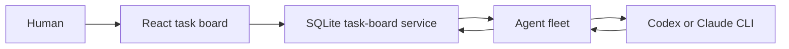

# Nexus Seventeen

Nexus Seventeen is a task board where people coordinate durable work with short-lived Codex or Claude agents. The board owns projects, agent profiles, tasks, messages, questions, wakeups, and run history in SQLite. Model processes start only when work is assigned, answered, resumed, or handed from an engineer to the project's sole manager.

The browser is only an operator interface. Closing it does not stop active work or lose task state.

## Architecture



There are three runtime pieces:

- **Task board** — the authoritative HTTP API and SQLite store.
- **Task fleet** — one lightweight waiting lane for each configured agent.
- **Task worker** — claims one wakeup, launches one contained provider process, and records progress or a result.

The product deliberately has no deployment endpoint. Agents can implement and review work, but production approval and deployment remain human responsibilities.

## Source layout

```text
src/
  web/                         React operator interface
    components/                Shared UI primitives
    task-board/                Pages, API client, and view models
  server/
    task-board/                SQLite board, HTTP API, and validation
    agents/
      task-fleet/              Multi-agent lane orchestration
      task-worker/             Work claiming and provider execution
  shared/
    task-board-contract/       API types shared by board and workers
tests/
  e2e/                         Browser workflows
  server/                      Board, fleet, and worker tests
  shared/                      Contract tests
```

This is one package with one source tree. Folders under `src/server` are module boundaries, not separate packages.

## Run locally

Requires Node 22.13+ or Node 24+.

```bash
npm ci
npm run build
install -d -m 700 .steward-data
```

Choose a private human token containing at least 32 characters and start the board:

```bash
export STEWARD_TASK_BOARD_HUMAN_TOKEN='replace-with-a-private-human-token-0001'
STEWARD_TASK_BOARD_DB_PATH="$PWD/.steward-data/board.sqlite" \
STEWARD_TASK_BOARD_HUMAN_TOKEN="$STEWARD_TASK_BOARD_HUMAN_TOKEN" \
STEWARD_TASK_BOARD_HUMAN_PRINCIPAL='human:operator' \
npm run dev:task-board
```

Start the frontend in another terminal:

```bash
STEWARD_TASK_BOARD_HUMAN_TOKEN="$STEWARD_TASK_BOARD_HUMAN_TOKEN" \
npm run dev -- --host 127.0.0.1
```

Open `http://127.0.0.1:4173/`.

To run agents, copy the fleet example and add one entry for each board agent:

```bash
cp src/server/agents/task-fleet/fleet.example.json .steward-data/fleet.json
chmod 600 .steward-data/fleet.json
npm run dev:task-fleet -- "$PWD/.steward-data/fleet.json"
```

Each fleet entry binds an existing agent and its token to a provider, model, working directory, and private journal.

## Commands

```bash
npm run typecheck:all       # browser and server TypeScript
npm run test:all            # unit and runtime tests
npm run test:e2e            # desktop and mobile browser workflows
npm run bootstrap:validate  # validate the project and agent catalog
npm run build               # production server and browser artifacts
```

Generated output is written to `build/`, `dist/`, `.test-dist/`, and `test-results/`.

## More detail

- [Agent system](docs/AGENT_SYSTEM.md)
- [Transparent workflow architecture](docs/WORKFLOW_ARCHITECTURE.md)
- [Task fleet](docs/TASK_FLEET.md)
- [Document broadcast](docs/DOCUMENT_BROADCAST.md)
