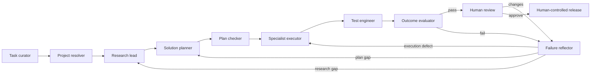

# Steward agent system

**Status** — catalog configured; execution pipeline dormant · **Author** — Cicada · **Date** — 2026-07-21 · **Scope** — company projects, reusable agent types, specialty skills, handoffs, evaluation, and cache-aware scheduling

## Summary

Cicada Steward gives a human one place to submit work, then uses short-lived agent runs to refine, research, plan, execute, and evaluate it. The **project** is the durable memory and authority boundary. An **agent type** defines a stage role. A **skill** adds reusable domain expertise. A **pipeline** decides which run may happen next. An **agent run** is disposable and is pinned to the versions of all three.

The checked-in catalog at [`catalog/company-bootstrap.json`](../catalog/company-bootstrap.json) defines six product-level projects, 18 fixed authority profiles, 16 reusable agent types, and the safe linear portion of the pipeline. [`scripts/reconcile-bootstrap.mjs`](../scripts/reconcile-bootstrap.mjs) applies it without duplicating existing records and stores one-time agent credentials in macOS Keychain.

Saving this catalog does **not** start automation. The current automation registry is deliberately dormant: it records ownership for the UI but does not bind an agent type to a fixed profile, launch a worker, or evaluate a transition. That boundary is verified in [`src/server/task-board/test/board.test.ts`](../src/server/task-board/test/board.test.ts).

## The four records

| Record | Durable contents | What it must not become |
|---|---|---|
| Project | Repositories, workspaces, links, conventions, architecture, decisions, completed work | One project per repo or one giant prompt transcript |
| Agent type | Stage objective, fixed authority role, instructions, eligible skills, evaluator profile | A long-lived model session |
| Pipeline | Allowed transitions, gates, retry budget, human boundaries | Free-form agents waking one another |
| Agent run | Exact task inputs, artifact references, versions, outcome, cost, timestamps | Durable project memory |

This separation follows the composable workflow patterns in Anthropic's [Building effective agents](https://www.anthropic.com/engineering/building-effective-agents) and its progressively loaded [Agent Skills](https://www.anthropic.com/engineering/equipping-agents-for-the-real-world-with-agent-skills). OpenAI describes the same practical foundation as model, tools, and instructions, with orchestration and guardrails outside the prompt in its [practical guide to agents](https://openai.com/business/guides-and-resources/a-practical-guide-to-building-ai-agents/).

## Company projects

**Product boundaries, not repository boundaries** — the catalog groups repositories where users and operations experience one product.

| Project | Boundary |
|---|---|
| Cicada Sense / HomeDots | One connected-care system across caregiver apps, Fleet, backend services, and DotAI |
| Cicada Ethos | Independent health-research product and deployment stack |
| Cicada Steward | Internal task board and agent-control plane |
| Cicada Website | Shared company and marketing surface |
| Cicada Prism | Standalone experimental side project |
| Cicada Platform / Operations | Cross-product architecture and operations documentation |

Cicada Sense has several workspace roots by design. Intake must resolve the responsible repository from evidence instead of treating the primary root as the only writable repository. Archived `HDotsFrontend`, generated certificates, and unverified Intelligent Dots sources are not catalog projects.

## Diagram mapping



The visible stage registry currently maps refinement through verification, followed by human review. The plan checker and reflector are valid agent types but are not pipeline stages yet. The decision diamond should be deterministic coordinator code reading the evaluator's structured result—not a second model asked whether the first model passed.

**Loop limits** — begin with two reflection cycles. Stop sooner when the same failure fingerprint appears twice, the score does not improve, a required tool or authority is unavailable, the remaining budget cannot fund a complete attempt, or the next action is irreversible. Missing evidence is `unknown`, never an invented pass.

## Fixed profiles and reusable specialists

Every project gets three immutable credentialed profiles:

- `manager` coordinates intake, routing, and human handoff but cannot modify a workspace.
- `engineer` can research, record plans, modify its assigned workspace, and run tests.
- `verifier` can read, test, and record independent evaluation but cannot repair the result.

Those profiles are authority pools, not permanent personalities. Stage and specialty behavior comes from an agent type plus skills loaded for an ephemeral run. This avoids creating combinations such as “Blender researcher,” “Blender planner,” and “Blender verifier.” The executor loads Blender production only when the plan calls for Blender; the evaluator applies the corresponding visual rubric.

The initial specialty types cover software implementation, human-readable tech designs, web UI/UX, Blender, After Effects, and image prompting. Detailed loadouts live under `~/.codex/skills`; only their small discovery metadata needs to be present before selection.

## Handoffs and agent-to-agent communication

Agents do not exchange unbounded chat messages and do not wake one another directly. A run writes an artifact and a typed handoff request. The coordinator validates the output schema, stage transition, fixed authority, project boundary, retry budget, and human gate before it queues another run.

A handoff should carry:

```text
work item and run IDs
from stage, requested stage, attempt, remaining budget
agent type, skill, pipeline, and project-memory versions
objective, scope, constraints, acceptance criteria
input and output artifact references
decisions and unresolved questions
evaluation evidence, failure class, fingerprint, and retry delta
```

Pass summaries and artifact references, not complete transcripts, large binaries, or secrets. Anthropic reports the same artifact-persistence pattern to avoid information loss in its [multi-agent research system](https://www.anthropic.com/engineering/multi-agent-research-system); OpenAI's [handoff API](https://openai.github.io/openai-agents-python/handoffs/) similarly supports typed payloads and input filtering.

## Evaluation

The executor cannot accept its own work. The evaluator inspects the actual outcome and combines:

- deterministic graders for builds, tests, schemas, render exits, metadata, and other exact checks;
- model rubrics for qualities such as readability or visual composition;
- human review for final creative judgment, product acceptance, and every production release.

The result is per-criterion `pass`, `fail`, or `unknown`, with evidence and a stable failure fingerprint. This follows Anthropic's guidance to judge outcomes rather than model claims and to combine code, model, and human graders in [Demystifying evals for AI agents](https://www.anthropic.com/engineering/demystifying-evals-for-ai-agents).

## Cache-aware scheduling

Cache is a scheduling optimization, not memory or identity. Build the prompt as a stable prefix—tools, stage instructions, skill versions, project conventions—followed by the task-specific brief, handoff, and artifacts. Queue compatible runs by a cache key derived from provider, model, toolset, agent version, skill versions, and project-memory version.

Anthropic's [prompt cache](https://platform.claude.com/docs/en/build-with-claude/prompt-caching) is an exact-prefix cache with a five-minute default lifetime refreshed on hits and an optional one-hour lifetime. Provider semantics differ, so the scheduler must use provider telemetry rather than assume one TTL. It should batch real compatible work while a prefix is warm, but never keep an idle model session alive or send meaningless heartbeats solely to preserve cache.

## Current limits

- [`src/server/task-board/schema.ts`](../src/server/task-board/schema.ts) stores nine ordered stage owners, not transition edges, conditions, retry limits, or backedges.
- Project creation and catalog reads are human-only. A trusted coordinator needs narrowly scoped server authority; the operator bearer token must never enter a model prompt.
- The engineer role is broader than ideal for read-only research and planning. The runtime must enforce tool allowlists in addition to prompt instructions.
- After Effects requires a licensed macOS or Windows worker; it cannot run inside the current Dokploy container.
- Fixed profiles do not launch workers. The task fleet remains idle and token-free until a task is assigned, but it still needs a secured local lane configuration before it can execute.
- Production approval and deployment are reserved for an authenticated human by [`src/shared/role-policy/policy.ts`](../src/shared/role-policy/policy.ts). The release-operator template therefore remains disabled.

## Alternatives considered

**Permanent specialist sessions** — rejected because idle sessions lose cache state, accumulate irrelevant context, and make project memory depend on a model process.

**One profile for every stage and specialty in every project** — rejected because it creates a Cartesian product of credentials and sidebar entries without adding authority separation.

**Agents wake one another directly** — rejected because free-form handoffs can bypass stage policy, lose artifacts, leak context, and run past retry budgets.

**Always return failures to research** — rejected because execution defects and evaluator problems should return to their earliest invalid stage; repeating valid research adds cost without information.
