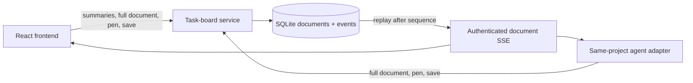

# Live Document Broadcast

**Status** — rung 1 API and human UI implemented; bundled agent adapter pending · **Author** — Steward project team · **Updated** — 2026-07-19 · **Scope** — durable Markdown documents with one writer and any number of read-only watchers; excludes multi-writer editing, presence, rich editor selection, and delta encoding.

## Summary

Steward now has a small document system beside its todo list. A human creates a Markdown document, one human or API-connected agent holds its **pen**, and subscribed clients receive each saved version. The pen is an exclusive write right, not a collaboration session: there is nothing to merge because the board accepts saves only from the current actor and client-session identity.

The task-board service owns document truth in SQLite. The React app is only a client — closing or updating the frontend does not release a pen, erase a document, or stop agents. When the app returns, it discovers document summaries from the board, fetches the selected body, and resumes that document's event stream.

| Shipped in rung 1 | Deliberately not shipped |
|---|---|
| Plain `text/markdown` snapshots | Rich text, sheets, and drawings |
| Persistent pen holder and fencing epoch | Pen heartbeat, renewal, or idle timeout |
| Content-version compare-and-swap | Multi-writer merge or offline editing |
| Authenticated, resumable SSE per document | Presence or watcher counts |
| Human force takeover | Automatic revocation |
| Explicit Save; no autosave | Snapshot diffs or CRDT deltas |

Document operations do not create tasks or wake agents. Agents still wake only for a new human assignment, a human answer, or an explicit human resume.

The HTTP API authorizes same-project agent credentials, but Steward's bundled one-shot task worker does not yet expose document reads, streams, or pen operations to the launched model. Current agents continue to receive bounded task context and communicate through task messages. Agent document use therefore requires a separate adapter today; it is not automatic model context or a background watcher.

## Where the feature lives

Rung 1 belongs to the active task-board path, not the compatibility-only legacy `/live` control plane. It borrows the legacy stream's snapshot-and-resume pattern without making the frontend or that older service authoritative.



The implementation is split by responsibility:

- [`src/shared/task-board-contract/index.ts`](../src/shared/task-board-contract/index.ts) — document, pen, request, and snapshot types.
- [`src/server/task-board/store.ts`](../src/server/task-board/store.ts) — schema v4 and the v3-to-v4 migration.
- [`src/server/task-board/board.ts`](../src/server/task-board/board.ts) — persistence, authorization boundaries, version checks, fencing, and event insertion.
- [`src/server/task-board/service.ts`](../src/server/task-board/service.ts) — authenticated HTTP and SSE routes.
- [`src/web/task-board/client.ts`](../src/web/task-board/client.ts) — strict response parsing and resumable stream consumption.
- [`src/web/task-board/DocumentsPage.tsx`](../src/web/task-board/DocumentsPage.tsx) — desktop/mobile viewer, editor, handoff controls, and recorded references.

## HTTP and stream contract

Board snapshots contain document summaries only. The full body travels only when a human or agent opens one document, which keeps normal task-board refreshes small.

| Operation | Route | Authority |
|---|---|---|
| Create and receive the first pen | `POST /v1/projects/:projectId/documents` | Human only |
| Read the current full snapshot | `GET /v1/documents/:documentId` | Human or same-project agent |
| Acquire, release, or force-take the pen | `POST /v1/documents/:documentId/pen` | Human or same-project agent; force is human-only |
| Save a full Markdown snapshot | `PATCH /v1/documents/:documentId` | Current actor and client session holding the pen |
| Replay and follow saved versions | `GET /v1/documents/:documentId/events?after=N` | Human or same-project agent |

Each mutation appends a durable, per-document sequence. SSE replays every event after the supplied cursor and then follows new commits with one frame shape:

```text
id: 12
event: document
data: {"document": {"sequence": 12, "contentVersion": 4, "content": "..."}}
```

The real payload also includes the document identity, project, title, content type, pen state, and timestamps. The `id` and `document.sequence` must match. A reconnect first reads the latest durable snapshot, then subscribes after its sequence; it never treats a cached browser value as authority.

## Holding the pen

Every save must pass three independent checks:

1. **Authenticated actor** — the bearer credential identifies the human or agent. Agents are limited to their own project.
2. **Pen epoch** — every new grant increments `penEpoch`; a late write from the previous holder is rejected.
3. **Content version** — the save must name the exact `contentVersion` it edited; a stale draft cannot overwrite a newer snapshot.

`clientId` distinguishes browser or agent client sessions. It is part of pen ownership, but it is not authentication and cannot impersonate the bearer actor. Creating a document grants epoch 1 to the creating human client. An ordinary acquire succeeds only when the pen is free; acquiring it again from the same actor and client is idempotent. Release clears the holder without changing the epoch. A human may explicitly force a takeover, which grants the next epoch and fences the former holder.

The frontend keeps its ID in session storage and claims ownership of that ID in same-origin local storage. An opener-created or duplicated tab that inherits session storage sees the existing claim and rotates to a new ID. A normal reload releases and reclaims the same ID; if shared browser storage is unavailable, the page chooses a fresh runtime ID rather than trusting a possibly copied value.

There is no lease timer or heartbeat. If a holder disappears, the document remains safely read-only until that holder returns, releases it, or a human confirms force takeover. This matches Steward's event-driven agent lifecycle and avoids background wakeups.

## Human workflow

The Documents page groups durable documents by project. Opening one fetches its full body and follows only its stream. The page shows the holder, content version, pen epoch, durable sequence, and connection state in text as well as controls.

- A watcher sees the saved Markdown snapshot read-only.
- A pen holder edits a local draft and must choose **Save snapshot**; there is no autosave.
- Drafts are bounded, stored per document for the browser session, and restored across document changes, app navigation, and reload. A five-second board refresh, stale-write response, pen release, or newer streamed version also preserves them. A newer content version blocks Save until the human chooses the saved version; leaving the tab with any dirty draft triggers the browser's unsaved-work warning.
- Taking an occupied pen requires confirmation. The previous epoch can no longer write after takeover.
- On mobile, the page uses a document-list/detail flow with an explicit Back control.
- Task-derived briefs, results, links, and workspace paths remain visible under **Recorded references**. They are task-board evidence, not editable documents.

## Token and complexity budget

Single-writer removes CRDT and operational-transform costs. Rung 1 also avoids repeatedly loading every document into the main board view: normal refreshes carry summaries, and a full body is fetched and streamed only for the selected document.

| Rung | Transport | Status | When it earns its cost |
|---|---|---|---|
| 1 | Full snapshot per saved version | **Shipped** | Small project notes; simplest auditable behavior |
| 2 | Computed patch plus periodic snapshots | Future | Documents are updated often enough that snapshots waste bandwidth or agent context |
| 3 | Yjs used only as a compact delta codec | Future | Large or structured documents justify another state format |

Rung 1 caps content at 48 KiB of valid text. That bound keeps one saved event manageable while real usage establishes whether deltas are worth their protocol, storage, recovery, and test surface.

## Worked example

A same-project agent adapter holds epoch 8 on a release note and saves content version 5. A manager and human reviewer subscribed after sequence 14 receive sequence 15 with the complete saved snapshot. The human then confirms a takeover: the board grants epoch 9 and broadcasts the new pen state. An agent save carrying epoch 8 is rejected even if its content version was otherwise current. The human edits version 5 and explicitly saves version 6. The bundled task worker cannot perform this flow until its model-tool boundary gains document operations.

No task was created, no agent was woken, and no concurrent text was merged. The database remains authoritative throughout a frontend restart.

## Boundaries and current limits

Consistent with [`ARCHITECTURE.md`](ARCHITECTURE.md):

- **A live document is not deployment evidence** — approvals, test results, diffs, and durable task decisions remain the source records.
- **The stream is delivery, not truth** — SQLite projections and events are authoritative; clients recover from a snapshot and sequence.
- **Watching grants no authority** — reading a document cannot queue, interrupt, approve, deploy, or acquire its pen.
- **The pen grants document writes only** — it conveys no task, agent, or production permission.

Rung 1 has known, bounded limits:

- Documents are plain Markdown shown in a plain-text viewer/editor.
- Every event stores a full snapshot, so history grows with document size and save frequency.
- Slow SSE consumers may buffer until they disconnect and replay from their last sequence.
- Pens have no timeout. Recovery is an explicit human force takeover.
- There is no presence, watcher count, offline edit queue, delta transport, or multi-writer merge.
- The bundled task worker does not place documents in agent context or expose document tools yet.

## Alternatives Considered

- **Reuse the legacy `/live` stream as the authority** — rejected. The product frontend and event-driven agents use the SQLite task board; routing documents through the compatibility control plane would create a second authority and couple this feature to an inactive path.
- **Run a separate document server** — rejected for rung 1. It would duplicate authentication, project scope, persistence, fencing, and recovery for a small Markdown feature.
- **Full CRDT co-editing** — rejected. The requirement is one writer, so merge machinery adds protocol and operational cost without solving a present conflict.
- **Automatic pen expiry** — rejected. A timer would reintroduce heartbeat and renewal behavior that Steward intentionally avoids. Explicit release plus human force takeover is deterministic and visible.
- **Polling full documents** — rejected. The board already polls small summaries; selected-document SSE pushes only committed changes and reconnects from a durable cursor.
- **Start with diffs** — deferred. Full snapshots are easier to audit and recover, and the 48 KiB bound makes them acceptable until measurements justify rung 2.
