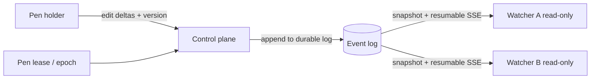

# Live Document Broadcast

**Status** — draft design · **Author** — Steward project team · **Date** — 2026-07-18 · **Scope** — how one writer's document edits reach many read-only watchers in real time inside Steward; excludes multi-writer co-editing, editor-component selection, and durable storage internals.

## Summary

Steward is a human-led control plane for software agents. This doc adds one capability: a person (or agent) edits a document — a text note, a spreadsheet, a drawing — and **everyone else watches it change live, without being able to edit it**. Exactly one writer at a time; any number of read-only watchers.

Three nouns matter:

- A **document** is one editable artifact: rich text, a sheet, or a drawing. Its content is a value, not a stream of keystrokes.
- The **pen** is the exclusive right to write a document. At any instant one holder has it; everyone else watches.
- A **watcher** is a client rendering the document read-only, kept current by pushed updates.

The key simplification: **single-writer is a broadcast problem, not a collaboration problem.** With one writer there are no conflicting edits to merge, so Steward needs no CRDT, no operational transform, and none of the paywalled or self-hosted co-editing backends those require. It needs one-way fan-out — which the control plane already does for the agent registry.

This is a design, not a shipped feature. It extends the typed frontend contract in [`../src/control-plane/contract.ts`](../src/control-plane/contract.ts); no document transport is wired into `App.tsx` yet.

## Why single-writer is the whole trick

"Real-time collaboration" is expensive because of **conflict resolution** — two people editing the same paragraph, and the system must merge without corrupting either. That merge logic (Yjs, operational transform) is also what vendors gate: Univer's real-time collaboration is a paid tier, Excalidraw's sync room is self-hosted and community-wired.

Single-writer removes the merge entirely. There is one source of truth for content, so watchers only need to **receive and render** it. That collapses the problem to fan-out plus one lock.

| | Multi-writer co-editing | Single-writer broadcast (this doc) |
|---|---|---|
| Conflict handling | CRDT / OT merge | None — one writer, no conflicts |
| Backend needed | Collab server (often paid/DIY) | The existing SSE event stream |
| Editor licensing | May require paid collab tier | Any editor's **free** read-only render works |
| Watcher role | Peer editor | Read-only viewer |

## It reuses the control plane, not a new product

Steward's clients already `bootstrap()` a snapshot and `subscribe(afterSequence)` to a resumable server-sent-events (SSE) stream for the agent registry ([`ControlPlaneGateway` in `contract.ts`](../src/control-plane/contract.ts)). A watched document is just **another projection on that same channel**.

- **Join** — a watcher gets the current document snapshot at a sequence number.
- **Follow** — it receives ordered update events after that sequence; a dropped connection resumes from the last sequence it saw, or reloads the snapshot. This is the same resume contract the registry stream already specifies (`afterSequence`, `retentionStartsAtSequence`).
- **Render read-only** — the editor is mounted non-editable: TipTap `editable: false`, Excalidraw `viewModeEnabled`, a read-only sheet render, a diagram viewer. No editor's paid collaboration feature is touched, so the **free tier of every candidate editor is sufficient**.

## Holding the pen

"One person writing" must be enforced, not assumed. Steward already issues a **fencing token** — `runtimeEpoch` on `AgentLeaseProjection` in [`contract.ts`](../src/control-plane/contract.ts) — that increases with every new owner. The pen reuses that idea:

- A client requests the pen; the control plane grants a **lease** carrying the current epoch and writes it as an event.
- Writes are accepted only from the current epoch holder. When the pen hands off, the epoch increments and the previous holder is **fenced** — its late writes are rejected, not merged.
- Watchers see who holds the pen as ordinary state; the UI shows the pen holder and, optionally, lightweight **presence** ("3 watching").

The lease answers "who may write." It never proves a keystroke landed — that is the update event's job, exactly as a command receipt in `contract.ts` proves durable intent, not a finished side effect.

## What travels on the wire: deltas, not snapshots

Two ways to keep watchers current:

- **Full snapshot per change** — resend the whole document on every edit. Simplest; wasteful.
- **Delta per change** — send only what changed since a sequence. More work; far cheaper.

Prefer **deltas**, for one reason that matters in Steward specifically: watchers may be **agents**, and Steward's token budget treats "repeated full-context reads" as a named waste (see `ARCHITECTURE.md`, token-efficient routing). An agent watching a document should ingest the change, not re-read the document each time.

**Complexity ladder** — pick the rung the document size justifies:

1. **Snapshot-only** — resend the document on change. Fine for small notes and drawings; no delta machinery.
2. **+ Snapshot diffs** — send a computed patch against the last snapshot; periodic full snapshots let late joiners and reconnects resync.
3. **+ Yjs delta encoding** — use a Yjs document *single-writer*, purely for its compact delta format and reconnect catch-up. Not for merge — there is nothing to merge. Worth it only when documents are large or edits are frequent.

Every rung uses the same SSE channel and the same read-only render. Rung 1 ships first; 2 and 3 are opt-in optimizations behind the same event shape.

## Worked example

A verifier agent holds the pen on a spreadsheet of test results. A human owner and two other agents watch.

1. Each watcher `bootstrap()`s the sheet snapshot at sequence 40 and renders it read-only.
2. The verifier fills a row. The control plane appends update event 41 (a delta: "row 7 = passed"). All three watchers apply it instantly. No merge, because no one else can write.
3. A watcher's network drops. On reconnect it presents `afterSequence: 41`; the plane replays 42–45. If those sequences aged out of retention, it reloads the snapshot instead — never trusting stale local state.
4. The human takes the pen to correct a value. The plane increments the epoch, fences the verifier, and the verifier's next stray write is rejected rather than silently applied.

The document was live for everyone, edited by one, and never in conflict.

## Boundaries this design keeps

Consistent with Steward's invariants ([`ARCHITECTURE.md`](ARCHITECTURE.md) security invariants):

- **A live document is not evidence.** Like the impact overview, a watched document is a presentation projection. A passing test, diff, or durable decision remains the source record.
- **The stream is delivery, not truth.** The durable log is authoritative; SSE only delivers it. Reconnecting clients resync from sequence or snapshot.
- **Watching grants no authority.** Read-only watchers cannot write, queue, interrupt, approve, or deploy. The pen grants writing to a document — nothing else.

## Limits and open risks

- **Pen handoff needs an operational policy** — request, grant, idle-timeout, and forced revocation intervals are undefined. A crashed pen holder must release the pen after a deadline, or the document freezes.
- **Snapshot cadence vs. retention** — rungs 2–3 need periodic full snapshots so reconnects past the retention window can resync; the interval is unmeasured.
- **Editor read-only fidelity is per-tool** — each editor's non-editable mode and its snapshot/delta format must be verified before selection. This doc does not choose the editor.
- **Large binary drawings** — image-heavy drawings may not delta cheaply; snapshot-only (rung 1) may dominate their cost regardless.
- **No offline editing** — a watcher that loses contact watches a frozen view; it cannot queue edits, because it never had the pen.
- **Not yet built** — the transport, lease, and document projection are typed intentions extending `contract.ts`, not running code.

## Alternatives Considered

- **Full CRDT co-editing (Yjs/Automerge as merge engine)** — rejected for this scope. Merge is the costly part, and the requirement is single-writer, so there is nothing to merge. Yjs may still appear at ladder rung 3 purely as a delta codec, not as a conflict resolver.
- **Adopt a collaboration product (Univer Pro, hosted Tiptap, Excalidraw rooms)** — rejected. These exist to solve multi-writer merge and are paid or self-hosted for that reason. Single-writer broadcast needs none of it, and every candidate editor's free read-only render suffices.
- **Broadcast full snapshots on every edit** — kept as ladder rung 1 for small documents, rejected as the default for large or fast-changing ones because agent watchers would re-ingest the whole document per change, which Steward's token budget explicitly avoids.
- **A separate document server outside the control plane** — rejected. It would duplicate the snapshot, resume, retention, and fencing machinery `contract.ts` already defines, and split the audit trail across two systems.
- **Let watchers edit and reconcile later** — rejected. That is multi-writer co-editing by another name and reintroduces the merge problem the single-writer constraint was chosen to avoid.
- **Poll for document changes** — rejected. Polling spends tokens and requests while nothing changes; the existing event-driven SSE stream pushes only real updates, matching the observer's event-driven principle in `ARCHITECTURE.md`.
