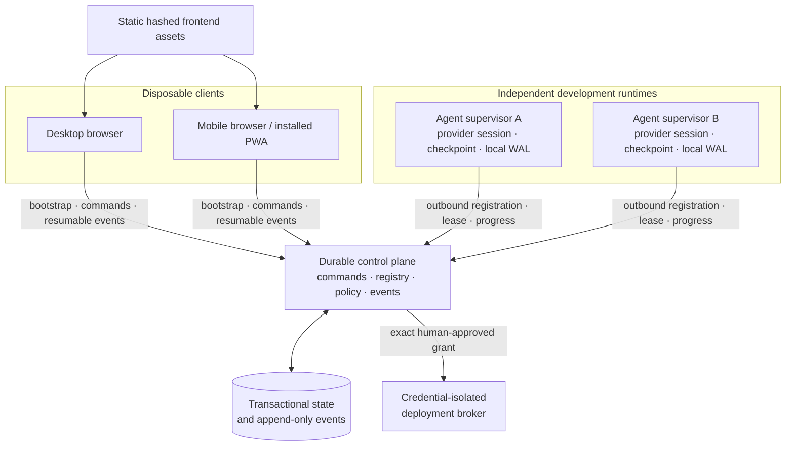

# Frontend-independent Steward

**Status** — working alpha boundary with live HTTP/SSE transport · **Author** — Cicada · **Date** — 2026-07-18 · **Scope** — browser, control-plane, registry, and agent-runtime boundaries; excludes provider isolation and production deployment.

## Summary

Steward's web application should be a disposable operator console. Serving, restarting, or upgrading the frontend must not start, stop, own, or mutate an agent. Independent agent runtimes register with a durable control plane, renew leases, execute development work, and record progress whether or not any browser is open. When a desktop or mobile client returns, it loads one authoritative snapshot and resumes an ordered event stream to find every registered agent automatically.

This requires a backend, but not an application server that owns the agents. The static frontend depends on a separately deployed control-plane API. The control plane owns durable human commands, queues, roles, evidence, approvals, the agent registry, and the event cursor. Agent supervisors own processes, provider sessions, checkpoints, and a local write-ahead journal. The browser owns only presentation state.

The production invariant is:

> Frontend lifecycle never owns or stops agent execution. An unavailable frontend removes that client's visibility and control surface, but running development work remains owned by supervisors; production authority never lives in the frontend.

## Terms

- The **frontend** is the static React/Tailwind console used on desktop and mobile. A browser tab is never a worker or scheduler.
- The **control plane** is the authoritative API, command log, registry, event store, and policy boundary. It is deployed independently from the frontend.
- An **agent supervisor** is a long-lived daemon or sidecar that owns one or more provider processes and registers them outbound with the control plane.
- An **agent lane** is a stable identity and queue destination. It survives browser sessions, provider runs, supervisor restarts, and temporary disconnection.
- An **agent task** is one durable unit of assigned agent work. Its actual timing and estimate survive replaceable provider runs; it is never a human approval or decision task.
- A **runtime instance** is one incarnation of a supervisor owning an agent lane. The control plane issues a monotonically increasing runtime epoch with compare-and-swap registration, so stale and concurrent instances are fenced before they can mutate the lane.
- A **lease** is the supervisor's renewable proof of liveness. Lease expiry changes visibility to stale or offline; it never implies that work succeeded.
- A **snapshot** is an authoritative workspace projection at one event sequence.
- A **cursor** is the last contiguous event sequence applied by a frontend.
- **Auto-location** means reconciling registered agent lanes from the control-plane registry. It does not mean scanning a LAN, browser, shell history, or operating-system process table.

## Boundary and topology

Neither the frontend host nor a browser has a network path to a provider process. Agent supervisors connect outbound, which works behind NAT and avoids exposing local agent ports to mobile clients. The frontend knows one control-plane origin, not every runtime address.

## Authoritative ownership

| State | Owner | Browser behavior |
|---|---|---|
| Agent identity, role, capabilities, runtime epoch, and lease | Control plane, asserted by authenticated supervisor | Render the latest projection |
| Current run, R → P → E → T progress, journal, checkpoint, and evidence | Agent runtime plus durable control-plane events | Inspect; never fabricate worker events |
| Agent-task start, end, pause history, and completion forecast | Control plane from authenticated runtime events and server time | Format and display; never derive authoritative timing from the browser clock |
| Human queue, interrupt intent, pause, product decisions, and approval | Control plane | Submit idempotent commands |
| Production grant and one-time consumption | Control plane and deployment broker | Request or inspect only |
| Filters, selected panel, drafts, density, and theme | Browser | May persist locally |
| Canonical agents, queues, runs, approvals, audit, and pause state | Never the browser | Must not persist as authoritative state |

An optional browser cache may improve cold-start rendering, but it is marked stale until a new bootstrap succeeds. A frontend schema change may discard that cache; it cannot reset control-plane state.

## Agent-task timing

Task timing answers two different questions: what actually happened, and how much agent work remains. It does not predict when a person will review something.

- `startedAt` and `endedAt` are exact runtime-reported timestamps accepted through the authenticated event stream and bounded against server receipt time. A provider-run replacement does not reset `startedAt`, and a provider process ending does not by itself set `endedAt`. Production should retain reported and receipt time separately.
- `expectedAgentMinutes` is agent model-and-tool time only. It must be a positive multiple of 15 minutes. Queued work carries this duration estimate but has no absolute completion time before an agent starts it.
- `expectedCompletedAt` is calculated from task start plus expected agent time and is rounded upward to `:00`, `:15`, `:30`, or `:45`. The control plane authors it; the frontend only formats it.
- A human interruption or workspace pause holds the forecast without ending the task. On resume, the same task keeps its original start and its forecast moves by the closed human-wait interval.
- Human scope checks, product decisions, manager-to-human handoffs, and production approvals record their actual opened and resolved times. They never receive an agent estimate or an “expected by” label.

The implemented domain contract and persistence validator live in [`../src/domain/agent-task.ts`](../src/domain/agent-task.ts) and [`../src/demo-persistence.ts`](../src/demo-persistence.ts). The discovery contract exposes task timing separately from the active provider run in [`../src/control-plane/contract.ts`](../src/control-plane/contract.ts), so a returning frontend can reconstruct both without conflating them.

## Agent registration and auto-location

An installed supervisor receives a workload identity and workspace assignment. It registers each lane with:

- stable `agentId` and `laneId`;
- unique `runtimeInstanceId`; the control plane returns a new `runtimeEpoch` after a successful ownership claim;
- fixed role and server-authorized capabilities;
- provider and external session references kept out of the public UI projection where sensitive;
- active run and checkpoint references;
- software version and compatibility range; and
- renewable lease timestamps.

Registration is an authenticated compare-and-swap operation. The control plane atomically advances the epoch when it grants a new runtime instance ownership; every later lease and event carries that fencing token. Events from an older instance are rejected. Restarting a supervisor therefore reconnects the same lane instead of producing a duplicate agent. An offline lane remains in the registry and retains its queue and history until an authorized retirement command removes it.

The frontend discovers agents through the workspace snapshot. A newly registered agent arrives as a complete `agent_upserted` event. A returning client receives it in the next snapshot even if it was created while the frontend was unavailable. Arbitrary unmanaged Claude, Codex, or shell processes cannot be identified safely; they need a Steward supervisor or provider adapter before they can be auto-located.

## Frontend bootstrap and reconnect

The frontend deployment contains only a workspace slug and one control-plane origin. A self-hosted deployment may publish those values from `/.well-known/steward.json`; they are configuration, not agent state. Bootstrap returns origin-relative API paths, which the gateway resolves only against that configured origin rather than trusting a server-supplied second host.

On every cold start or recovery:

1. Authenticate the human with the control plane.
2. Request a bootstrap containing permissions, an authoritative workspace snapshot at sequence `N`, event-retention metadata, and command/event endpoints. The alpha snapshot includes the agent registry, queues, tasks, and RPET progress; reviews, approvals, and bounded history pagination remain future work.
3. Validate the API version, identities, versions, leases, and snapshot timestamp.
4. Replace the in-memory replica atomically.
5. Open a server-sent event stream after sequence `N`.
6. Apply only contiguous events. Exact replays are idempotent; reused IDs, conflicting versions, regressions, or gaps invalidate the replica.
7. Re-bootstrap after a gap, retention miss, incompatible API version, or reconciliation conflict.

The transactionally consistent snapshot at sequence `N`, combined with replay of every retained event after `N`, closes the discovery/live-update race. Merely fetching a snapshot and then opening a non-replayable stream would not. A periodic low-frequency snapshot comparison may be used as a safety net, but the stream is never the database.

Stream termination is typed rather than reduced to a generic error: transient network/server shutdown retries from the cursor, authentication expiry requires reauthentication, retention miss requires a new bootstrap, and incompatible protocol becomes read-only. The frontend retains only a bounded recent replay window; a duplicate older than that window also forces a fresh snapshot instead of growing browser memory indefinitely.

The implemented frontend types, bootstrap validation, and fail-closed reconciliation logic live in [`../src/control-plane/contract.ts`](../src/control-plane/contract.ts) and [`../src/control-plane/reconciliation.ts`](../src/control-plane/reconciliation.ts). Their tests cover snapshots, bootstrap metadata, dynamic registration, bounded duplicate delivery, sequence gaps, conflicts, retirement, identity replacement, lease aging, and command causation in [`../src/control-plane/reconciliation.test.ts`](../src/control-plane/reconciliation.test.ts).

## Frontend API seam

The React tree should depend on one `ControlPlaneGateway` rather than importing trusted policy engines or worker identities.

| Operation | Purpose |
|---|---|
| `GET /v1/ui/bootstrap` | Authenticated permissions and an authoritative workspace snapshot; the implemented first slice is agent discovery |
| `GET /v1/ui/events?after=N` | Resumable, sequenced server-sent events; returns a re-bootstrap signal when `N` is outside retention |
| `POST /v1/ui/commands` | Durable human intent with command ID and expected entity version |

Runtime registration uses a separate workload-authenticated API. A browser credential cannot call it, acknowledge an interrupt, publish observer output, or consume a deployment grant.

Every frontend command carries a client-generated UUID that is retained across network retries, a typed compare-and-swap precondition for its exact lane, workspace, or approval resource, and a diagnostic client timestamp. The target identity appears only in that precondition, so two command fields cannot name different lanes or approvals. Agent heartbeat traffic advances a projection version but not the lane's control version, so liveness updates do not create spurious human-command conflicts. The server deduplicates the UUID, validates authorization and the target's control version, commits the intent, and assigns the authoritative sequence plus a nondecreasing workspace commit timestamp in one transaction. Reusing an ID with different content returns a non-retryable command-ID conflict.

A `queue_work` command includes the result-oriented outcome and `expectedAgentMinutes`. The estimate is part of the idempotent command content: retrying the same command ID with a different duration is a conflict, not a silent revision.

An `accepted` or `duplicate` receipt returns the original committed intent-event sequence. If a new snapshot has already passed that sequence, the UI knows the intent is included even though its live event will not be replayed. The receipt does not prove that an agent stopped, resumed, changed work, or deployed anything; those later runtime outcomes require their own events. This distinction is especially important when a browser closes immediately after requesting an interrupt.

## Independent rollout and compatibility

Frontend assets are content-hashed and may be deployed or rolled back without a runtime rollout. The control plane serves at least the current and previous UI protocol during a rolling upgrade. Bootstrap advertises optional features separately from human permissions: an unsupported feature is hidden or read-only, while an unauthorized feature remains forbidden even if the server supports it.

Every snapshot and event carries the UI API version. A client that receives an incompatible version stops applying events and shows an upgrade-required, read-only state; it never resets authoritative data or falls back to demo records. Supervisor/control-plane protocol versions are negotiated separately, so a frontend release cannot trigger supervisor restart, drain, or adoption behavior.

## Failure behavior

| Failure | Agent behavior | Frontend behavior | Safety boundary |
|---|---|---|---|
| Frontend host is down or redeploying | Unchanged; current runs, leases, observer jobs, and queues continue | That client's visibility and new human actions are unavailable unless another authenticated client is usable | No browser lifecycle event is written as an agent event |
| Browser closes or loses network | Unchanged | On return, bootstrap and resume from authoritative sequence | Pending commands are reconciled by their stable command IDs |
| Event stream disconnects | Unchanged | Reconnect after last contiguous sequence; re-bootstrap on gap | Duplicates cannot create duplicate state or actions |
| Agent supervisor disappears | Its lease expires; no success is inferred | Lane becomes stale, then offline, with last evidence retained | Scheduler fences the runtime epoch and does not fabricate completion |
| Supervisor restarts | Re-register the stable lane with a new instance and epoch; replay local WAL | Receive an upsert and subsequent progress events | Old instances cannot continue writing |
| Control plane is temporarily unavailable | Finish only the current non-interruptible development action, journal it to the local outbox, then checkpoint and hold | Show the last snapshot as stale/read-only | No new assignment, authority change, human decision, replacement owner, or production grant while disconnected |
| Deployment broker is unavailable | Development work is unaffected | Approved release remains pending only while its grant is valid | Broker consumes only an unexpired exact grant; expiry requires a new human authorization |

Frontend independence is not control-plane high availability. The control plane still needs replicated storage, backups, and an availability objective. The separation ensures a frontend upgrade cannot become a control-plane or runtime outage.

## Worked restart example

At 10:00, a browser has applied event 100 and closes for a frontend deployment. An engineer continues through Execute and Test, writes journal events 101–112, and a manager agent writes review events 113–114. No browser is involved in producing them.

At 10:08, the new frontend begins bootstrap and receives a snapshot at sequence 114. While that snapshot is being produced or delivered, the manager writes events 115–117. The frontend renders the snapshot, subscribes after 114, and applies 115–117. If event 116 is delivered twice, the second copy is ignored. If the stream starts at 117, the client detects the missing 115–116 range and replaces its replica from a new snapshot. It never guesses the missing state.

## Implementation state

The migration now has two explicit surfaces:

1. `/live` is the authoritative runtime console. It uses the typed gateway, snapshot-plus-SSE reconciliation, stable command IDs, workload registration, leases, server-issued epochs, local supervisor outboxes, and runtime-confirmed interrupt settlement described above.
2. Routes backed by `App.tsx` remain a clearly separate local product demo for missions, review, and approval interaction design. Their browser persistence and timers are not runtime evidence.

The next migration slice is reviews and approvals: project the manager-review coordinator's evidence and production checks into the authoritative control-plane stream, add the corresponding `/live` views, and then retire the equivalent browser-generated events. Until that is complete, the UI must continue to distinguish demo data from `/live` data.

## Relevant reference patterns

**Observed in Paperclip** — Paperclip separates durable wake requests from execution runs and stores per-run sequenced events. Its browser live-event channel is process-local and non-replayable; after reconnect, the UI invalidates and refetches the live-runs query because missed socket events cannot yet be replayed. **Steward recommendation** — retain durable state as authoritative, add a resumable workspace cursor, and keep the human queue as a separate durable concept ([wake-request schema](https://github.com/paperclipai/paperclip/blob/f12bb27bcd1b36148090d6922a85bf1611d327e0/packages/db/src/schema/agent_wakeup_requests.ts), [run-event schema](https://github.com/paperclipai/paperclip/blob/f12bb27bcd1b36148090d6922a85bf1611d327e0/packages/db/src/schema/heartbeat_run_events.ts), [in-memory live-event service](https://github.com/paperclipai/paperclip/blob/f12bb27bcd1b36148090d6922a85bf1611d327e0/server/src/services/live-events.ts), [UI reconnect behavior](https://github.com/paperclipai/paperclip/blob/f12bb27bcd1b36148090d6922a85bf1611d327e0/ui/src/context/LiveUpdatesProvider.tsx#L1351-L1426)).

Paperclip's built-in Summarizer also supports the headless boundary: it is read-and-report only, uses a cheap profile, and writes revisioned source-linked summaries rather than requiring an open UI ([Summarizer instructions](https://github.com/paperclipai/paperclip/blob/f12bb27bcd1b36148090d6922a85bf1611d327e0/server/src/built-ins/agents/summarizer/AGENTS.md), [summary-slot service](https://github.com/paperclipai/paperclip/blob/f12bb27bcd1b36148090d6922a85bf1611d327e0/server/src/services/summary-slots.ts)).

Paperclip's durable records are useful control-plane references, but its scheduler and managed child processes normally belong to its server lifecycle. Steward's permanently independent supervisors and outage outbox are additions, not Paperclip behavior ([Paperclip server shutdown](https://github.com/paperclipai/paperclip/blob/f12bb27bcd1b36148090d6922a85bf1611d327e0/server/src/index.ts#L1200-L1239)).

Paseo is a useful execution-plane reference because a daemon owns sessions and exposes remote orchestration instead of tying a worker to one browser. Steward adds a durable, multi-user policy and registry boundary above that execution model ([Paseo orchestration documentation](https://paseo.sh/docs/orchestration)).

## Limits and open risks

- A returning frontend still needs one configured control-plane origin. No secure system can discover unrelated agent processes from a mobile browser with zero bootstrap information.
- Auto-location covers authenticated, supervised agents only. Adoption must include supervisor installers and adapters for supported Codex and Claude environments.
- `/live` implements registry, queue, task timing, current action, RPET progress, human runtime control, and impact summaries. Evidence, manager review, and production-check projections are not yet part of that authoritative console.
- Atomic-action boundaries and checkpoint deadlines require threat modeling and adapter tests. A runtime must not label a long, multi-tool plan as one non-interruptible action.
- Local progress replay uses event IDs, accepted-prefix reconciliation, and server-issued runtime epochs. Replicated-store conflict handling and multi-instance control-plane ownership remain production work.
- Event retention, snapshot compaction, API compatibility windows, supervisor upgrades, and workspace disaster recovery remain production work.
- Visibility is a report from an authenticated runtime, not proof of correctness. Reviewers still need repository, test, artifact, and CI evidence.

## Alternatives Considered

- **Let browsers scan for agent processes** — rejected because mobile browsers cannot enumerate operating-system processes, LAN discovery fails across networks and NAT, and an unauthenticated advertisement is easy to spoof. Supervisors register outbound with workload identity instead.
- **Connect the browser directly to each agent** — rejected because it exposes runtime ports and credentials, multiplies protocols, loses durable commands while offline, and makes multi-user ordering unreliable.
- **Make browser storage authoritative** — rejected because clearing storage, opening a second tab, or deploying a new schema can reset or overwrite the apparent system.
- **Host scheduling and observer timers in the frontend** — rejected because closing the last tab would pause work and a frontend update could manufacture worker state transitions.
- **Use polling as the only discovery transport** — rejected because it increases latency and needless traffic. An authoritative snapshot plus resumable events provides immediate updates and bounded recovery; slow polling may remain a safety net.
- **Treat a WebSocket as authoritative state** — rejected because sockets disconnect and do not provide durable history. Live transport carries sequenced facts that already exist in storage.
- **Delete an agent when its lease expires** — rejected because loss of contact is not retirement. The lane, queue, evidence, and last checkpoint must remain visible as stale or offline.
- **Let disconnected runtimes continue a development grace period** — rejected for the first production version because another runtime could acquire the lane while the disconnected process still has filesystem or network side effects. Finish the current indivisible action, checkpoint, and hold; a future offline lease would require hard-expiry enforcement in every tool and workspace.
