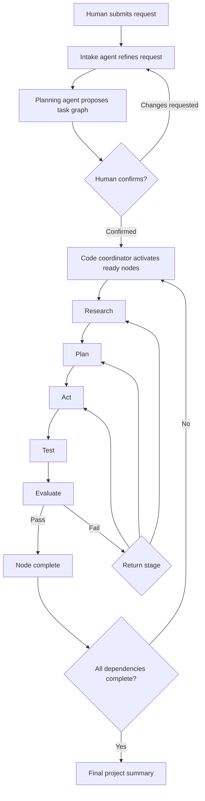

# Transparent Agent Workflow

**Status** — implemented · **Author** — Cicada · **Date** — 2026-07-26 · **Scope** — editable skills, confirmed task graphs, deterministic stage orchestration, compact agent handoffs, live project progress, diagrams, and image artifacts; excludes deployment automation and arbitrary agent-to-agent activation.

## Summary

Nexus Seventeen will turn a human request into a visible, versioned plan and run each confirmed subtask through Research → Plan → Act → Test → Evaluate. A low-cost intake agent may interpret ambiguous language, but ordinary code owns dependencies, stage transitions, retries, and permissions.

Four records define the workflow:

- A **work item** preserves the human’s original request.
- A **plan revision** proposes a set of subtasks and dependencies for human confirmation.
- A **work node** is one confirmed subtask in that dependency graph.
- A **stage attempt** is one existing board task assigned to a specialist for one stage.

Agents never wake each other. They return structured handoffs; the task board validates each handoff and creates the next allowed attempt. The project dashboard shows the plan, dependencies, stage history, progress posts, decisions, diagrams, and images as durable board data.

## User flow



The confirmation screen shows the rewritten objective, assumptions, acceptance criteria, selected project, proposed specialists, subtasks, and dependency diagram. No implementation stage starts before confirmation.

## Ownership

| Concern | Owner |
|---|---|
| Interpret an ambiguous request | Intake or planning agent |
| Propose subtasks and dependencies | Planning agent |
| Confirm initial scope or material revisions | Human |
| Validate graph shape and permissions | Task-board code |
| Choose the configured executor for a stage | Task-board code |
| Perform bounded stage work | Specialist agent |
| Recommend a corrective return stage | Evaluator |
| Enforce retry limits and perform transitions | Task-board code |
| Persist history, events, and artifacts | Task board |

An agent may propose a plan change but cannot apply it. This keeps authority and failure recovery inspectable.

## Editable skills

Skills become repository-owned sections in one file:

```text
config/skills.md
  ## cicada-software-implementation
  ## cicada-web-interface-design
```

Each section body uses the existing frontmatter shape:

```yaml
---
name: cicada-software-implementation
description: Execute a confirmed implementation stage.
---
```

The remainder is Markdown instructions. The catalog and automation configuration continue to reference lowercase `skillIds`.

**Load-time trust** — the board reads only validated sections from the regular, non-symlinked `config/skills.md` file, enforces per-skill limits, and computes a SHA-256 digest. Confirmation pins selected digests. If a referenced section changes before an attempt launches, that attempt stops visibly instead of silently using different instructions.

**Compact prompts** — a worker receives only the stage’s pinned skills, direct dependency handoffs, acceptance criteria, relevant project memory, and referenced artifacts. It does not receive the full project transcript or unrelated skills.

The first version edits skills through normal repository tools. A browser editor is optional because it adds write authorization, review, and deployment concerns unrelated to orchestration.

## Durable task graph

The SQLite board gains:

- `plan_revisions` — immutable proposed or confirmed plans for one work item;
- `work_nodes` — stable subtask identities and current stage;
- `work_node_dependencies` — directed dependency edges;
- `stage_attempts` — links a work node and stage to an existing `tasks` row;
- `stage_handoffs` — structured outputs from completed attempts;
- `artifacts` — immutable metadata for diagrams, images, and files;
- `project_events` — ordered project-wide events for replayable UI updates.

A confirmed plan revision contains:

```ts
interface PlanRevision {
  workItemId: string;
  revision: number;
  objective: string;
  assumptions: string[];
  acceptanceCriteria: string[];
  projectId: string;
  skillDigests: Record<string, string>;
  state: "proposed" | "confirmed" | "superseded" | "rejected";
}

interface WorkNode {
  nodeId: string;
  title: string;
  objective: string;
  acceptanceCriteria: string[];
  dependencyNodeIds: string[];
  stageTemplate: WorkflowStage[];
  state: "pending" | "ready" | "active" | "blocked" | "stale" | "completed" | "cancelled";
}

type WorkflowStage =
  | "research"
  | "planning"
  | "implementation"
  | "testing"
  | "verification";
```

Stage templates are configurable but must end in an evaluator stage. The initial template is Research → Planning → Implementation → Testing → Verification.

Graph validation is deterministic:

- node IDs are unique;
- dependencies reference nodes in the same revision;
- the graph is acyclic;
- at least one root node exists;
- each node has bounded text and node count;
- every stage has an enabled agent type;
- the selected agent role cannot exceed the stage’s authority;
- implementation waits until all dependencies complete.

## Structured handoffs

Each stage attempt returns:

```ts
interface StageHandoff {
  outcome: "passed" | "failed" | "needs_input";
  summary: string;
  evidence: EvidenceReference[];
  artifactIds: string[];
  acceptanceCriteria: CriterionResult[];
  blockers: string[];
  proposedPlanChange: PlanChangeProposal | null;
  recommendedReturnStage: WorkflowStage | null;
}
```

The coordinator accepts the handoff only when it matches the active node, attempt, plan revision, stage, and pinned skill set.

Evaluator failures may recommend returning to research, planning, implementation, or testing. Code checks that the transition is allowed and below the retry limit. Ambiguous failures pause for a human rather than guessing.

## Changing a plan

The current version allows replacing an unconfirmed proposal. Once confirmed, its graph is immutable; scope changes require a new work item. This deliberately avoids exposing revision controls before stale-node and active-attempt semantics exist.

## Live progress and visibility

Every meaningful mutation appends a `project_event` in the same SQLite transaction:

- plan proposed, confirmed, or revised;
- node ready, blocked, stale, or completed;
- stage started, progressed, failed, or completed;
- question asked or answered;
- update posted;
- artifact attached;
- dependency unblocked.

The task board exposes a project SSE endpoint with a monotonic cursor. Reconnection resumes after the last observed cursor; the browser periodically reloads the authoritative snapshot to recover from missed or compacted events.

Agents post short progress messages at stage boundaries and meaningful discoveries. Provider reasoning, raw commands, and tool output remain private.

The project dashboard provides:

- overall acceptance-criteria progress;
- dependency graph and critical blockers;
- expandable nodes with stage attempts and handoffs;
- live activity timeline;
- pending human decisions;
- artifact gallery;

## Diagrams and images

Artifacts are immutable blobs stored outside SQLite under a configured private artifact root. SQLite stores the ID, project, node, attempt, media type, byte size, digest, caption, and creator.

Initial media types:

- `text/markdown`;
- `text/vnd.mermaid`;
- `image/png`;
- `image/jpeg`;
- `image/webp`;
- `image/svg+xml` after sanitization.

Mermaid source is rendered in the browser using strict mode and no HTML labels. Images are served through authenticated, same-origin endpoints with content sniffing disabled. Uploads have explicit size, pixel, and aggregate project limits.

Humans can upload artifacts from the project dashboard. Handoffs may reference validated artifact IDs; binary data is never inserted into prompts.

## Token budget

Each stage prompt has a deterministic budget:

1. stable role and stage instructions;
2. pinned, relevant skills only;
3. node objective and acceptance criteria;
4. direct dependency handoff summaries;
5. selected artifact metadata;
6. recent messages for this node only.

The worker enforces an overall serialized context limit and per-field bounds. Prompt digests and separate token-budget telemetry are not implemented.

## Failure and recovery

- Coordinator transitions are idempotent SQLite transactions.
- Only one active attempt exists for a node and stage.
- Existing worker journals protect the model launch and settlement boundary.
- A coordinator crash leaves confirmed nodes discoverable and safe to reconcile.
- Retry counts are stored per stage, not in memory.
- Missing skills, changed digests, invalid graphs, or unavailable executors pause the workflow visibly.
- Cancelling a plan does not delete its tasks, handoffs, events, or artifacts.

## Rollout

The workflow is introduced without changing existing manually created tasks:

1. Add skill loading and immutable snapshots.
2. Add plan revisions, nodes, dependencies, handoffs, and artifacts.
3. Add coordinator transitions behind a disabled configuration flag.
4. Add confirmation and project-dashboard views.
5. Enable refinement and planning for new work items.
6. Enable automatic post-confirmation stages after end-to-end evaluation.

Existing tasks remain visible and manually operated. Rollback disables new coordinator transitions; persisted workflow records remain readable.

## Alternatives Considered

**One orchestrator LLM** — rejected because stage transitions, retries, and permissions would be probabilistic, expensive, and difficult to audit.

**Direct agent-to-agent handoff** — rejected because it obscures authority, permits duplicate activation, and makes recovery dependent on model behavior.

**One long-lived agent session** — rejected because it hides stage boundaries, couples recovery to provider session state, and repeatedly carries unrelated context.

**MCP as the internal workflow engine** — deferred. Internal typed APIs are simpler while contracts are evolving. A later MCP adapter can expose the same board operations to external agents without becoming the source of truth.

**Store binary artifacts in SQLite** — rejected because large images would inflate transactional backups and snapshots. SQLite stores immutable metadata; a private artifact root stores content-addressed blobs.
