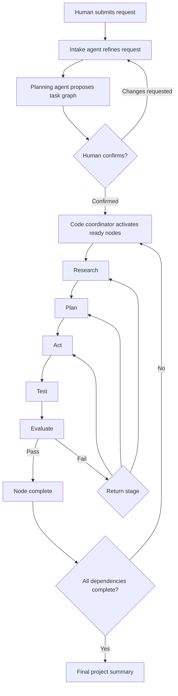

# Transparent Agent Workflow

**Status** — proposed · **Author** — Cicada · **Date** — 2026-07-26 · **Scope** — editable skills, confirmed task graphs, deterministic stage orchestration, compact agent handoffs, live project progress, diagrams, and image artifacts; excludes deployment automation and arbitrary agent-to-agent activation.

## Summary

Nexus Seventeen will turn a human request into a visible, versioned plan and run each confirmed subtask through Research → Plan → Act → Test → Evaluate. A low-cost intake agent may interpret ambiguous language, but ordinary code owns dependencies, stage transitions, retries, and permissions.

Four records define the workflow:

- A **work item** preserves the human’s original request.
- A **plan revision** proposes a set of subtasks and dependencies for human confirmation.
- A **work node** is one confirmed subtask in that dependency graph.
- A **stage attempt** is one existing board task assigned to a specialist for one stage.

Agents never wake each other. They return structured handoffs; the task board validates each handoff and creates the next allowed attempt. The project dashboard shows the plan, dependencies, stage history, progress posts, decisions, diagrams, and images as durable board data.

## User flow



The confirmation screen shows the rewritten objective, assumptions, acceptance criteria, selected project, proposed specialists, subtasks, and dependency diagram. No implementation stage starts before confirmation.

## Ownership

| Concern | Owner |
|---|---|
| Interpret an ambiguous request | Intake or planning agent |
| Propose subtasks and dependencies | Planning agent |
| Confirm initial scope or material revisions | Human |
| Validate graph shape and permissions | Task-board code |
| Choose the configured executor for a stage | Task-board code |
| Perform bounded stage work | Specialist agent |
| Recommend a corrective return stage | Evaluator |
| Enforce retry limits and perform transitions | Task-board code |
| Persist history, events, and artifacts | Task board |

An agent may propose a plan change but cannot apply it. This keeps authority and failure recovery inspectable.

## Editable skills

Skills become repository-owned files:

```text
skills/
  cicada-software-implementation/
    SKILL.md
  cicada-web-interface-design/
    SKILL.md
```

`SKILL.md` uses the existing frontmatter shape:

```yaml
---
name: cicada-software-implementation
description: Execute a confirmed implementation stage.
---
```

The remainder is Markdown instructions. The catalog and automation configuration continue to reference lowercase `skillIds`.

**Load-time trust** — the board reads only `skills/<validated-id>/SKILL.md`, rejects symlinks and path traversal, enforces per-skill and aggregate byte limits, and computes a SHA-256 digest. Confirmation pins the selected skill IDs and digests to the plan revision. Editing a skill affects future confirmed revisions, never an active attempt.

**Compact prompts** — a worker receives only the stage’s pinned skills, direct dependency handoffs, acceptance criteria, relevant project memory, and referenced artifacts. It does not receive the full project transcript or unrelated skills.

The first version edits skills through normal repository tools. A browser editor is optional because it adds write authorization, review, and deployment concerns unrelated to orchestration.

## Durable task graph

The SQLite board gains:

- `plan_revisions` — immutable proposed or confirmed plans for one work item;
- `work_nodes` — stable subtask identities and current stage;
- `work_node_dependencies` — directed dependency edges;
- `stage_attempts` — links a work node and stage to an existing `tasks` row;
- `handoffs` — structured outputs from completed attempts;
- `artifacts` — immutable metadata for diagrams, images, and files;
- `project_events` — ordered project-wide events for replayable UI updates.

A confirmed plan revision contains:

```ts
interface PlanRevision {
  workItemId: string;
  revision: number;
  objective: string;
  assumptions: string[];
  acceptanceCriteria: string[];
  projectId: string;
  skillDigests: Record<string, string>;
  state: "proposed" | "confirmed" | "superseded" | "rejected";
}

interface WorkNode {
  nodeId: string;
  title: string;
  objective: string;
  acceptanceCriteria: string[];
  dependencyNodeIds: string[];
  stageTemplate: WorkflowStage[];
  state: "pending" | "ready" | "active" | "blocked" | "stale" | "completed" | "cancelled";
}

type WorkflowStage =
  | "research"
  | "planning"
  | "implementation"
  | "testing"
  | "verification";
```

Stage templates are configurable but must end in an evaluator stage. The initial template is Research → Planning → Implementation → Testing → Verification.

Graph validation is deterministic:

- node IDs are unique;
- dependencies reference nodes in the same revision;
- the graph is acyclic;
- at least one root node exists;
- each node has bounded text and node count;
- every stage has an enabled agent type;
- the selected agent role cannot exceed the stage’s authority;
- implementation waits until all dependencies complete.

## Structured handoffs

Each stage attempt returns:

```ts
interface StageHandoff {
  outcome: "passed" | "failed" | "needs_input";
  summary: string;
  evidence: EvidenceReference[];
  artifactIds: string[];
  acceptanceCriteria: CriterionResult[];
  blockers: string[];
  proposedPlanChange: PlanChangeProposal | null;
  recommendedReturnStage: WorkflowStage | null;
}
```

The coordinator accepts the handoff only when it matches the active node, attempt, plan revision, stage, and pinned skill set.

Evaluator failures may recommend returning to research, planning, implementation, or testing. Code checks that the transition is allowed and below the retry limit. Ambiguous failures pause for a human rather than guessing.

## Changing a plan

History is never rewritten.

1. An agent or human submits a plan-change proposal with reasons and affected nodes.
2. Code validates a new graph revision.
3. Small changes within confirmed scope may be accepted automatically:
   - split a pending node;
   - add a missing test;
   - clarify implementation detail;
   - adjust an estimate.
4. Material changes require human confirmation:
   - objective or acceptance-criteria changes;
   - new project, permissions, or external effects;
   - cancellation of active work;
   - substantial scope expansion.
5. Completed nodes remain immutable. Affected pending nodes become `stale`; active attempts finish or are explicitly interrupted. The new revision records what changed and why.

## Live progress and visibility

Every meaningful mutation appends a `project_event` in the same SQLite transaction:

- plan proposed, confirmed, or revised;
- node ready, blocked, stale, or completed;
- stage started, progressed, failed, or completed;
- question asked or answered;
- update posted;
- artifact attached;
- dependency unblocked.

The task board exposes a project SSE endpoint with a monotonic cursor. Reconnection resumes after the last observed cursor; the browser periodically reloads the authoritative snapshot to recover from missed or compacted events.

Agents post short progress messages at stage boundaries and meaningful discoveries. Provider reasoning, raw commands, and tool output remain private.

The project dashboard adds:

- overall acceptance-criteria progress;
- dependency graph and critical blockers;
- expandable nodes with stage attempts and handoffs;
- live activity timeline;
- pending human decisions;
- artifact gallery;
- plan-revision comparison.

## Diagrams and images

Artifacts are immutable blobs stored outside SQLite under a configured private artifact root. SQLite stores the ID, project, node, attempt, media type, byte size, digest, caption, and creator.

Initial media types:

- `text/markdown`;
- `text/vnd.mermaid`;
- `image/png`;
- `image/jpeg`;
- `image/webp`;
- `image/svg+xml` after sanitization.

Mermaid source is rendered in the browser using strict mode and no HTML labels. Images are served through authenticated, same-origin endpoints with content sniffing disabled. Uploads have explicit size, pixel, and aggregate project limits.

Artifacts are passed to agents as metadata and authorized file references. Binary data is never inserted into prompts.

## Token budget

Each stage prompt has a deterministic budget:

1. stable role and stage instructions;
2. pinned, relevant skills only;
3. node objective and acceptance criteria;
4. direct dependency handoff summaries;
5. selected artifact metadata;
6. recent messages for this node only.

When the budget is exceeded, code truncates optional history before required contracts. It never silently drops acceptance criteria, dependency handoffs, or human answers. Prompt digests and byte counts are recorded for audit, but prompt contents and model reasoning are not.

## Failure and recovery

- Coordinator transitions are idempotent SQLite transactions.
- Only one active attempt exists for a node and stage.
- Existing worker journals protect the model launch and settlement boundary.
- A coordinator crash leaves confirmed nodes discoverable and safe to reconcile.
- Retry counts are stored per stage, not in memory.
- Missing skills, changed digests, invalid graphs, or unavailable executors pause the workflow visibly.
- Cancelling a plan does not delete its tasks, handoffs, events, or artifacts.

## Rollout

The workflow is introduced without changing existing manually created tasks:

1. Add skill loading and immutable snapshots.
2. Add plan revisions, nodes, dependencies, handoffs, and artifacts.
3. Add coordinator transitions behind a disabled configuration flag.
4. Add confirmation and project-dashboard views.
5. Enable refinement and planning for new work items.
6. Enable automatic post-confirmation stages after end-to-end evaluation.

Existing tasks remain visible and manually operated. Rollback disables new coordinator transitions; persisted workflow records remain readable.

## Implementation plan

```yaml
version: 1
status: ready_for_implementation
goal: A submitted work item can become a human-confirmed, live, inspectable task graph whose nodes advance through bounded specialist stages with editable pinned skills and durable artifacts.
non_goals:
  - Production deployment automation
  - Direct agent-to-agent wakeups
  - Browser editing of repository skill files
  - Arbitrary executable workflow definitions
must_haves:
  - Repository-owned editable SKILL.md files with digest pinning
  - Immutable plan revisions and acyclic dependency graphs
  - Human confirmation before implementation
  - Deterministic stage transitions and bounded retry routing
  - Structured handoffs and visible progress events
  - Authenticated Mermaid and image artifacts
  - Compact stage-specific prompt construction
contracts:
  - name: Workflow records
    location: src/shared/task-board-contract/index.ts
    decision: Add PlanRevision, WorkNode, StageAttempt, StageHandoff, Artifact, ProjectEvent, and their request types before backend or frontend work.
  - name: Skill file
    location: skills/<skill-id>/SKILL.md
    decision: Validated lowercase directory ID, YAML frontmatter name matching the ID, bounded Markdown body, and SHA-256 digest pinned by confirmed plan revision.
  - name: Worker launch context
    location: src/server/agents/task-worker/types.ts
    decision: Add plan/node/stage identity, pinned skill snapshots, direct dependency handoffs, artifact references, and prompt-budget metadata; omit unrelated project history.
  - name: Project event stream
    location: src/server/task-board/service.ts
    decision: Ordered per-project SSE with cursor replay and snapshot recovery.
tasks:
  - id: T1
    capability: backend
    depends_on: []
    paths: [src/shared/task-board-contract/index.ts, src/server/task-board/schema.ts, tests/shared/task-board-contract/contract.test.ts]
    action: Define and validate the frozen workflow, skill snapshot, handoff, artifact, and event contracts with explicit bounds.
    validation: npm run typecheck:all && npm run test:all
    done_when: Invalid graphs, handoffs, skill IDs, media types, and oversized payloads fail contract tests.
  - id: T2
    capability: backend
    depends_on: [T1]
    paths: [skills, src/server/task-board/skills.ts, catalog/company-bootstrap.json, scripts/bootstrap-lib.mjs]
    action: Add repository skill loading, frontmatter validation, symlink/path protection, digest computation, catalog reference validation, and initial skill files.
    validation: npm run test:bootstrap && npm run test:runtime
    done_when: Every configured skill resolves to one bounded file and confirmed revisions can pin immutable digests.
  - id: T3
    capability: backend
    depends_on: [T1]
    paths: [src/server/task-board/store.ts, src/server/task-board/board.ts, tests/server/task-board/board.test.ts]
    action: Add schema migration and transactional APIs for plan revisions, nodes, dependencies, stage attempts, handoffs, artifacts, and project events.
    validation: npm run test:runtime
    done_when: Graphs and histories survive restart, reject cycles, preserve completed nodes, and append events atomically.
  - id: T4
    capability: backend
    depends_on: [T2, T3]
    paths: [src/server/task-board/coordinator.ts, src/server/task-board/service.ts, src/server/task-board/http.ts, tests/server/task-board/http.test.ts]
    action: Implement idempotent coordinator reconciliation, confirmation, ready-node activation, executor selection, stage advancement, retries, and material-change pauses.
    validation: npm run test:runtime
    done_when: Code alone advances valid confirmed workflows and cannot bypass confirmation, dependencies, role ceilings, or retry limits.
  - id: T5
    capability: backend
    depends_on: [T1, T2, T3]
    paths: [src/server/agents/task-worker/types.ts, src/server/agents/task-worker/schema.ts, src/server/agents/task-worker/contained-cli-launcher.ts, src/server/agents/task-worker/agent-result.schema.json, tests/server/agents/task-worker]
    action: Add compact stage context, pinned skill bodies, structured handoffs, artifact references, and deterministic prompt budgets to worker execution.
    validation: npm run test:runtime
    done_when: Worker tests prove relevant-only context, digest binding, bounded prompts, and schema-valid handoffs.
  - id: T6
    capability: backend
    depends_on: [T3]
    paths: [src/server/task-board/artifacts.ts, src/server/task-board/service.ts, deploy/Caddyfile, tests/server/task-board/http.test.ts]
    action: Add authenticated immutable artifact upload/download and project SSE endpoints with replay cursors and configured storage limits.
    validation: npm run test:runtime && docker build -t nexus-seventeen:workflow-check .
    done_when: Authorized clients can replay events and retrieve validated artifacts while traversal, spoofed media, and oversized uploads are rejected.
  - id: T7
    capability: frontend
    depends_on: [T1, T3, T4, T6]
    paths: [src/web/task-board/client.ts, src/web/task-board/types.ts, src/web/task-board/BoardApp.tsx, src/web/task-board/WorkspacePages.tsx]
    action: Add refinement confirmation, graph, stage history, live event reconciliation, progress timeline, artifact gallery, and revision comparison using the frozen contracts.
    validation: npm run test:web && npm run test:e2e
    done_when: Desktop and mobile users can inspect, confirm, follow, and revise a workflow without hidden transitions or horizontal overflow.
  - id: T8
    capability: testing
    depends_on: [T4, T5, T6, T7]
    paths: [tests/e2e/task-board.spec.ts, tests/server/agents/task-worker/http-board-integration.test.ts]
    action: Add an end-to-end scenario covering refinement, confirmation, dependency gating, specialist stages, failed evaluation, corrective revision, live updates, diagram/image artifacts, and final completion.
    validation: npm run typecheck:all && npm run test:all && npm run test:e2e && npm run build
    done_when: The complete workflow survives restart and every state transition is visible and replayable.
integration_order: [T1, T2, T3, T4, T5, T6, T7, T8]
risks:
  - risk: Workflow tables duplicate existing task state.
    mitigation: Treat work nodes as logical plan state and existing tasks as immutable stage attempts linked by ID; never maintain a second execution status.
  - risk: Skill edits make active work irreproducible.
    mitigation: Pin content digests at confirmation and reject launch when the resolved content no longer matches.
  - risk: Live events become another authority.
    mitigation: Append events transactionally as projections and always recover from the board snapshot.
  - risk: Artifact rendering introduces script or file attacks.
    mitigation: Use strict media allowlists, authenticated delivery, CSP, Mermaid strict mode, SVG sanitization, and immutable digests.
  - risk: Automatic corrections loop indefinitely.
    mitigation: Persist per-stage retry limits and pause for human review when exhausted or ambiguous.
human_checkpoints:
  - Confirm the proposed plan before implementation begins.
  - Confirm material plan revisions that alter objective, acceptance criteria, project, permissions, or external effects.
```

## Alternatives Considered

**One orchestrator LLM** — rejected because stage transitions, retries, and permissions would be probabilistic, expensive, and difficult to audit.

**Direct agent-to-agent handoff** — rejected because it obscures authority, permits duplicate activation, and makes recovery dependent on model behavior.

**One long-lived agent session** — rejected because it hides stage boundaries, couples recovery to provider session state, and repeatedly carries unrelated context.

**MCP as the internal workflow engine** — deferred. Internal typed APIs are simpler while contracts are evolving. A later MCP adapter can expose the same board operations to external agents without becoming the source of truth.

**Store binary artifacts in SQLite** — rejected because large images would inflate transactional backups and snapshots. SQLite stores immutable metadata; a private artifact root stores content-addressed blobs.
