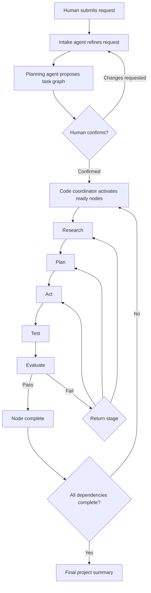
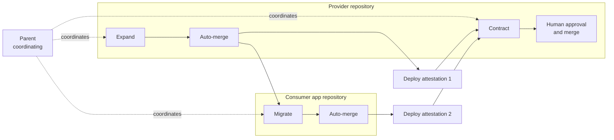

# Transparent Agent Workflow

**Status** — implemented · **Author** — Cicada · **Date** — 2026-08-29 · **Scope** — editable skills, confirmed task graphs, deterministic stage orchestration, parent/child decomposition, cross-repository interface changes, compact agent handoffs, live project progress, diagrams, and image artifacts; excludes deployment automation and arbitrary agent-to-agent activation.

## Summary

Nexus Seventeen turns a human request into a visible, versioned plan and runs each confirmed subtask through Research → Plan → Act → Test → Evaluate. A low-cost intake agent may interpret ambiguous language, but ordinary code owns dependencies, stage transitions, retries, and permissions.

Four records define the workflow:

- A **work item** preserves the human’s original request.
- A **plan revision** proposes a set of subtasks and dependencies for human confirmation.
- A **work node** is one confirmed subtask in that dependency graph.
- A **stage attempt** is one existing board task assigned to a specialist for one stage.

An ordinary work item owns one project, branch, and merge. A decomposed request instead has a branchless **parent** that coordinates independently mergeable **child work items**; each child still owns one project, branch, and merge, so one parent may span repositories without giving one agent cross-repository write authority.

Agents never wake each other. They return structured handoffs; the task board validates each handoff and creates the next allowed attempt. The project dashboard shows the plan, dependencies, stage history, progress posts, decisions, diagrams, and images as durable board data.

## User flow



The confirmation screen shows the rewritten objective, assumptions, acceptance criteria, selected project, proposed specialists, subtasks, and dependency diagram. No implementation stage starts before confirmation.

## Ownership

| Concern                                      | Owner                    |
| -------------------------------------------- | ------------------------ |
| Interpret an ambiguous request               | Intake or planning agent |
| Propose subtasks and dependencies            | Planning agent           |
| Confirm initial scope or material revisions  | Human                    |
| Validate graph shape and permissions         | Task-board code          |
| Choose the configured executor for a stage   | Task-board code          |
| Perform bounded stage work                   | Specialist agent         |
| Recommend a corrective return stage          | Evaluator                |
| Enforce retry limits and perform transitions | Task-board code          |
| Persist history, events, and artifacts       | Task board               |

An agent may propose a plan change but cannot apply it. This keeps authority and failure recovery inspectable.

## Decomposition and cross-repository coordination

Decomposition turns one approved request into a durable family. The parent owns coordination and human gates; children own executable repository changes. Only one level is allowed: a materialized child cannot declare more children.

### Phased family at a glance

The coordinating parent spans the family without owning a branch. Expand and Contract use the provider repository; Migrate uses the consumer repository.



The dependency and gate order comes from phased-plan validation, sibling-wide Contract readiness, and phase-selected merge policy (`validateWorkflowPlanChildren` in [`validate.ts`](../src/shared/task-board-contract/validate.ts), `decompositionReadinessBlocker` in [`decomposition-readiness.ts`](../src/server/task-board/collaborators/decomposition-readiness.ts), and `ProjectsCollaborator.decompositionMergePolicy` plus `ProjectsCollaborator.reconcileDecompositionParent` in [`projects.ts`](../src/server/task-board/collaborators/projects.ts)).

**Worked example — a provider API change used by one app.** Suppose a provider replaces a v1 endpoint with v2:

1. Expand keeps v1 available, adds v2, and updates `docs/interface.md`; the publication check runs during verification before Expand auto-merges.
2. Migrate receives that file at Expand’s recorded merge SHA, moves the app to v2, and auto-merges.
3. A human attests the deployed Expand and Migrate merges. Only then can Contract start.
4. Contract removes v1 from the provider, then waits for its own human approval and merge.

This example follows the implemented publication check, merge-SHA interface lookup, deployment-attestation gate, and Contract approval path (`RunsCollaborator.expandInterfacePublicationFailure` in [`runs.ts`](../src/server/task-board/collaborators/runs.ts), `migrateInterfaceProvider` in [`decomposition-readiness.ts`](../src/server/task-board/collaborators/decomposition-readiness.ts), `WorkItemsCollaborator.attestDeploy` in [`work-items.ts`](../src/server/task-board/collaborators/work-items.ts), and `ProjectsCollaborator.reconcileDecompositionParent` plus `ProjectsCollaborator.approvePipelineMerge` in [`projects.ts`](../src/server/task-board/collaborators/projects.ts)).

**Hard limits**

- **One level** — validation rejects a child plan that declares children (`validateWorkflowPlanChildren` in [`validate.ts`](../src/shared/task-board-contract/validate.ts)).
- **One repository per Project** — every child targets one board Project, and every Project has one `repo_path`. A product grouped into one Project but spanning several repositories, including Cicada Sense/HomeDots, cannot be decomposed across those repositories until repository identity is modeled separately from the product Project ([roadmap item 9.9](../orchestrator-roadmap.md#99-repository-identity-separate-from-the-product-project)).
- **No re-merge** — unphased fan-out skips merged children, and phased auto-merge considers only children in `final_approval`. Expand publication is enforced during verification before merge; a merged Expand is not reopened for that check (`ProjectsCollaborator.approveUnphasedParent` and `ProjectsCollaborator.reconcileDecompositionParent` in [`projects.ts`](../src/server/task-board/collaborators/projects.ts), and `RunsCollaborator.expandInterfacePublicationFailure` in [`runs.ts`](../src/server/task-board/collaborators/runs.ts)).
- **Phased failure has one exit** — an abandoned or dead-lettered Expand/Migrate keeps Contract blocked. Cancelling the parent is the only exit from that family (`decompositionReadinessBlocker` in [`decomposition-readiness.ts`](../src/server/task-board/collaborators/decomposition-readiness.ts) and `deriveDecompositionAffordances` in [`work-item-detail.ts`](../src/web/model/work-item-detail.ts)).

### Declaration and materialization

The plan gate shows every declared child before confirmation, including its objective, project, declared scope, acceptance criteria, phase, and dependencies. `DeclaredChild` stores those fields plus `splitBy`; confirmation therefore approves the split and the children’s work, not just the parent objective.

| Plan shape         | Split rule                                                                                                                                                                                                                                                                                     |
| ------------------ | ---------------------------------------------------------------------------------------------------------------------------------------------------------------------------------------------------------------------------------------------------------------------------------------------- |
| `mechanical_sweep` | Children are forbidden.                                                                                                                                                                                                                                                                        |
| `feature`          | Children are optional and unphased. Same-project sibling scopes must not overlap.                                                                                                                                                                                                              |
| `blast_radius`     | Children are required, and every child declares `splitBy: consumer` or `splitBy: phase`. An unphased split is allowed only when same-project scopes are disjoint; validation rejects every overlap.                                                                                            |
| Phased declaration | If one child has a phase, all do. There is exactly one Expand, at least one Migrate, and exactly one Contract. Every Migrate depends on Expand; Contract depends on every Migrate. The sequenced Expand/Contract pair is the only same-project overlap exempted from the disjoint-scope check. |

Keys are unique, dependencies remain inside the family, and cycles are rejected. Every unphased same-project overlap is rejected, as is an overlap between same-project Migrates. Expand and Contract are the ordered exception: both use the parent/provider project and both must cover `docs/interface.md`. Migrate children use other projects (`validateWorkflowPlanChildren` in [`validate.ts`](../src/shared/task-board-contract/validate.ts)).

Confirming the parent performs one transaction:

1. Revalidate the persisted declaration and resolve each child repository’s base SHA before writing.
2. Confirm the parent plan and write its human `plan_confirm` gate action.
3. Create target-locked children in `queued` state and declaration order, each with `parent_work_item_id`, optional `phase`, `child_ordinal`, its own `task/<child-id>` branch, and a repository-specific base SHA.
4. Give each child a pre-confirmed single-node leaf plan (`changeShape: feature`, inherited tier, empty `criterionChecks`) and a human `plan_confirm` action whose `refId` is the parent.
5. Insert `work_item_dependencies`, then move the branchless parent from `plan_approval` to `coordinating`.

A `coordinating` parent has no branch, base SHA, run, or heartbeat and is excluded from execution and wall-clock sweeps. Its guarded lifecycle is `coordinating → final_approval | merged | parked | abandoned | dead_letter`; final rejection and a valid park recovery return it to `coordinating`.

Hazardous tier is inherited by every child. Each hazardous child runs the ordinary single-item Design stage before implementation; the coordinating parent never runs a duplicate Design stage.

### Version 26 storage

Version 26 keeps coordination separate from the existing node graph.

| Storage                  | Version 26 contract                                                                                                                                                                                                                                                                                                                             |
| ------------------------ | ----------------------------------------------------------------------------------------------------------------------------------------------------------------------------------------------------------------------------------------------------------------------------------------------------------------------------------------------- |
| `work_items`             | Adds nullable `parent_work_item_id`, `phase` (`expand`, `migrate`, or `contract`), and `child_ordinal`; the state constraint includes `coordinating`.                                                                                                                                                                                           |
| `plan_revisions`         | Adds nullable JSON `children`, preserving the declaration reviewed at the parent gate.                                                                                                                                                                                                                                                          |
| `work_item_dependencies` | Stores child-to-child edges as `(work_item_id, depends_on_work_item_id)` with self-dependencies rejected.                                                                                                                                                                                                                                       |
| `projects`               | Adds `repo_path`. `repoPath` is optional at project creation; as a compatibility fallback, omission copies `description` into it (`parseBoardCreateProject` in [`validate.ts`](../src/shared/task-board-contract/validate.ts) and `ProjectsCollaborator.createProject` in [`projects.ts`](../src/server/task-board/collaborators/projects.ts)). |
| `gate_actions`           | Adds `deploy_attest`.                                                                                                                                                                                                                                                                                                                           |
| `notifications`          | Adds `parent_ready_for_approval` and `phase_ready`.                                                                                                                                                                                                                                                                                             |
| `park_records`           | Adds the `child_failed` category.                                                                                                                                                                                                                                                                                                               |
| `verify_attempts`        | Adds terminal state `retired`, used when cancellation owns verifier shutdown and workspace cleanup.                                                                                                                                                                                                                                             |

Fresh databases and every supported migration path finish at schema version 26. The v25 schema golden remains frozen.

### Readiness and published interfaces

Readiness depends on whether the family is phased.

| Family   | Activation rule                                                                                                                                                                                                                                                                                                                                                                                                                                                                                                                                                                                                                                                                                                                   |
| -------- | --------------------------------------------------------------------------------------------------------------------------------------------------------------------------------------------------------------------------------------------------------------------------------------------------------------------------------------------------------------------------------------------------------------------------------------------------------------------------------------------------------------------------------------------------------------------------------------------------------------------------------------------------------------------------------------------------------------------------------- |
| Unphased | Children activate in parallel. `dependsOn` orders the later parent fan-out merge; it does not gate execution.                                                                                                                                                                                                                                                                                                                                                                                                                                                                                                                                                                                                                     |
| Expand   | Activates first. On first activation, every phased child runs `git rev-parse HEAD`, recording the repository’s current HEAD (its checked-out branch — the merge target). It does not resolve a default branch: the operator must check out the intended target, and the later merge requires that branch to be clean and non-task (`pipelineBaseSha` in [`workflow.ts`](../src/server/task-board/persistence/workflow.ts), `ProjectsCollaborator.phasedChildPreflightForActivation` and `ProjectsCollaborator.activateWorkflowNode` in [`projects.ts`](../src/server/task-board/collaborators/projects.ts), and `inspectPipelineMergeTarget` in [`merge-executor.ts`](../src/server/task-board/collaborators/merge-executor.ts)). |
| Migrate  | Waits for its declared predecessors to merge, then must be able to load the provider’s published interface within the worker-context budget.                                                                                                                                                                                                                                                                                                                                                                                                                                                                                                                                                                                      |
| Contract | Checks every non-Contract sibling under the parent, not only direct dependency edges. Every Expand and Migrate sibling must be `merged` and have `deploy_attest`.                                                                                                                                                                                                                                                                                                                                                                                                                                                                                                                                                                 |

An abandoned or dead-lettered Expand/Migrate is never treated as ready. It keeps Contract blocked, and the block summary names the sibling’s actual terminal state (`abandoned` or `dead_letter`). When several blockers exist, a terminal sibling wins over an unmerged predecessor, which wins over a merged-but-unattested sibling.

**Expand publishes the contract** — Expand verification reads `docs/interface.md` at the verified SHA. The reader requires a regular-file Git mode, no more than 64 KiB, valid UTF-8, non-empty content, and no prohibited control characters; it does not validate Markdown structure. A failure produces a board-authored verification finding and the normal fix round without rewriting the worker’s submitted settlement. If that failure occurs on the fourth pipeline-verification attempt, the verification stage-attempt cap dead-letters the child. Expand and Contract scopes must cover the file, and engineers on those phases are expressly authorized to edit it (`publishedTreeEntry` and `readPublishedInterface` in [`interface-context.ts`](../src/server/task-board/collaborators/interface-context.ts), `TransparentWorkflow.recordExpandInterfacePublicationFailureInTransaction` in [`workflow.ts`](../src/server/task-board/persistence/workflow.ts), and `validateWorkflowPlanChildren` in [`validate.ts`](../src/shared/task-board-contract/validate.ts)).

**Consumers use the published contract** — a Migrate implementation-engineer claim receives:

```ts
crossRepoContext = {
  providerProjectId,
  providerRepoName,
  interfacePath: "docs/interface.md",
  sha: expandMergeSha,
  markdown,
};
```

The board reads the file from the provider repository at the Expand child’s recorded merge SHA, validates it, and includes it in the claim’s total context budget. Testing and verification tasks do not receive it. The interface-context rule is absolute: **consumers read the published interface, never the provider’s source**. A residual interface failure blocks Migrate; cancellation of the parent abandons the decomposition.

### Merge policy and human gates

Phases—not `changeShape`—select merge policy. A feature split is unphased, and an unphased `blast_radius` uses the same single-parent-approval policy.

| Policy                | Merge behavior                                                                                                                                                                                                                                 | Human gate                                                                                       |
| --------------------- | ---------------------------------------------------------------------------------------------------------------------------------------------------------------------------------------------------------------------------------------------- | ------------------------------------------------------------------------------------------------ |
| Unphased              | Children run independently. When every non-terminal, unmerged child is in `final_approval`, the parent enters `final_approval`; fan-out checks base movement before each child, merges in dependency order, and skips children already merged. | One parent **Approve & merge children** action when every child repository base remains current. |
| Phased Expand/Migrate | Each child auto-merges on reaching `final_approval`, after the normal branch-tip and base-advance guards. Transient failures retry on a later reconciliation pass; one child’s failure does not stop another eligible child or family.         | Parent plan confirmation is explicit pre-authorization.                                          |
| Phased Contract       | Contract remains blocked until every Expand/Migrate sibling is merged and deploy-attested, then follows the ordinary merge path.                                                                                                               | Contract always has its own human final approval.                                                |

Deployment status is a human assertion: observing a merge on the base branch is a prerequisite shown to the operator, never a substitute for `deploy_attest`.

The board pause gates the entire decomposition policy pass: while paused there is no automatic merge, parent promotion, or parent settlement. A project-scoped pass includes a family when either its parent or any child belongs to that project.

Every merge and human decision remains auditable:

| Step                       | Durable action                                                                                                                                                                               |
| -------------------------- | -------------------------------------------------------------------------------------------------------------------------------------------------------------------------------------------- |
| Parent plan confirmed      | Human `plan_confirm` on the parent; its gate-action ID authorizes phased auto-merges.                                                                                                        |
| Children materialized      | Human `plan_confirm` on every child, attributed to the parent approver with `refId = parent work item`.                                                                                      |
| Expand/Migrate auto-merged | System `final_approve` on the child with verified SHA, merge SHA, actor `system:parent-plan-authorization`, and `refId = parent plan_confirm gate action`.                                   |
| Unphased fan-out           | Human `final_approve` on each child actually merged.                                                                                                                                         |
| Contract merged            | Human `final_approve` on Contract with verified and merge SHAs.                                                                                                                              |
| Phase deployed             | Idempotent human `deploy_attest` on the merged child, with an optional note.                                                                                                                 |
| Parent completed           | Parent `final_approve` with no merge SHA, `refId = confirmed parent plan`, and a bounded note such as `3 children merged, 0 abandoned`. Child merge SHAs are derived from their own actions. |
| Parent sent back           | Human `final_reject` on the parent plus the same `final_reject` note on every unmerged child in `final_approval`; the parent returns to `coordinating`.                                      |
| Family cancelled           | Human/system `cancel` on the parent and every non-terminal child; each child action references the parent.                                                                                   |

An unphased parent tolerates children merged independently. If the last child merges outside fan-out, reconciliation settles the parent directly. If a promoted child leaves `final_approval` because of rejection, base movement, or merge conflict, the parent returns to `coordinating` until all remaining children are ready again.

The per-child base check also runs between fan-out merges. If sibling A advances a repository shared with sibling B, B is withdrawn to implementation for re-verification, the parent returns to `coordinating`, and reconciliation re-promotes it when B reaches `final_approval` again. The already merged child and final completion note are preserved, so same-repository feature splits may require a second parent approval. Cross-repository siblings do not advance one another's bases and normally complete under one approval.

### Notifications, recovery, and operations

| Signal                      | Meaning                                                                                                                                                                                                                                                                                                                                                                                                                                                                           |
| --------------------------- | --------------------------------------------------------------------------------------------------------------------------------------------------------------------------------------------------------------------------------------------------------------------------------------------------------------------------------------------------------------------------------------------------------------------------------------------------------------------------------- |
| `parent_ready_for_approval` | At least one unphased child awaits final approval and every other non-terminal child is merged or also awaiting approval; the parent human gate is ready.                                                                                                                                                                                                                                                                                                                         |
| `phase_ready`               | The final required deployment attestation made Contract ready.                                                                                                                                                                                                                                                                                                                                                                                                                    |
| `final_approval_withdrawn`  | Final approval became unusable after ordinary base movement or divergence, parent withdrawal for child re-verification, or an automatic-merge failure (`ProjectsCollaborator.withdrawFinalApprovalForBaseAdvance`, `ProjectsCollaborator.parkFinalApprovalForBaseDivergence`, `ProjectsCollaborator.withdrawPromotedParentForChildInTransaction`, and `ProjectsCollaborator.notifyAutomaticMergeFailure` in [`projects.ts`](../src/server/task-board/collaborators/projects.ts)). |
| `park_auto_abandoned`       | A park deadline auto-abandoned an item, or an abandoned/dead-lettered parent automatically abandoned a non-terminal child (`ParkLifecycleCollaborator.sweepParkLifecycle` in [`park-lifecycle.ts`](../src/server/task-board/collaborators/park-lifecycle.ts) and `WorkItemsCollaborator.cancelChildrenForParentTerminationInTransaction` in [`work-items.ts`](../src/server/task-board/collaborators/work-items.ts)).                                                             |

An abandoned or dead-lettered child parks its parent as `child_failed`. **Resume coordination** is the recovery path for an unphased family: failed children are excluded from promotion and completion, and the parent completion note records the abandoned count. A phased family cannot safely omit a failed phase; an abandoned Expand/Migrate keeps Contract blocked, the web does not offer resume, and cancelling the parent is the exit.

Rejecting the parent fans the note out to its ready children. Abandoning or dead-lettering the parent cascades to every non-terminal child while leaving merged children untouched.

Cancellation cleanup is bounded per child:

- Open machine-verification attempts become `retired`; their verifier processes are terminated and their verification workspaces are removed.
- Active agent runs are interrupted, linked tasks are cancelled, and open questions are closed.
- One child’s cleanup failure records a `work_item_cancellation_cleanup_failed` project event and a structured diagnostic; the remaining child cascade continues.

These behaviors are implemented in the cancellation coordinator and verification-retirement listener (`WorkItemsCollaborator.closeWorkItemWorkInTransaction`, `WorkItemsCollaborator.cancelChildrenForParentTerminationInTransaction`, and `WorkItemsCollaborator.recordChildCancellationFailureInTransaction` in [`work-items.ts`](../src/server/task-board/collaborators/work-items.ts); `retireOpenVerifyAttemptsForWorkItemInTransaction`, `registerRetirementListener`, and `VerifyAttemptsCollaborator.#retireAttemptResources` in [`verify-attempts.ts`](../src/server/task-board/collaborators/verify-attempts.ts)).

Every unexpected HTTP 500 emits exactly one structured `[task-board] request failed` record containing bounded, redacted method, path, message, and stack fields before returning the generic response.

### Operator interface

The parent detail is the control surface for a coordination family:

- The plan gate lists every declared child’s scope and acceptance criteria. A phased gate also states that Expand/Migrate will merge automatically and Contract remains human-gated.
- The Children table is ordered by declaration and has Ordinal, Phase, Project, State, Attestation, and Actions columns. Merged unattested Expand/Migrate rows provide inline **Attest deployed**; each child’s Audit gate-action timeline shows its merge SHA.
- An unphased parent exposes one **Approve & merge children** action and **Send back to coordination**. Contract detail shows all transitive sibling attestations and disables approval until they are ready.
- A `child_failed` park exposes **Resume coordination** only for unphased families. Phased failure explains that cancellation is the exit.
- Any pipeline item parked for `base_diverged`, whether an ordinary item or a phased child, pins **Resume after base change** to its detail footer. The **Resume child** confirmation (or **Resume work item** for an ordinary item) refreshes the base, resolves the park, and returns implementation to the active stage.
- Terminal parents retain the family table for audit. Child detail links back to the parent.

### Rolling upgrade

Every claim now carries `phase`; ordinary claims carry `phase: null`. Migrate implementation claims may also carry `crossRepoContext`. Older workers use a closed claim schema, so every old worker rejects every new-board claim, not only decomposition work. Upgrade every worker first, then deploy the board/web version. Existing pre-decomposition claim replays remain readable because the new worker treats absent `phase` as `null` and omits absent interface context.

After upgrading a database to version 26, every Project used by a pipeline or decomposition child must have an explicit `repoPath`, supplied through `PATCH /v1/projects/:id` or the checked-in catalog. Catalog reconciliation repairs description and repository-path drift; duplicates with the same catalog name remain a conflict. The migration’s `description → repo_path` backfill and project-creation default are compatibility shims only; descriptive text is not a usable repository identity. Correct those rows before confirming decomposition plans.

Catalog paths are container paths under `/var/lib/steward/repos`. Operators must clone provider and consumer repositories into the persistent `steward-data` volume at those paths, or bind-mount them there, before onboarding. Local container development uses the checked-in `docker-compose.dev.yml` override with `STEWARD_DEV_REPOS_ROOT`; host-native development uses an equivalent `/var/lib/steward/repos` symlink. Repository existence is checked when a plan is confirmed, not when a Project path is patched.

### Implementation map

| Concern                                         | Source                                                                                                                                                                                                    |
| ----------------------------------------------- | --------------------------------------------------------------------------------------------------------------------------------------------------------------------------------------------------------- |
| Declaration and split validation                | [`validate.ts`](../src/shared/task-board-contract/validate.ts)                                                                                                                                            |
| Version 26 schema and child materialization     | [`store.ts`](../src/server/task-board/persistence/store.ts), [`workflow.ts`](../src/server/task-board/persistence/workflow.ts)                                                                            |
| Readiness, merge policy, and attestation        | [`decomposition-readiness.ts`](../src/server/task-board/collaborators/decomposition-readiness.ts), [`projects.ts`](../src/server/task-board/collaborators/projects.ts)                                    |
| Published-interface reads and claim context     | [`interface-context.ts`](../src/server/task-board/collaborators/interface-context.ts), [`runs.ts`](../src/server/task-board/collaborators/runs.ts)                                                        |
| Recovery, cancellation, and request diagnostics | [`work-items.ts`](../src/server/task-board/collaborators/work-items.ts), [`verify-attempts.ts`](../src/server/task-board/collaborators/verify-attempts.ts), [`http.ts`](../src/server/task-board/http.ts) |
| Parent/child operator controls                  | [`WorkItemDetail.tsx`](../src/web/views/WorkItemDetail.tsx), [`work-item-detail.ts`](../src/web/model/work-item-detail.ts)                                                                                |

## Editable skills

Skills become repository-owned sections in one file:

```text
config/skills.md
  ## cicada-software-implementation
  ## cicada-web-interface-design
```

Each section body uses the existing frontmatter shape:

```yaml
---
name: cicada-software-implementation
description: Execute a confirmed implementation stage.
---
```

The remainder is Markdown instructions. The catalog and automation configuration continue to reference lowercase `skillIds`.

**Load-time trust** — the board reads only validated sections from the regular, non-symlinked `config/skills.md` file, enforces per-skill limits, and computes a SHA-256 digest. Confirmation pins selected digests. If a referenced section changes before an attempt launches, that attempt stops visibly instead of silently using different instructions.

**Compact prompts** — a worker receives only the stage’s pinned skills, direct dependency handoffs, acceptance criteria, relevant project memory, and referenced artifacts. It does not receive the full project transcript or unrelated skills.

The first version edits skills through normal repository tools. A browser editor is optional because it adds write authorization, review, and deployment concerns unrelated to orchestration.

## Durable task graph

The SQLite board gains:

- `plan_revisions` — immutable proposed or confirmed plans for one work item;
- `work_nodes` — stable subtask identities and current stage;
- `work_node_dependencies` — directed dependency edges;
- `stage_attempts` — links a work node and stage to an existing `tasks` row;
- `stage_handoffs` — structured outputs from completed attempts;
- `artifacts` — immutable metadata for diagrams, images, and files;
- `project_events` — ordered project-wide events for replayable UI updates.

A confirmed plan revision contains:

```ts
interface PlanRevision {
  workItemId: string;
  revision: number;
  objective: string;
  assumptions: string[];
  acceptanceCriteria: string[];
  projectId: string;
  skillDigests: Record<string, string>;
  state: "proposed" | "confirmed" | "superseded" | "rejected";
}

interface WorkNode {
  nodeId: string;
  title: string;
  objective: string;
  acceptanceCriteria: string[];
  dependencyNodeIds: string[];
  stageTemplate: WorkflowStage[];
  state: "pending" | "ready" | "active" | "blocked" | "stale" | "completed" | "cancelled";
}

type WorkflowStage = "research" | "planning" | "implementation" | "testing" | "verification";
```

Stage templates are configurable but must end in an evaluator stage. The initial template is Research → Planning → Implementation → Testing → Verification.

Graph validation is deterministic:

- node IDs are unique;
- dependencies reference nodes in the same revision;
- the graph is acyclic;
- at least one root node exists;
- each node has bounded text and node count;
- every stage has an enabled agent type;
- the selected agent role cannot exceed the stage’s authority;
- implementation waits until all dependencies complete.

## Structured handoffs

Each stage attempt returns:

```ts
interface StageHandoff {
  outcome: "passed" | "failed" | "needs_input";
  summary: string;
  evidence: EvidenceReference[];
  artifactIds: string[];
  acceptanceCriteria: CriterionResult[];
  blockers: string[];
  proposedPlanChange: PlanChangeProposal | null;
  recommendedReturnStage: WorkflowStage | null;
}
```

The coordinator accepts the handoff only when it matches the active node, attempt, plan revision, stage, and pinned skill set.

Evaluator failures may recommend returning to research, planning, implementation, or testing. Code checks that the transition is allowed and below the retry limit. Ambiguous failures pause for a human rather than guessing.

## Changing a plan

The current version allows replacing an unconfirmed proposal. Once confirmed, its graph is immutable; scope changes require a new work item. This deliberately avoids exposing revision controls before stale-node and active-attempt semantics exist.

## Live progress and visibility

Every meaningful mutation appends a `project_event` in the same SQLite transaction:

- plan proposed, confirmed, or revised;
- node ready, blocked, stale, or completed;
- stage started, progressed, failed, or completed;
- question asked or answered;
- update posted;
- artifact attached;
- dependency unblocked.

The task board exposes a project SSE endpoint with a monotonic cursor. Reconnection resumes after the last observed cursor; the browser periodically reloads the authoritative snapshot to recover from missed or compacted events.

Agents post short progress messages at stage boundaries and meaningful discoveries. Provider reasoning, raw commands, and tool output remain private.

The project dashboard provides:

- overall acceptance-criteria progress;
- dependency graph and critical blockers;
- expandable nodes with stage attempts and handoffs;
- live activity timeline;
- pending human decisions;
- artifact gallery;

## Diagrams and images

Artifacts are immutable blobs stored outside SQLite under a configured private artifact root. SQLite stores the ID, project, node, attempt, media type, byte size, digest, caption, and creator.

Initial media types:

- `text/markdown`;
- `text/vnd.mermaid`;
- `image/png`;
- `image/jpeg`;
- `image/webp`;
- `image/svg+xml` after sanitization.

Mermaid source is rendered in the browser using strict mode and no HTML labels. Images are served through authenticated, same-origin endpoints with content sniffing disabled. Uploads have explicit size, pixel, and aggregate project limits.

Humans can upload artifacts from the project dashboard. Handoffs may reference validated artifact IDs; binary data is never inserted into prompts.

## Token budget

Each stage prompt has a deterministic budget:

1. stable role and stage instructions;
2. pinned, relevant skills only;
3. node objective and acceptance criteria;
4. direct dependency handoff summaries;
5. selected artifact metadata;
6. recent messages for this node only.

The worker enforces an overall serialized context limit and per-field bounds. Prompt digests and separate token-budget telemetry are not implemented.

## Failure and recovery

- Coordinator transitions are idempotent SQLite transactions.
- Only one active attempt exists for a node and stage.
- Existing worker journals protect the model launch and settlement boundary.
- A coordinator crash leaves confirmed nodes discoverable and safe to reconcile.
- Retry counts are stored per stage, not in memory.
- Missing skills, changed digests, invalid graphs, or unavailable executors pause the workflow visibly.
- Cancelling a plan does not delete its tasks, handoffs, events, or artifacts.

## Rollout

The workflow is introduced without changing existing manually created tasks:

1. Add skill loading and immutable snapshots.
2. Add plan revisions, nodes, dependencies, handoffs, and artifacts.
3. Add coordinator transitions behind a disabled configuration flag.
4. Add confirmation and project-dashboard views.
5. Enable refinement and planning for new work items.
6. Enable automatic post-confirmation stages after end-to-end evaluation.

Existing tasks remain visible and manually operated. Rollback disables new coordinator transitions; persisted workflow records remain readable.

## Alternatives Considered

**One orchestrator LLM** — rejected because stage transitions, retries, and permissions would be probabilistic, expensive, and difficult to audit.

**Direct agent-to-agent handoff** — rejected because it obscures authority, permits duplicate activation, and makes recovery dependent on model behavior.

**One long-lived agent session** — rejected because it hides stage boundaries, couples recovery to provider session state, and repeatedly carries unrelated context.

**MCP as the internal workflow engine** — deferred. Internal typed APIs are simpler while contracts are evolving. A later MCP adapter can expose the same board operations to external agents without becoming the source of truth.

**Store binary artifacts in SQLite** — rejected because large images would inflate transactional backups and snapshots. SQLite stores immutable metadata; a private artifact root stores content-addressed blobs.

**One cross-repository child** — rejected because it would combine repository authority, branch identity, verification, and merge recovery in one execution unit. A branchless parent keeps coordination global while each child stays repository-scoped.

**Auto-merge Contract** — rejected because removing compatibility is the irreversible phase. Parent plan confirmation may pre-authorize additive Expand/Migrate work, but Contract retains a separate human gate.

**Infer deployment from Git** — rejected because a merge proves only that code reached the base branch. Human `deploy_attest` records the operational fact Contract readiness needs.
