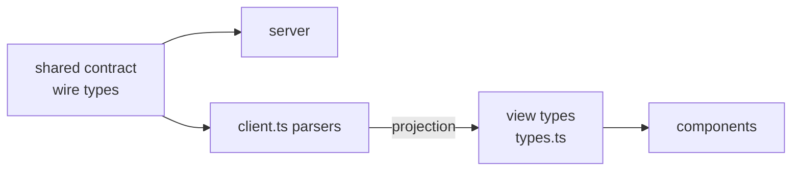

# Single Source Tree + Agentic Workspace Design

**Status** — Proposed
**Author** — John Song (with Claude)
**Date** — 2026-08-01
**Scope** — `src/web`, `src/shared`, build config, `styles.css`, `ui.tsx`

## Summary

Three independent projects, sequenced. Together they remove a duplicated
type/contract layer, give the app real URLs, and move it onto a new visual
language.

| | Project | Nature | Visual change |
|---|---|---|---|
| **A** | Contract unification | Refactor | None |
| **B** | Hash routing | Feature | None |
| **C** | Design adoption | Redesign | Every view |

**A goes first.** It deletes a large share of `client.ts`, so doing C first
would mean restyling code A then rewrites. B is independent.

### What this app is

`nexus-seventeen` is an operations console for supervising AI coding agents. A
**project** holds **tasks**; tasks are picked up by **agents** (engineer,
manager, verifier) that report **events**, ask **questions**, and produce
**artifacts** (diagrams, images, markdown). Humans watch, answer, and confirm
plans. The browser app is the human's window; a Node server owns durable state.

---

## Project A — Contract unification

### The problem

`src/shared/task-board-contract/index.ts` (668 lines) is named "shared" but is
imported by **10 server files and zero web files**. The web side redeclares the
same domain twice over:

- `src/web/task-board/types.ts` (385 lines) — view-model types
- `src/web/task-board/client.ts` — local `RawAgent` (:161), `RawTask` (:197),
  `RawRun` (:253) describing the *server's wire format*

Constants are duplicated verbatim too:

| Value | Shared | Web copy |
|---|---|---|
| `steward.task-board/v1` | `index.ts:1` | `client.ts:45` |
| `48 * 1_024` | `index.ts:3` | `client.ts:72`, `document-drafts.ts:10` |
| `200` | `index.ts:5` | `client.ts:73` |

### Why it happened

`package.json` maps `#shared/task-board-contract` to
`./build/shared/task-board-contract/index.js` — a **build artifact**. For the
browser to consume it, Vite would have to import compiled JS, breaking HMR and
forcing `build:runtime` before every `dev`. The boundary is structurally
unusable from the web side, so duplication was the path of least resistance.
The directory is named for an intent the build never made real.

### The hazard, concretely

`client.ts:868` looks exhaustive:

```ts
const statuses: Record<RawTask['status'], TaskStatus> = { backlog: 'backlog', /* … */ };
```

But `RawTask` is a *local copy* of the server's enum. Add a status server-side
and `tsc` stays green (`tsconfig.app.json` has `include: ["src/web"]`), then
`statuses[status]` returns `undefined` at runtime. Same in `agentStatus`
(:880) and `runStatus` (:891). The API-version copy is worse: a server bump to
v2 leaves web silently sending v1.

### What is NOT the problem

`TaskStatus`, `AgentStatus`, and `RunStatus` differ between the two files **by
design**. Web maps `idle→sleeping`, `in_progress→running`, and derives
`waiting_for_human` from `hasOpenQuestion`. That is a deliberate view-model
projection and it stays.

> **Share the wire types, not the view types.** Collapsing them would destroy
> the useful layer.



### Changes

1. **Make `shared/` reachable from source.** Vite `resolve.alias` +
   `tsconfig.app.json` `paths`, both pointing at `src/shared/...`, not
   `build/`. Server keeps its existing `#shared/*` subpath imports — unchanged.
2. **Delete local `Raw*` types**; import from the contract. The projection
   functions then fail the build the moment the server adds a state, which is
   the entire point.
3. **Delete duplicated constants**; import `TASK_BOARD_API_VERSION`,
   `AUTOMATION_CONFIGURATION_MAX_BYTES`, `WORK_ITEM_PAGE_SIZE`.
4. **Split `client.ts` (1897 lines)** into `wire.ts` (contract re-exports),
   `parse.ts` (~40 validators), `project.ts` (wire→view projection),
   `client.ts` (HTTP). Do this *after* 2–3, which shrink the parser surface.

### Verification

`npm run typecheck:all`, `npm run test:web`, `npm run test:runtime`. Then a
deliberate check: add a fake status to the shared contract and confirm the web
build **fails**. That failure is the deliverable — it proves the seam is real.

### Outcome (completed 2026-08-02)

Delivered in `88d091f..72d2b17`. The seam is real and **broader than planned**:
all 16 contract vocabulary arrays fail the web typecheck when a member is added,
not just the three status enums, because the check runs through `member()`'s
return type rather than through the `Wire*` aliases.

`client.ts` went 1897 → ~900 lines, split into `wire.ts` (the only file
importing `@shared/*`), `parse.ts`, `project.ts`, `client.ts`.

**Known gaps — deliberately not fixed, in rough priority order.** These are
follow-up work, not blockers:

1. **The workflow and artifact half of the wire protocol has no seam at all.**
   `types.ts` hand-copies `WorkflowStage`, `PlanRevisionState`, `WorkNodeState`,
   and `StageHandoffOutcome`, and `client.ts` pushes raw records into them
   through 11 `as unknown as` casts, so there is no runtime validation either.
   Verified: adding a `WorkNodeState` member produces **zero** typecheck errors.
   All 11 casts predate this work. The honest claim is *the board wire surface
   is unified; the workflow surface is not.*
2. **`ActorType` has no runtime array** in the contract, so `parseEvent`'s
   hand-rolled check has no seam — a new server actor type throws at runtime
   with the build green. Adding `ACTOR_TYPES` would close it.
3. **The document content cap is duplicated, uncoupled.** Web and server each
   hardcode 48 KiB. Properly sharing it needs `DOCUMENT_CONTENT_MAX_BYTES` in
   the contract plus a `src/server` edit, which Project A's constraints forbade.
4. **Two component-level leaks.** `AutomationPage.tsx` hardcodes the four
   evaluator options; `WorkspacePages.tsx` hardcodes five artifact media types
   while the contract lists six (it includes `image/svg+xml`).

---

## Project B — Hash routing

`WorkspaceSidebar.tsx:13` already defines a typed router:

```ts
export type BoardPage =
  | { kind: 'tasks' } | { kind: 'automation' }
  | { kind: 'documents'; documentId?: string }
  | { kind: 'project'; projectId: string }
  | { kind: 'agent'; agentId: string };
```

Held at `BoardApp.tsx:640`, dispatched at `:797–805`. There are **zero** hits
for `window.location`, `pushState`, `popstate`, or `searchParams` in `src/web`.
So refresh resets to `tasks`, browser back does nothing, and no view is
linkable.

**No router library.** The routing logic is already correct and well-typed;
only the URL binding is missing. `react-router` would mean rewriting working
dispatch to gain what a small module adds.

New `src/web/task-board/routing.ts`:

- `pageToHash(page: BoardPage): string` — `#/project/abc`
- `hashToPage(hash: string): BoardPage` — invalid input falls back to `tasks`
- `useHashRoute()` — syncs state to `location.hash`, listens for `popstate`

Unit-tested round-trip over every `kind`, including unknown and malformed
hashes. Deep-link and back-button cases added to `tests/e2e/task-board.spec.ts`.

---

## Project C — Design adoption

Adopt the "Agentic Workspace Overview" language across **all four views**.

### This is a dark → light inversion

**The app is currently dark-only.** `styles.css:113` sets
`:root { color-scheme: dark }` over a near-black canvas. The incoming design is
light. So C is not a palette tweak — it inverts the application's base.

| Token | From (dark) | To (light) |
|---|---|---|
| `color-scheme` | `dark` | `light` |
| `--canvas` | `#0e0f0a` | `#FFFFFF` |
| `--foreground` | `#e4e6d9` | `#2A2A28` |
| `--border` | `#2d301f` | `#EAEAEA` |
| `--card` | `#161811` | `#F3F3F5` |
| `--scrim` | `#050604` | light overlay |
| `--color-primary` | `#808b5e` olive | `#5F4B51` mauve |
| `--color-header` | *(new)* | `#D6D8CC` |
| font | Manrope / DM Mono | system stack, 13px |
| radii | 0.45–1.75rem | 4px / 6px / pill |

The change still lands in the **token layer**, so all views and every `ui.tsx`
primitive inherit it — that is what keeps app-wide tractable. But three things
need real attention rather than a find-and-replace:

- **Soft fills are alpha over dark.** `--teal-soft`, `--success-soft`, and
  friends are `rgba(…, 0.14)` tuned to sit on `#0e0f0a`. On white they read
  almost invisible and must be re-derived, not recoloured.
- **`--scrim: #050604`** is a near-black modal overlay. Inverting the canvas
  without revisiting it leaves modals looking correct by accident.
- **`.dark` (`styles.css:172`) is dead code** — never applied anywhere in
  `src/web` or `index.html`. Delete it rather than carry it.

Also `index.html:6` already declares `theme-color` `#eae9e4`, a *light* colour
inconsistent with today's dark theme — stale, and worth correcting to the new
header colour as part of this.

Status pills: `queued` `#D1D1D1` · `working` `#A2BBE0` · `review` `#F28D50` ·
`changes` `#C45A34` · `merged` `#8B9883`.

`Pill`'s existing tones (`amber`/`green`/`neutral`) are used in Documents and
Automation; they map onto the new palette rather than forking the component.

### ProjectPage layout

Rebuild to the design's three regions — a sage header, a 260px
"Context & Materials" sidebar, and a core column holding the "Active Thread
Pipeline" table above a scrolling "Recent Activity & Visuals" feed.

Data already exists in `ProjectPage` (`WorkspacePages.tsx:168`): documents and
artifacts feed the sidebar, `snapshot.tasks` the table, and workflow events the
feed — the latter already live via `subscribeProjectEvents`, and artifact blobs
already resolve to object URLs for the visual previews.

New components: `WorkspaceHeader`, `ContextSidebar`, `ThreadPipelineTable`,
`ActivityFeed`, `VisualPreview`.

### Parked logic

Per direction: **keep the logic, don't render it.** `noUnusedLocals: true` in
`tsconfig.app.json` means unrendered logic left inside the component *fails the
build*. So it moves out into exported, tested modules the new view doesn't
import:

- `project-workflow.ts` — `confirmPlan`, workflow fetch/subscribe
- `project-artifacts.ts` — `uploadArtifact`, media-type validation
- `project-metrics.ts` — completion percent, status grouping

Nothing is deleted; each keeps its tests and is re-surfaceable.

### Actions

- **Pause Agents** → existing `interruptRun` (`client.ts:1887`).
- **Compile Report** → **no backing API exists.** Rendered disabled with a
  TODO. Inventing an endpoint is out of scope.

### Code organization

Dense logic gets a comment explaining *why*, or is wrapped in a named util —
preferred where a name removes the need for prose. Applies to the status
projections, hash parsing, and pill tone mapping.

### Limits

- Two visual languages coexist mid-migration; C lands view-by-view.
- New status labels ("Merged", "Agent Working") change accessible names, so
  `task-board.spec.ts` updates in step. The suite queries by role/name, so
  pure restyling is otherwise safe.
- **C is the riskiest of the three by a wide margin** — a dark→light inversion
  touches every contrast pair in the app. Expect visual regressions in places
  the mockup never depicts (modals, scrims, disabled states, focus rings).
- The design is specified light-only, so the app ends up light-only. Nothing
  here adds a theme toggle; that would be its own project.

---

### Reviewing the result

`vite.config.ts` binds `server.host` to `127.0.0.1`. The reviewer reaches this
machine over Tailscale, where loopback resolves to their own device — so the
dev server must be started with `--host 0.0.0.0` and shared as
`http://100.72.64.97:4173/`, not a localhost URL.

---

## Alternatives Considered

**Add `react-router`** — rejected. `BoardPage` is already an exhaustive typed
union with working dispatch; a router would replace correct code to gain URL
sync alone, which `routing.ts` provides in ~40 lines.

**Point web at `build/` to reach the contract** — rejected. Works, but imports
compiled JS into the browser bundle, breaks HMR, and forces `build:runtime`
before `dev`. Aliasing to source costs one config line.

**Collapse view types into wire types** — rejected. Destroys the deliberate
projection layer (`sleeping`, `waiting_for_human`) that keeps server vocabulary
out of components.

**Build the new design as a second view alongside the old** — rejected by
direction; app-wide adoption chosen so the app has one language.

**Delete the features the design omits** — rejected. Plan confirmation and the
execution map are the subject of the last four commits.

**Restyle each view independently** — rejected. Duplicates the palette per
view and lets them drift; the token layer is the whole point.
