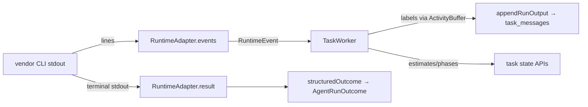

# Campaign 8: Second runtime + onboarding task type

**Status:** Approved for implementation
**Author:** Claude (brainstormed under standing drive-to-completion authorization)
**Date:** 2026-08-25
**Scope:** orchestrator-design.md §11 (multi-runtime support) and §6 (project onboarding), roadmap campaign 8. Local-first: no GitHub calls, no real third-vendor CLI, no live onboarding of external repos in-test.

## Summary

The board can already drive two vendor CLIs (codex, claude), but vendor knowledge is smeared across four leak sites and a closed `AgentProvider` union threaded through ~10 files, the only mid-run signal is a vendor-parsed activity string, capability differences are hard-coded per role, prompts are TypeScript literals, and the end-to-end proof only ever runs codex-shaped lanes. Campaign 8 makes multi-runtime real:

1. **Internal event schema + runtime adapters** — one adapter module per vendor turns its stream into `RuntimeEvent`s (`stage_started | message_delta | tool_call | tool_result | stage_finished | error`); everything downstream is vendor-neutral.
2. **Capability profiles** — `config/runtimes.json` declares, per runtime: binary, supported roles, per-role sandbox level, and the §11 documentation axes (permission model, MCP, tool-call granularity, context notes). Every claim fails closed at the pre-launch guard when its role is unsupported; an optional fleet-config `role` also enables construction-time rejection.
3. **Prompts as files** — the prose blocks of `agentPrompt()` move to `prompts/*.md`, loaded and sha256-pinned like skills; this finally wires the `promptsSha` claim pin that has existed unset since campaign 1.
4. **Onboarding task type** — a per-project, run-once work item flowing the normal v2 pipeline whose implementation stage produces the §6 deliverables in the target repo (doc slots, verify-contract tiers, agent Dockerfile target) plus a gap report persisted as a board artifact; settle-time validation machine-checks the deliverables.

**Exit criteria** (roadmap): (a) adding a runtime touches one adapter + one profile — proven by a test that registers a synthetic third runtime and drives a work item end to end through it; (b) an external (non-self) repo onboarded end to end — proven by an e2e arc that onboards a fixture repo **on claude-provider lanes**, covering both exits in one arc.

Seam facts cited below are from `.superpowers/sdd/campaign8-exploration.md` (as-built exploration, 2026-08-25).

---

## Part A — Runtime adapters and the internal event schema

### What exists

`AgentLauncher` (`src/server/agents/task-worker/types.ts`) is already the substrate seam — contained CLI, container, and workspace-scoped implementations all conform, and `createTaskFleetWorker` (`task-fleet/runtime.ts`) is the single selection point. What is *not* abstracted is the vendor: argv construction (`codexProviderArgs`/`claudeProviderArgs`), env allowlists (`providerEnvironment`), terminal parsing (`providerResult`), and stream parsing (the three `*FromProviderLine` functions in `provider-activity.ts`) all branch on `AgentProvider = "codex" | "claude"`, and the launcher's mid-run channel is `AsyncIterable<string>` of pre-derived 160-char labels.

### RuntimeEvent — the internal schema

```ts
// src/server/agents/runtime/events.ts
export type RuntimeEvent =
  | { readonly type: "stage_started" }
  | { readonly type: "message_delta"; readonly text: string }
  | { readonly type: "tool_call"; readonly name: string; readonly detail: string }
  | { readonly type: "tool_result"; readonly name: string; readonly output: string }
  | { readonly type: "stage_finished" }
  | { readonly type: "error"; readonly detail: string };
```

These are §11's six events verbatim. They are an **in-process seam between launcher and worker**, not a wire or storage format: the worker derives from them exactly what it derives today (activity labels, `STEWARD_ESTIMATE_MINUTES` estimates, `STEWARD_PHASE_JSON` phase signals, error detail) and persists through the existing `appendRunOutput` / task-event paths. No new tables, no HTTP change, no durable transcript — that is deferred (see Limits).

### RuntimeAdapter — one module per vendor

```ts
// src/server/agents/runtime/adapter.ts
export interface RuntimeAdapter {
  readonly runtime: string;                 // profile key: "codex", "claude", test ids
  args(options: ProviderArgumentOptions, role: AgentRole, profile: RuntimeProfile): readonly string[];
  environment(source: NodeJS.ProcessEnv): NodeJS.ProcessEnv;
  events(line: string): readonly RuntimeEvent[];  // one stdout line → 0..n events
  result(stdout: string): unknown;          // terminal parse; throws on vendor-reported failure
}
```

- `src/server/agents/runtime/codex.ts` and `claude.ts` are extracted **behavior-preserving** from `agent-envelope.ts` + `provider-activity.ts`: same argv, same env allowlists, same JSONL/stream-json parsing, now emitting `RuntimeEvent`s instead of feeding vendor-specific label functions. The existing role→sandbox hard-coding moves to profile data (below); the *interpretation* of a sandbox level into flags stays adapter code.
- `src/server/agents/runtime/registry.ts` — a plain readonly map `runtimeAdapter(id): RuntimeAdapter`, default map `{codex, claude}`, injectable everywhere it is consumed (launcher options, fleet factory) so tests register synthetic runtimes without global mutation.
- `AgentProvider` stops being a closed union: runtime ids become `string` validated at load time against the registry ∩ profile file. This is the compile-error sweep the exploration priced (~10 files); it is the point of the campaign.
- Both launchers change from `provider: "codex"|"claude"` to `adapter: RuntimeAdapter` (+ `profile`); the container plan's default command becomes `adapter.runtime`-derived (`agentCommand ?? profile.binary`), and `captureTaskFleetRuntimeVersion` / image label `steward.cli.<id>` parameterize on the runtime id.
- `AgentRunHandle.activity` becomes `AsyncIterable<RuntimeEvent>`. The `observeLine` triple leaves the launchers; the worker's `#forwardActivity` consumes events through a new vendor-neutral `runtime/derive.ts` (`activityFromEvent`, `estimateFromEvent`, `phaseSignalFromEvent` — the marker-scanning logic from `provider-activity.ts`, now scanning `tool_result.output` instead of vendor JSON). `ActivityBuffer` (rate-limit, dedupe, truncate) is unchanged and stays worker-side. `provider-activity.ts` is deleted.



`RESULT_SCHEMA` → `structuredOutcome()` stays the vendor-neutral terminal contract exactly as-is; adapters only locate the result payload in their vendor's stream.

### Capability profiles — `config/runtimes.json`

JSON, not YAML: the repo has no YAML dependency and every existing config (fleet config, bootstrap catalog) is JSON with hand-rolled validators and O_NOFOLLOW size-bounded loads (`task-fleet/config.ts` pattern). The design doc's `runtimes.yaml` name is treated as a layout suggestion, not a format requirement — recorded as a deviation.

```json
{
  "version": 1,
  "runtimes": {
    "codex": {
      "binary": "codex",
      "permissionModel": "cli-sandbox-flags",
      "roles": { "engineer": { "sandbox": "workspace-write" },
                 "verifier": { "sandbox": "read-only" },
                 "manager":  { "sandbox": "read-only" } },
      "mcp": false,
      "toolCallGranularity": "command",
      "contextNotes": "JSONL item stream; schema via --output-schema file"
    },
    "claude": {
      "binary": "claude",
      "permissionModel": "permission-modes",
      "roles": { "engineer": { "sandbox": "acceptEdits" },
                 "verifier": { "sandbox": "dontAsk" },
                 "manager":  { "sandbox": "plan" } },
      "mcp": true,
      "toolCallGranularity": "tool",
      "contextNotes": "stream-json; schema inline via --json-schema"
    }
  }
}
```

- Loader `src/server/agents/runtime/profiles.ts`: `loadRuntimeProfiles(path)` / `parseRuntimeProfiles(value)`, same discipline as `parseTaskFleetConfig`. Fleet config gains `runtimesConfigPath` (default `<repo>/config/runtimes.json`).
- **What the profile drives today:** `binary` (spawn command), `roles` (which roles a lane may serve + the per-role sandbox level the adapter turns into flags/modes). **Enforcement is at launch:** immediately before any model-process side effect, the worker checks the claimed role, quarantines a mismatch, rethrows `RuntimeCapabilityError`, and the fleet closes the `POISONED` lane. An optional per-lane `role` in fleet config adds construction-time fail-closed validation; omission does not weaken the launch guard.
- **Documentation axes** (`permissionModel`, `mcp`, `toolCallGranularity`, `contextNotes`) are §11's remaining profile fields: schema-validated, logged at lane startup, consumed by nothing else yet. MCP is disabled in both vendors' argv by construction (as-built posture), so `mcp` is honest metadata, not a switch.

### Prompts as files

`agentPrompt()`'s fixed prose blocks move to `prompts/*.md` (per §2's orchestrator-repo layout): `intake.md`, `engineer.md`, `engineer-fix.md`, `reviewer.md`, `verifier.md`, `designer.md`, `oversight.md`, `onboarding-intake.md`, `onboarding-engineer.md` (final list settled in the plan; one file per existing prompt branch). Mechanics copy `SkillRegistry` (`src/server/task-board/skills.ts`):

- `PromptRegistry` loads `<promptsRoot>/*.md` at lane construction: ≤64 KiB per file, sha256 per file, **`promptsSha` = sha256 over the sorted `(name, digest)` list**.
- Files carry `{{placeholder}}` slots; `renderPrompt(template, vars)` fails closed on unknown or unfilled placeholders. Dynamic assembly (context JSON, plan rendering, bright-line block interpolation) stays in `agent-envelope.ts` — the files own the instructions, the code owns the data.
- The worker pins `promptsSha` at claim (`ClaimRunPinning.promptsSha` — stored since v-campaign-1, never set by production code until now); the worker-side `ClaimedRunPinning` mirror gains the field so replay divergence is diagnosed (`run_pinning_diverged`, existing logged-not-fatal behavior).

---

## Part B — Onboarding task type (§6)

Onboarding is a **run-once-per-project work item** that flows the normal pipeline and doubles as the proof the pipeline works against that repo. It reuses the v2 stage template `["implementation","testing","verification"]` — no new stages, no `pipelineTemplateShape` change, no SQL-mirror edit. Onboarding-ness lives in three places: a link table, the prompts, and settle-time deliverable validation.

**Intake.** `CreateWorkItemRequest` gains optional `taskType: "standard" | "onboarding"` (default standard; contract enum + forward-tolerant web parse). An onboarding item requires a resolved project target and is unique per project: schema **v24** adds

```sql
CREATE TABLE IF NOT EXISTS work_item_onboarding_tasks (
  work_item_id TEXT PRIMARY KEY REFERENCES work_items(work_item_id),
  project_id   TEXT NOT NULL REFERENCES projects(project_id),
  task_id      TEXT NOT NULL REFERENCES tasks(task_id),
  created_at   TEXT NOT NULL
);
CREATE UNIQUE INDEX IF NOT EXISTS onboarding_once_per_project
  ON work_item_onboarding_tasks(project_id);
```

(additive block, no CHECK rebuild; golden `v23-schema.sql` fixture + contract-drift assertions per migration discipline). A second onboarding request for a project is a 409. The planning task is created by the existing `startWorkItemPlanningInTransaction` path with onboarding objective/criteria, and the claim context gains `onboarding: true` so the intake prompt swaps to `onboarding-intake.md`.

**Planning.** The manager returns the ordinary single-node v2 plan whose declared scope covers `README.md`, `docs/**`, and the Dockerfile, with acceptance criteria naming the §6 deliverables.

**Implementation** (engineer, `onboarding-engineer.md` prompt) produces, in the target repo worktree:

- **Doc slots** (§2 layout, create-if-missing, stub with required headings): `README.md`, `docs/architecture.md`, `docs/interface.md` (mechanical portion generated from discoverable routes/schema; handwritten layer stubbed with the §2 required topics), `docs/dependencies.md`, `docs/workflow.md`, `docs/decisions/` (with a first dated ADR recording onboarding).
- **Verify-contract tiers**: `docs/workflow.md` must contain one fenced ```json block parsing as `VerifyContract` (`version:1, compile[], rules[], full[]`) with rules mapping the repo's source layout — this is "the three tiers defined", concretely, because `loadVerifyContract(repoRoot)` is what machine verify reads.
- **`agent` Dockerfile target** when a Dockerfile exists; otherwise a gap line.
- **Gap report**: a markdown section of the structured settlement result listing what could not be produced (no test suite, no lockfile, no Dockerfile, unfixturable dependencies, branch protection not configured — always listed while GitHub integration is deferred).

**Settle-time validation** (board-side, in `settleActiveRunInTransaction`'s onboarding branch, checked against the worktree before the attempt settles): the five slots exist, `loadVerifyContract` parses the new workflow.md, and the result carries a non-empty gap report. Failure produces a structured settlement error into the normal fix loop — the same shape as `WORKFLOW_PLAN_REQUIRED`.

**Testing/verification** run the machinery the engineer just configured: machine verify derives the fast tier from the onboarding diff via the freshly written contract (rules must map `docs/**` and the Dockerfile — typically to `none`/`fixed`), proving the tiers work rather than asserting they exist. Human gate = the existing final approval + merge.

**Gap report persistence**: at successful settle the board writes the gap report through `ArtifactStore` (`text/markdown`, FK to project/node/task — existing ≤192 KiB store, no new machinery) and surfaces it on the project view next to the onboarding item; the park/findings ledgers already carry the cost story §6 asks for.

---

## Testing

- **Adapter units**: codex/claude adapters pinned on argv, env allowlist, event mapping (vendor fixture lines → expected `RuntimeEvent`s), terminal parse — the existing `contained-cli-launcher.test.ts` / `agent-envelope-pipeline.test.ts` assertions relocated, not weakened. Worker doubles emit events instead of strings.
- **Profile units**: parse/validate/reject (unknown role, missing binary, bad version), pre-launch quarantine and permanent lane close, plus construction-time fail-closed when a lane declares `role`.
- **Prompt units**: registry load/digest, `renderPrompt` fail-closed, promptsSha claim pin present on production claims, divergence diagnostic.
- **Onboarding units**: intake uniqueness 409, settle validation failures (missing slot, unparseable contract, empty gap report) → fix loop.
- **E2E arc 1 (both exit criteria)**: fixture *external* repo (synthetic git repo, not the board's own) → project registered → onboarding work item → plan gate → implementation writes real doc slots + contract + Dockerfile target via fake CLI → settle validation passes → machine verify green using the new contract → final approval → merged; **lanes are claude-provider** with claude-shaped fake CLI output (`fakeCli(root, "claude", …)` emitting stream-json), proving the second runtime end to end through the adapter/event path.
- **E2E arc 2 (abstraction proof)**: a synthetic third runtime ("acme") = one test-local adapter (distinct event shapes) + one profile entry + a PATH shim; a work item runs end to end. The test adds nothing else — that *is* the "one adapter + one profile" exit criterion, executable.
- Existing suites (pipeline-e2e codex arcs, container stub, wall-clock, settle) must stay green — the extraction is behavior-preserving.

## Limits and deferrals

- **No durable event journal**: `tool_call`/`tool_result` events are derived into the existing progress/task-state persistence and then dropped; a transcript table is future observability work, noted for the ledger campaign follow-ups. Any future durable path must add its own `redactForPersistence` ingress (no chokepoint exists).
- **No real third vendor**: the abstraction proof is synthetic; shipping a Gemini/other adapter is a follow-up decision (local-first).
- **Branch protection** requires GitHub — permanently listed in gap reports until the deferred GitHub slice lands (campaign 4 precedent).
- **Live Cicada onboarding is operational, not in-repo**: the campaign ships machinery + fixture proof; onboarding `DotBackendLuo`/the active pair for real spends live agent runs against another working tree and waits for explicit go-ahead.
- **MCP profile field is metadata**: both vendors run MCP-disabled by construction; the field records capability, it does not enable anything.
- **Container runtime registration has three touch points**: add the adapter, add the profile, and ensure the agent image both installs the CLI and carries the `steward.cli.<id>` version label used for immutable runtime identity.

## Alternatives considered

- **Board-side capability rejection at claim** — rejected: activation binds tasks to identities before claims, so withholding a claim would livelock. The worker instead claims durably, applies a side-effect-free pre-launch guard, quarantines the mismatch, and lets the fleet close the `POISONED` lane. Optional fleet-config `role` validation catches known static mismatches even earlier at construction.
- **`AsyncIterable<string>` retained, events internal to launchers** — rejected: leaves the §11 schema decorative; the launcher↔worker handle is the real seam, and moving derivation worker-side deletes the vendor-branching in `provider-activity.ts` outright.
- **Durable `run_events` table now** — rejected (YAGNI): no consumer; §11 requires the schema, not a transcript store; the widest edit stays bounded.
- **New `onboarding` stage / template shape** — rejected: new `WORKFLOW_STAGES` values ripple through `pipelineTemplateShape`, its SQL mirror in `wall-clock.ts`, the work_nodes CHECK, and the automation stage executors; the v2 template plus prompts/validation delivers §6 without touching any of it.
- **`work_items.kind` column** — rejected in favor of the link table: twice-established precedent (`work_item_planning_tasks`, `work_item_design_tasks`), no CHECK rebuild, and the once-per-project uniqueness wants a project-keyed index anyway.
- **YAML config** — rejected: no YAML dependency exists; JSON keeps the loader discipline uniform. Name deviation from §2 recorded here.
- **`config/projects.json` registry** — rejected: the board DB *is* the project registry as-built (`projects.description` = repo path); duplicating it into a file adds a second source of truth with no consumer.
- **Real-CLI onboarding of a Cicada repo as the e2e** — rejected for tests (nondeterministic, paid, network); retained as the operational follow-up.

## Amendments (post final review)

These amendments describe the implemented behavior where final review found the original design incomplete or inaccurate.

### Capability enforcement

Capability enforcement is a launch-time safety boundary. After a durable claim and before any model-process side effect, the worker validates the claim role against the runtime profile. A mismatch is quarantined, rethrown as `RuntimeCapabilityError`, classified `POISONED`, and closes that lane permanently. A fleet agent may also declare an optional `role`; `createTaskFleetWorker` then rejects an unsupported role or sandbox at construction. The earlier lane-construction-only claim and the corresponding Alternatives reasoning are superseded by this two-layer behavior.

### Correctable settlement rejection

`WORKFLOW_PLAN_REQUIRED` and `ONBOARDING_DELIVERABLES_MISSING` remain correctable 400s, but relaunch is bounded per durable claim:

- Each rejection writes a `settlement_rejected` task event with its code and redacted detail, outside the rolled-back settlement transaction.
- Rejected terminal-output batches are retracted before the corrected turn so the task exposes one accepted result narrative.
- The worker journals the rejection count. The first two rejections reset the same claim for correction; the third rewrites the journaled outcome to failed and settles through the existing attempt/park path. No fourth model turn launches.
- Replaying the persisted claim while the board is paused returns the same hold response as a new claim, so pause remains a kill switch for correction loops.

Feeding rejection detail into the immutable claim prompt is deferred to campaign 9.

### Container runtime limit

The one-adapter-plus-one-profile abstraction proof covers local-process runtimes. A container runtime also requires the CLI to be installed in the agent image and the image to expose its version as `steward.cli.<id>`; container image inspection fails closed without that third touch point.

### Gap-report persistence

Gap-report Markdown uses a newline-preserving persistence redactor only at the artifact ingress. It retains `\n` formatting while applying the same secret patterns and removing every other control character; the existing single-line redactor remains unchanged elsewhere.
