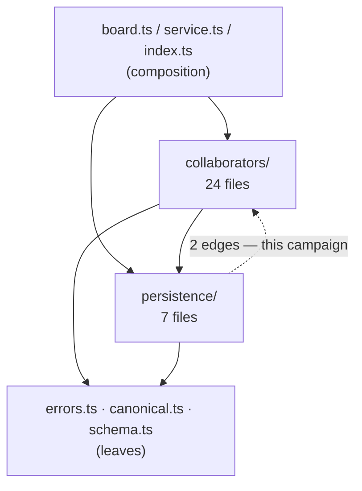

# Layering and file size (campaign 12)

**Status** Draft · **Author** Claude (controller) · **Date** 2026-08-31 · **Scope**
`src/server/task-board/` layer direction; the two largest files in the repository.

Supersedes the campaign 12 sketch in
`docs/superpowers/specs/2026-08-29-codebase-health-audit.md` §12, which was measured before
campaign 11 landed.

## Summary

The task board's server code is filed into two named layers, `persistence/` and
`collaborators/`, that import each other. Because the cycle exists, no rule about import
direction can be enforced, and a reader cannot tell from a file's location what it is
allowed to depend on.

**The cycle is now two import statements.** The audit counted three back-edges; campaign 11
removed one when `scope-check.ts` moved to `server/shared/`. Both survivors are in one file,
`persistence/workflow.ts`, and both point at modules that are misfiled rather than at
genuine orchestration:

| Back-edge                                                | Target    | What it actually is                                                                                                                                                                                              |
| -------------------------------------------------------- | --------- | ---------------------------------------------------------------------------------------------------------------------------------------------------------------------------------------------------------------- |
| `workflow.ts` → `collaborators/work-item-transitions.ts` | 453 lines | A transaction state machine over `TaskBoardStore`. Every export is `…InTransaction`, `workItemTransitionStoreForDatabase`, or a state lookup. It imports nothing from `collaborators/`. **This is persistence.** |
| `workflow.ts` → `collaborators/pipeline-inspection.ts`   | 137 lines | Reads a git branch and compares it to a declared scope. Imports only `shared/git.ts`, `shared/scope-check.ts` and a `DatabaseSync` type. It is a leaf: it belongs to neither layer.                              |

So the cycle is not a design problem to be untangled. It is two files in the wrong
directory, and moving them makes the layer rule true — after which a test can hold it true.

The expensive half of this campaign is unrelated to the cycle: `validate.ts` is 5,067 lines,
the largest file in the repository, and `collaborators/projects.ts` is 2,451. Those are file
size problems. They are worth separating from the layering fix, because the layering fix is
an afternoon and the splits are not.

## What the graph looks like today

Counted mechanically over `src/server/task-board/**` (relative imports only):

```
  43  collaborators -> persistence      the intended direction
  23  collaborators -> (root)           errors.ts, canonical.ts, skills.ts …
  16  (root)        -> collaborators    board.ts and index.ts composing
  10  persistence   -> (root)
   5  (root)        -> persistence      board.ts, service.ts
   2  persistence   -> collaborators    ← the cycle
```



The `(root)` directory is not one layer. `errors.ts` and `canonical.ts` import nothing local
— they are leaves both layers may use. `board.ts`, `service.ts` and `index.ts` import
downward into both layers — they are the composition root. That is correct as it stands and
this campaign does not change it; it only means the enforceable rule must be stated about
`persistence/` specifically, not about "the root".

## The rule, and the test that holds it

> No module under `src/server/task-board/persistence/` may import from
> `src/server/task-board/collaborators/`.

One sentence, mechanically checkable, and the exit criterion the roadmap already asks for. It
goes in `tests/tooling/` beside the comment ratchet, which is the tier that already walks the
tree and has no runtime dependencies.

Two properties matter more than the rule itself:

- **It must fail on a violation.** The test gets a fixture that plants a back-import in a
  temporary tree and asserts the checker reports it — the same technique
  `code-style.test.mjs` uses for its banner scanner. A layering test that has never been seen
  to fail is decoration.
- **It must not be satisfiable by re-export.** A collaborator that re-exports a persistence
  symbol, or a leaf that launders one, defeats the rule while keeping the graph acyclic on
  paper. The checker resolves relative specifiers to real files rather than trusting
  directory names.

## The two moves

**`collaborators/work-item-transitions.ts` → `persistence/work-item-transitions.ts`.** Six
collaborators import it; after the move they import it in the allowed direction, and
`workflow.ts` imports a sibling. Its own `import type { TaskBoardStore } from
"../persistence/store.js"` becomes `./store.js`. Its mirror test moves to
`tests/server/task-board/persistence/`, a directory that does not exist yet.

**`collaborators/pipeline-inspection.ts` → `task-board/pipeline-inspection.ts`.** It has two
importers, one in each layer, which is exactly why it cannot live in either. The task-board
root already holds the leaves both layers use.

Neither move changes a line of logic. Both are `git mv` plus import rewrites, and the
hazards are the ones campaign 11 task 6 documented: the module-header allowlist and baseline
must move together as a provable pure path rewrite, `docs/` carries source links, and a
module leaving a directory published in `package.json`'s `imports` map can silently downgrade
a bare specifier to a deep relative path that resolves through a different build output.

## The splits, and why they are a separate decision

`validate.ts` is 5,067 lines behind one specifier. It is the contract's validation surface,
imported by 25 files across the server, the web and the tests, and it already carries fifteen
`/* —— Section —— */` banners from campaign 11 — the seams are drawn and the split can follow
them mechanically:

| Banner group                                            |  Lines | Becomes                |
| ------------------------------------------------------- | -----: | ---------------------- |
| Scalar validation                                       |   ~230 | `validate/scalars.ts`  |
| Stored entity parsing → Pipeline evidence and artifacts | ~2,040 | `validate/entities.ts` |
| Automation configuration, Snapshots and claim responses |   ~440 | `validate/board.ts`    |
| Worker claim boundary → Worker outputs                  |   ~980 | `validate/worker.ts`   |
| Shared plan-draft policy                                |   ~540 | `validate/plans.ts`    |
| Board request boundary                                  |   ~680 | `validate/requests.ts` |

`validate.ts` stays as the façade that re-exports all of them, so **no caller changes** —
that is what makes a 5,000-line split reviewable at all.

`projects.ts` is different: 2,451 lines under a single banner, `Project workflow
orchestration`. Its seams are not drawn, and drawing them is design work — deciding where
catalog management ends and decomposition reconciliation begins — not a mechanical
regrouping. That is a campaign's worth of thinking on its own.

## Recommendation

A complexity ladder, so the cost is opt-in:

- **do-X — the cycle.** Two moves plus the direction test. Delivers the roadmap's stated exit
  criterion. Small, mechanical, independently valuable.
- **+Y — `validate.ts` behind a façade.** Follows banners that already exist; zero caller
  edits; the largest file in the repository stops being one file.
- **+Z — `projects.ts`.** Needs its seams designed first.

**Recommended: X + Y.** Z should be its own campaign with its own brainstorming, because
"split the 2,451-line file" is not yet a specification — nobody has said where the cuts go.
Shipping X + Y and leaving Z named and unstarted is more honest than pretending the third is
the same kind of work as the first two.

## What this campaign will not do

- Touch `persistence/workflow.ts`'s own size (3,040 lines). It is the second-largest file and
  the centre of the cycle, but the cycle is fixed by moving other files into it, not by
  splitting it. Splitting it is a `projects.ts`-shaped problem.
- Change any runtime behaviour. Every task here is a move, a re-export, or a test.
- Enforce direction anywhere but `persistence/`. `collaborators/ → collaborators/` edges are
  numerous and unexamined; declaring a rule about them without measuring first is how a
  layering test becomes something people suppress.

## Alternatives considered

**Break the cycle by inverting the dependency instead of moving files.** Have `workflow.ts`
accept the transition functions as injected parameters, so persistence declares an interface
and a collaborator supplies it. Rejected: it adds a seam and a wiring point to satisfy a rule
that two `git mv`s satisfy outright. Dependency inversion earns its complexity when the two
sides genuinely belong to different layers; here one side is simply filed wrong.

**Leave `pipeline-inspection.ts` in `collaborators/` and let `workflow.ts` keep importing
it.** Rejected: it is the one import that would still make the rule false, and a rule with a
grandfathered exception cannot be tested — the exception list becomes the thing that drifts.

**Enforce the direction with a lint rule instead of a test.** Rejected on the same evidence
as campaign 11's comment convention: the repository has no eslint, and adding one to hold a
single rule costs a dependency, a config, and a second place for style opinions to live. The
tooling tier already walks the tree.

**Split `validate.ts` by moving callers to the new modules.** Rejected: 25 importing files
would change in the same commit that moves 5,000 lines, which makes the diff unreviewable.
The façade keeps the move and the caller migration separable, and the caller migration may
never need to happen.

**Do the whole audit proposal, including `projects.ts`.** Rejected as scope that has not been
specified. See Recommendation.
