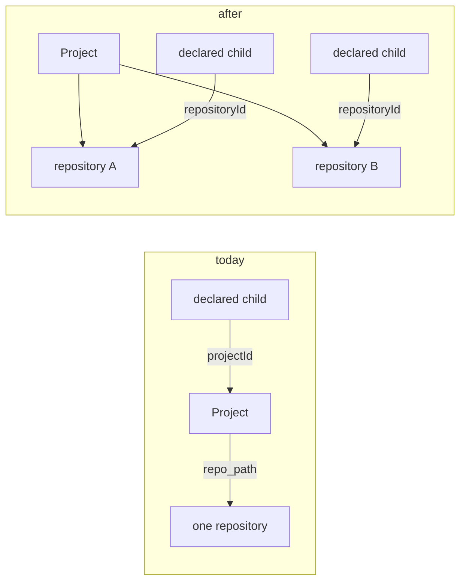

# Repository identity separate from the product project (roadmap 9.9)

**Status** Draft · **Author** Claude (controller) · **Date** 2026-09-06 · **Scope** the board's
project/repository model, the decomposition contract, and the v26 → v27 migration.

## What this is about

A **Project** on the board groups a product's work: its threads, its agents, its automation. A
**work item** is one request against a project, and decomposition can split a large one into
**children**, each of which is implemented and merged independently.

Today a Project has exactly one repository, stored as `projects.repo_path` (`store.ts:537`,
`NOT NULL`), and a declared child targets a Project (`DeclaredChild.projectId`,
`contract/index.ts:461`). Those two facts together mean **the unit of grouping and the unit of
checkout are the same thing**. That is fine for a product living in one repository and wrong
for one that does not.

The concrete shape it gets wrong is the one in this estate's own repo map: Cicada Sense and
HomeDots are one system whose code is split across several repositories. Grouped as one
Project, a change spanning two of its repositories cannot be decomposed — every child would
inherit the same `repo_path`. Grouped as several Projects, the product loses its single
workspace, its agents fragment, and cross-repo coordination becomes coordination between
strangers.

Campaign 10 built the cross-repo machinery — phased children, `crossRepoContext`, the published
interface — and then noted this limit in its own rollout: _"one repository per Project (→ 9.9)"_.
This is that item.

## The change in one sentence

Repositories become records of their own, a Project has many of them, and a declared child
names the repository it targets rather than inheriting one.

## Where `repo_path` is read today

Thirty files mention `repoPath`. They fall into three groups, and only the first is load-bearing
for this change:

| Group                       | Files                                                                                                                                                                              | What it needs                                             |
| --------------------------- | ---------------------------------------------------------------------------------------------------------------------------------------------------------------------------------- | --------------------------------------------------------- |
| **Checkout and git**        | `collaborators/{runs, merge-executor, base-branch-poll, interface-context, onboarding-check}.ts`, `pipeline-inspection.ts`, `persistence/workflow.ts`, `docs-publish/enumerate.ts` | "which working tree do I operate on for _this_ work item" |
| **Contract and projection** | `contract/index.ts`, `validate/{entities,requests}.ts`, `persistence/rows.ts`                                                                                                      | carries the value through                                 |
| **Display and choice**      | `web/{types.ts, model/project.ts, model/project-picker.ts, views/workspace/ProjectPage.tsx}`                                                                                       | shows it, and picks one at creation                       |

Every one of them resolves the same way — read the project row, take `repo_path`. That single
resolution point is the seam: after this change they ask a work item for its repository, and
the answer falls back to the project's primary repository when nothing more specific is set.

## Model

**`repositories`** — a new table. `repository_id`, `project_id`, `name`, `path`, `is_primary`,
`version`, `created_at`, `updated_at`. A repository belongs to exactly one project; a project
has at least one, exactly one of which is primary.

**`work_items.repository_id`** — nullable. Null means "the project's primary repository", which
is what every existing row means today.

**`DeclaredChild.repositoryId`** — optional, alongside the existing `projectId`. Absent means
the target project's primary repository, so every plan written before this change still means
what it meant.

The invariant that makes decomposition work across repositories is unchanged from campaign 10 —
children are independently mergeable — but the thing they are independent _in_ becomes the
repository rather than the project.

## Migration v26 → v27

Following the ladder's own rules (`store.ts:255`: add the next version, never rewrite an applied
one):

1. Create `repositories`.
2. Insert one row per project from `projects.repo_path`, `is_primary = 1`, `name` = the project
   name. Every existing project therefore keeps exactly the repository it had.
3. Add `work_items.repository_id` as nullable, left null — every existing work item continues to
   resolve to the primary.
4. **Keep `projects.repo_path`** as a maintained mirror of the primary repository's path. It is
   not dead weight: a worker running the v26 contract still reads it, and campaign 10's rollout
   order — workers upgrade before the board — only works if the old field keeps its meaning
   through one version.

Dropping `repo_path` is a later version's job, once no supported worker reads it.

## Recommendation

A ladder:

- **do-X — the model and the resolution.** The table, the migration, `repositoryId` on the
  contract and on declared children, and one resolution helper that every git caller uses.
  Decomposition across repositories in one project works; the web still shows the primary.
- **+Y — the web surface.** Add, rename and re-point repositories on a project; choose one when
  declaring a child. Without this, X is reachable only through the API.
- **+Z — retire the shim.** Drop `projects.repo_path` in v28 once no supported worker reads it.

**Recommended: X + Y.** Z is a version away by construction and belongs to whichever campaign
notices the last v26 worker is gone.

**Exit:** a `pipeline-e2e` arc lands a blast-radius change as two children in **one** project
and **two** repositories, with real git, and the schema test proves a v26 database migrates to
v27 with every project keeping its repository.

## What this does not do

- **No repository sharing between projects.** A repository belongs to one project. Nothing in
  the estate needs otherwise today, and a many-to-many costs a join on the hottest read path
  (resolving a checkout) to buy a case nobody has.
- **No change to the merge policy.** Campaign 10 keyed it on phases, not on change shape or
  location, and that stays true — two children in different repositories of one project merge
  under exactly the rules two children in different projects do now.
- **No monorepo path scoping.** A repository is a working tree, not a subdirectory of one.
  Declared scope already narrows work within a tree.

## Anticipated questions

**Does this break the "one repository per Project" assumption anywhere subtle?** The risk is a
caller that reads `project.repo_path` _for a work item_ rather than for the project. Those are
the eight files in the first table, and the task that introduces the resolution helper has to
convert all of them together — a half-converted caller silently operates on the wrong tree,
which is worse than a compile error. The helper takes a work item, not a project, so the wrong
call is not expressible.

**What about a project whose primary repository changes?** Out of scope for X; the record has
`is_primary` so Y can move it, and nothing resolves through a cached copy.

## Alternatives considered

**Keep one repository per Project and tell users to make more Projects.** This is the status quo
and it is a real option — it costs nothing to build. Rejected because it fragments exactly the
thing a Project is for: one product's agents, automation and threads. The estate's own map says
Cicada Sense and HomeDots are _one system_; modelling them as several Projects encodes the
opposite.

**Make `repo_path` a JSON list on `projects`.** Cheapest possible change. Rejected: a repository
needs identity to be referenced by a child, and a list of strings has none — a child would have
to reference by index or by path, and both break the moment a path is corrected.

**Global repositories referenced by many projects.** Rejected under "what this does not do":
speculative generality on the hottest read path.

**Put `repository_id` on the task rather than the work item.** Tasks are the unit of execution,
so this looks natural. Rejected: a work item's children are declared before any task exists, and
the declaration is where the choice belongs. Tasks inherit it through their work item.
