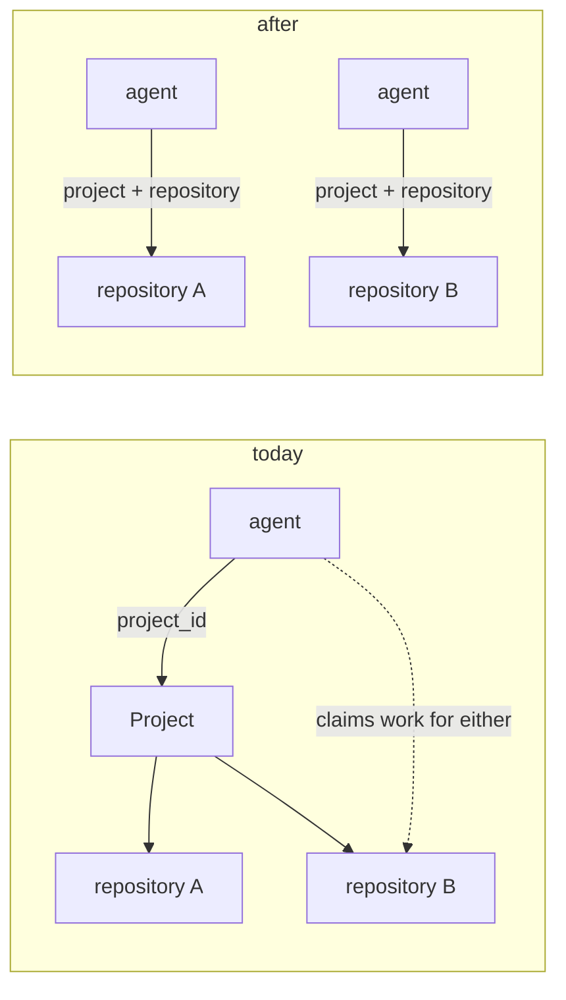

# Repository-aware agent identity (roadmap 17)

**Status** Draft · **Author** Claude (controller) · **Date** 2026-09-07 · **Scope** agent
identity, claim eligibility, and the fleet's worker configuration.

## What this is about

An **agent** on the board is a durable identity a **worker** authenticates as. The board hands
work to an agent; a worker process picks it up and executes it in a **working tree** on disk.

Campaign 16 gave a work item its own repository, so a product spanning several repositories can
be decomposed across them. Its exit arc could not run, and the reason is not in the board:

- a worker's tree comes from **its own static configuration** — `task-fleet/runtime.ts` sets
  `repositoryPath: config.workingDirectory`;
- a claim carries **no repository at all**;
- the board routes work by **agent identity**, and an agent belongs to a **project**
  (`agents.project_id`, and `runs.ts` rejects a task whose `projectId !== agent.projectId`).

That was sufficient for exactly as long as a project had one repository, because _project
determined repository_. Campaign 16 broke that correspondence on the board side only. Today
nothing stops a worker configured for repository A from claiming a child that targets repository
B and committing into the wrong tree.

**So decomposition across repositories inside one project is modelled but not executable.**
Across projects it still works, because a project still determines a repository there.

## The change in one sentence

An agent belongs to a repository, so routing by agent identity determines the checkout again.

## Model

**`agents.repository_id`** — nullable, referencing `repositories`. **Null means the project's
primary repository**, which is precisely what an agent means today: a project had one repository
and the agent served it. Null is therefore not "any repository" — that reading would let an
existing agent claim work for a tree it cannot reach, which is the bug this item exists to fix.

**Claim eligibility** gains one clause beside the existing project and role checks: a task is
claimable only when the task's resolved repository equals the agent's resolved repository. Both
sides resolve through `WORK_ITEM_REPOSITORY_PATH_SQL` and the primary fallback campaign 16
already built, so there is one definition of "which tree" and no second answer to drift from.

Nothing else changes. Role, project, priority, lanes, budgets and the wake protocol are
untouched.

## Why null-means-primary is the safe default

| Existing deployment                                          | Before                                                   | After                                                                                           |
| ------------------------------------------------------------ | -------------------------------------------------------- | ----------------------------------------------------------------------------------------------- |
| One repository per project, agents with null `repository_id` | agent serves the project's only repository               | agent serves the project's primary — the same repository                                        |
| A project that gains a second repository                     | agents could claim its work and check out the wrong tree | agents keep serving the primary; work for the second repository waits for an agent scoped to it |

The second row is the point: after this change, mis-scoped work **waits** instead of executing
in the wrong place. Waiting is visible and recoverable; a commit in the wrong repository is
neither.

## Rollout

Additive schema (v28), and the ordering matches campaign 16's claim-contract rule rather than
its migration rule: **workers first**. An older worker does not send a repository and does not
need to — the board resolves the agent's repository server-side — but `AgentProfile` gains a
field, and the board's own closed-schema rule for claim payloads is the constraint to check
before assuming otherwise.

Operators with several repositories in one project must create one agent per repository, and
point each worker's `workingDirectory` at the matching tree. That pairing is currently a
convention with nothing enforcing it; **the board should reject a claim whose agent resolves to
a repository the worker cannot reach** only if the worker tells it where it is, which it does
not. That check is deliberately out of scope — see below.

## Recommendation

- **do-X — identity and eligibility.** `agents.repository_id`, the claim clause, the contract
  field, and `createAgent` accepting a repository. The campaign 16 arc un-skips.
- **+Y — the fleet.** Configuration for one worker per repository, and the docs that say how to
  run several.
- **+Z — verify the pairing.** Have a worker declare the tree it holds, and reject a claim whose
  agent resolves elsewhere. This closes the last silent-wrong-tree path, and it is the only part
  that needs a wire change to the claim.

**Recommended: X + Y.** Z is worth doing and is not urgent while an operator configures both
sides; X already converts the failure from "commits into the wrong tree" into "waits for an
agent", which is the difference that matters.

**Exit:** the `campaign 16 exit` arc in `pipeline-e2e` un-skips and passes, and a test proves an
agent scoped to repository A cannot claim a task targeting repository B.

## Alternatives considered

**Put the resolved repository path on the claim and let the worker refuse work it cannot reach.**
Rejected as the primary mechanism: it makes correctness depend on every worker implementing the
check, and a worker that skips it is back to committing in the wrong tree. It is worth doing as
+Z, as a second line behind identity, not instead of it.

**Let one agent serve every repository in its project, and have the worker check out whichever
tree the claim names.** This is the most flexible shape and the most invasive: a worker would
need every repository on disk, and the workspace manager is built around one configured
`repositoryPath`. It also removes the operator's ability to give different repositories
different lanes or budgets. Rejected for now; reconsider if operators start running one worker
per project deliberately.

**Treat null `repository_id` as "any repository".** Rejected: it is the reading that makes
existing agents claim work for trees they cannot reach, which is the defect. Null must mean the
primary.

**Do nothing and require one project per repository.** This is the pre-campaign-16 world. It
works, and it fragments a product's agents, automation and threads across several projects —
the thing campaign 16 exists to avoid. Rejected, but worth stating: if 17 proves harder than it
looks, reverting to this is a coherent position rather than a failure.
